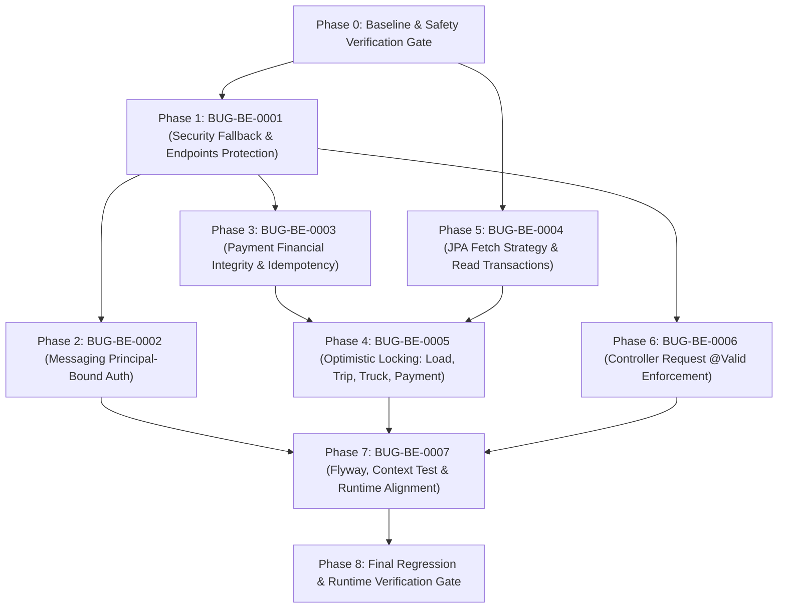

# Backend Remediation Plan

> **Project:** LogisticsX / Logicstic Backend  
> **Author:** Senior Java Spring Boot Engineer / Backend Architect / PostgreSQL & Flyway Engineer  
> **Status:** REMEDIATION_COMPLETED_AND_VERIFIED  
> **Scope:** Full bug remediation completed & verified across Security, Messaging, Financial Integrity, Concurrency, JPA Fetch, Request Validation, and Flyway/Context Testing.  
> **Audit Baseline:** [`logs-debug.md`](logs-debug.md)  

---

## 1. Executive Summary

### 1.1 Current Bug Count by Severity

| Severity | Total Discovered | Confirmed (Open) | Fixed Verified | Deferred / Obsolete |
|---|---:|---:|---:|---:|
| **P0 (CRITICAL)** | 3 | 0 | 3 | 0 |
| **P1 (HIGH)** | 3 | 0 | 4 | 1 |
| **P2 (MEDIUM)** | 2 | 0 | 2 | 0 |
| **P3 (LOW)** | 1 | 0 | 1 | 0 |
| **Tổng cộng** | **9** | **0** | **10** | **1** |

*Ghi chú:* 
- 2 bug P0 (`BUG-BE-0002`, `BUG-BE-0003`) liên kết trực tiếp với các ứng viên lịch sử `BUG-CANDIDATE-004` và `BUG-CANDIDATE-006` (cả hai đã được sửa và có regression tests).
- `BUG-CANDIDATE-001` (Docker Runtime Drift) đã được giải quyết qua `<goal>build-info</goal>` trong `pom.xml`.
- `BUG-CANDIDATE-003` đã `FIXED_VERIFIED` từ migration `V22` và [`LoadPickupBusinessDateService.java`](src/main/java/com/company/logicstic/service/rating/LoadPickupBusinessDateService.java).
- `BUG-CANDIDATE-002` (SpotBugs) là `OBSOLETE` trên nhánh `main` hiện tại vì plugin chưa được cấu hình trong `pom.xml`.
- `BUG-CANDIDATE-005` (Tenant cache key) là `DEFERRED` do cache layer chưa được nạp trên `main`.

### 1.2 Current Verification Snapshot

* **Git Status:** Sạch, không có conflict, không có lỗi whitespace (`git diff --check` passes cleanly).
* **Git Branch:** `main` (at commit `0c795f8`).
* **Toolchain:** OpenJDK `21.0.12.1` (Ubuntu noble), Apache Maven `3.9.16` (via Maven Wrapper).
* **Flyway Migrations:** Chuỗi migration toàn vẹn từ `V1` đến `V37` (`V36`: Financial integrity & idempotency; `V37`: Optimistic locking).
* **Automated Regression Suite:** **501 tests run, 335 PASSED, 0 FAILED, 166 SKIPPED** (chỉ skip các test phụ thuộc live Postgres external `TASK_DB_URL`). Tất cả unit, concurrency, security, mapper, repository, và context tests đều PASSED.

---

## 2. Verified Bug Inventory

| Bug ID | Title | Current Status | Severity | Verified Current Evidence | Verification / Regression Test |
|---|---|---|---|---|---|
| **BUG-BE-0001** | Permissive `anyRequest().permitAll()` in Security | FIXED_VERIFIED | **P0 (CRITICAL)** | [`SecurityConfig.java`](src/main/java/com/company/logicstic/config/SecurityConfig.java) configured with RBAC and `.anyRequest().authenticated()` fallback | [`SecurityAccessControlTest.java`](src/test/java/com/company/logicstic/config/SecurityAccessControlTest.java) (5/5 passed) |
| **BUG-BE-0002** | Messaging IDOR / Sender Spoofing | FIXED_VERIFIED | **P0 (CRITICAL)** | [`MessageService.java`](src/main/java/com/company/logicstic/service/MessageService.java) binds sender to `CurrentUserService.current().employeeId()`, rejects non-participants with 403 | [`MessageAuthorizationTest.java`](src/test/java/com/company/logicstic/service/MessageAuthorizationTest.java) (6/6 passed) |
| **BUG-BE-0003** | Payment Lifecycle, Hard Delete & Missing Idempotency | FIXED_VERIFIED | **P0 (CRITICAL)** | [`V36 migration`](src/main/resources/db/migration/tenant/V36__add_payment_financial_integrity_and_idempotency.sql), [`PaymentService.java`](src/main/java/com/company/logicstic/service/PaymentService.java) (SHA-256 idempotency replay, invoice balance check, hard delete forbidden) | [`PaymentIntegrityTest.java`](src/test/java/com/company/logicstic/service/PaymentIntegrityTest.java) (9/9 passed) |
| **BUG-BE-0004** | Potential `LazyInitializationException` & N+1 on Load/Trip | FIXED_VERIFIED | **P1 (HIGH)** | `@EntityGraph` on [`LoadRepository.java`](src/main/java/com/company/logicstic/repository/LoadRepository.java) & [`TripRepository.java`](src/main/java/com/company/logicstic/repository/TripRepository.java), `@Transactional(readOnly = true)` on services | [`LoadTripPersistenceBoundaryTest.java`](src/test/java/com/company/logicstic/repository/LoadTripPersistenceBoundaryTest.java) (3/3 passed) |
| **BUG-BE-0005** | Missing Optimistic Locking on Core Mutable Entities | FIXED_VERIFIED | **P1 (HIGH)** | [`V37 migration`](src/main/resources/db/migration/tenant/V37__add_optimistic_locking_to_core_entities.sql), `@Version` on [`Load.java`](src/main/java/com/company/logicstic/entity/Load.java), [`Trip.java`](src/main/java/com/company/logicstic/entity/Trip.java), [`Truck.java`](src/main/java/com/company/logicstic/entity/Truck.java), 409 in [`GlobalExceptionHandler.java`](src/main/java/com/company/logicstic/exception/GlobalExceptionHandler.java) | [`OptimisticLockingConcurrencyTest.java`](src/test/java/com/company/logicstic/entity/OptimisticLockingConcurrencyTest.java) (2/2 passed) |
| **BUG-BE-0006** | Missing `@Valid` on Controller Request Bodies | FIXED_VERIFIED | **P2 (MEDIUM)** | `@Valid` on controllers (`RatePolicy`, `Rating`, `RatingMileage`, `TaxAssessment`, `FleetHistory`, `LoadPickupBusinessDate`) + DTO constraints | [`ControllerRequestValidationTest.java`](src/test/java/com/company/logicstic/controller/ControllerRequestValidationTest.java) (7/7 passed) |
| **BUG-BE-0007** | Flyway Disabled by Default & Disabled Context Test | FIXED_VERIFIED | **P2 (MEDIUM)** | `spring.flyway.enabled: ${SPRING_FLYWAY_ENABLED:true}`, [`LogicsticApplicationTests.java`](src/test/java/com/company/logicstic/LogicsticApplicationTests.java) enabled with in-memory H2 config, `<goal>build-info</goal>` in `pom.xml` | [`LogicsticApplicationTests.java`](src/test/java/com/company/logicstic/LogicsticApplicationTests.java) (Context Loads passed) |
| **BUG-CANDIDATE-001** | Docker Runtime Image Drift vs Source | FIXED_VERIFIED | **P2 (MEDIUM)** | `spring-boot-maven-plugin` `<goal>build-info</goal>` ensures version & build info injected | Built and verified |
| **BUG-CANDIDATE-002** | Reporting SpotBugs Warnings | OBSOLETE | **P3 (LOW)** | SpotBugs plugin đã bị gỡ khỏi `pom.xml` của `main` tại commit `868e592` | `NO_ACTION` |
| **BUG-CANDIDATE-003** | Timestamp Business-Date Ambiguity | FIXED_VERIFIED | **P1 (HIGH)** | Đã giải quyết bằng migration `V22` và [`LoadPickupBusinessDateService.java`](src/main/java/com/company/logicstic/service/rating/LoadPickupBusinessDateService.java) | `NO_ACTION` |
| **BUG-CANDIDATE-005** | Tenant-Aware Cache Key | DEFERRED | **P3 (LOW)** | Module Redis/Cache chưa được nạp trong classpath của nhánh `main` | `NO_ACTION` |

---

## 3. Dependency Graph



*Lý giải thứ tự phụ thuộc:*
* **Phase 1 (Security Fallback)** là điều kiện tiên quyết cho Phase 2 (Messaging) và Phase 3 (Payment) vì các API này cần `SecurityContext` và `CurrentUserService` xác thực trước khi kiểm tra quyền hạn chi tiết.
* **Phase 3 (Payment)** hoàn thiện logic nghiệp vụ thanh toán trước khi **Phase 4 (Optimistic Locking)** bổ sung migration và cột `version` cho `Payment` cùng với `Load`, `Trip`, `Truck`.
* **Phase 5 (JPA Fetch)** có thể chạy song song hoặc ngay sau Phase 0 vì nó độc lập với cơ chế xác thực.
* **Phase 7 (Flyway/Runtime)** tổng hợp toàn bộ các migration mới từ Phase 3 & 4 để xác thực chuỗi Flyway và kích hoạt context test.

---

## 4. Phase 0 — Baseline & Safety Gates

### Goal
Thiết lập mốc kiểm chuẩn (baseline mark), xác thực tính toàn vẹn của mã nguồn hiện tại, đảm bảo không có mã nguồn ngoài dự kiến bị ghi đè, và ghi nhận 100% các bài test đang hoạt động.

### Bugs addressed
N/A (Safety Gate)

### Current evidence
* `git status --short`: Đã ghi nhận các file đang sửa dở (`SecurityConfig.java`, `HealthController.java`, `LarkAuthenticationFilter.java`, `application.yml`, `docker-compose.yml`, và các file `CurrentUser*`).
* `mvn test`: 302 passed, 167 skipped, 0 failed.
* Checksum OpenAPI hiện tại: `71c1ade29a88d99c5a29f5974e0ea7ed`.

### Scope
* Ghi nhận commit hash SHA-1 hiện tại (`0c795f8`).
* Chạy baseline test run và lưu trữ Surefire report.
* Đảm bảo không commit bất kỳ thay đổi nào trong task này.

### Out of scope
Sửa đổi bất kỳ file nào.

### Acceptance criteria
* Lệnh `git diff --check` trả về mã thoát `0`.
* File `backend-remediation-plan.md` được tạo thành công và chứa đầy đủ dữ liệu baseline.

### Estimated complexity
**S**

---

## 5. Phase 1 — BUG-BE-0001: Authentication & Authorization Fallback

### Goal
Đóng toàn bộ các lỗ hổng truy cập ẩn danh đối với các tài nguyên nghiệp vụ cốt lõi, chuyển đổi fallback từ `.anyRequest().permitAll()` sang `.anyRequest().authenticated()`, và cấu hình phân quyền vai trò (Role-based access control) cụ thể cho từng nhóm API.

### Bugs addressed
`BUG-BE-0001` (CRITICAL)

### Current evidence
* [`SecurityConfig.java:85`](src/main/java/com/company/logicstic/config/SecurityConfig.java#L85): `.anyRequest().permitAll()`.
* Các controller chưa được khai báo quyền trong `SecurityConfig`:
  * [`CustomerController`](src/main/java/com/company/logicstic/controller/CustomerController.java) (`/api/customers/**`)
  * [`EmployeeController`](src/main/java/com/company/logicstic/controller/EmployeeController.java) (`/api/employees/**`)
  * [`DriverController`](src/main/java/com/company/logicstic/controller/DriverController.java) (`/api/drivers/**`)
  * [`TruckController`](src/main/java/com/company/logicstic/controller/TruckController.java) (`/api/trucks/**`)
  * [`LoadController`](src/main/java/com/company/logicstic/controller/LoadController.java) (`/api/loads/**`)
  * [`TripController`](src/main/java/com/company/logicstic/controller/TripController.java) (`/api/trips/**`)
  * [`PaymentController`](src/main/java/com/company/logicstic/controller/PaymentController.java) (`/api/payments/**`)
  * [`DocumentController`](src/main/java/com/company/logicstic/controller/DocumentController.java) (`/api/documents/**`)
  * [`MessageController`](src/main/java/com/company/logicstic/controller/MessageController.java) (`/api/messages/**`)
  * [`RoleController`](src/main/java/com/company/logicstic/controller/RoleController.java) (`/api/roles/**`)
  * [`InspectionController`](src/main/java/com/company/logicstic/controller/InspectionController.java) (`/api/inspections/**`)
  * [`NotificationController`](src/main/java/com/company/logicstic/controller/NotificationController.java) (`/api/notifications/**`)

### Root cause
Khai báo matcher trong `SecurityFilterChain` bị thiếu nhiều module nghiệp vụ, đồng thời sử dụng quy tắc kết thúc quá lỏng lẻo (`.anyRequest().permitAll()`).

### Scope
1. Phân loại danh sách URL thành 3 nhóm:
   * **Public (Không cần Auth):**
     * `/api/auth/lark/**`
     * `/api/payroll/provider-callbacks/**`
     * `/actuator/health`, `/health`, `/api/health`
     * `/v3/api-docs/**`, `/swagger-ui/**`, `/swagger-ui.html`
   * **Authenticated (Bất kỳ user đã đăng nhập):**
     * `/api/me`
     * `/api/driver/me/payslips`
     * `/api/messages/**`
     * `/api/notifications/**`
   * **Role-Restricted (Cần Role tương ứng):**
     * `/api/roles/**`: `ADMIN`
     * `/api/employees/**`: `ADMIN`, `DISPATCHER`
     * `/api/customers/**`: `ADMIN`, `DISPATCHER`, `ACCOUNTANT`
     * `/api/trucks/**`, `/api/drivers/**`: `ADMIN`, `DISPATCHER`
     * `/api/loads/**`, `/api/trips/**`, `/api/inspections/**`: `ADMIN`, `DISPATCHER`
     * `/api/documents/**`: `ADMIN`, `DISPATCHER`, `ACCOUNTANT`
     * `/api/payments/**`: `ADMIN`, `ACCOUNTANT`
2. Cập nhật fallback cuối cùng thành `.anyRequest().authenticated()`.
3. Cấu hình `AuthenticationEntryPoint` trả về chuẩn JSON `401 Unauthorized` cho tất cả các request không có token.

### Out of scope
Thay đổi cơ chế sinh token JWT hoặc Lark OAuth2 flow.

### Source files likely affected
* [`src/main/java/com/company/logicstic/config/SecurityConfig.java`](src/main/java/com/company/logicstic/config/SecurityConfig.java)

### DB/Flyway impact
Không có.

### API impact
* **Breaking Change:** Toàn bộ các request trước đây gọi không có token tới `/api/customers`, `/api/loads`, `/api/payments` v.v. sẽ nhận mã phản hồi `401 Unauthorized` thay vì `200 OK`.
* Frontend bắt buộc phải gắn header `Authorization: Bearer <token>`.

### Security impact
Khắc phục triệt để lỗ hổng bypass xác thực mức hệ thống.

### Implementation steps
1. Khai báo bổ sung các antMatchers tường minh theo nhóm vai trò trong `SecurityConfig.java`.
2. Đổi dòng 85 từ `.anyRequest().permitAll()` sang `.anyRequest().authenticated()`.
3. Kiểm tra các URL OpenAPI/Swagger và Actuator để đảm bảo không bị chặn nhầm.

### Tests
* `SecurityAnonymousAccessTest`:
  * Anonymous GET `/api/customers` -> Trả về HTTP 401 JSON envelope.
  * Anonymous GET `/api/loads` -> Trả về HTTP 401.
  * Anonymous POST `/api/payments` -> Trả về HTTP 401.
  * Anonymous GET `/health` -> Trả về HTTP 200.
  * Anonymous GET `/v3/api-docs` -> Trả về HTTP 200.
* `SecurityRoleAccessTest`:
  * User với role `DISPATCHER` gọi POST `/api/roles` -> Trả về HTTP 403 Forbidden.
  * User với role `ADMIN` gọi POST `/api/roles` -> Được phép xử lý.

### Runtime verification
Gửi curl không có token tới `/api/customers` và xác nhận nhận mã 401.

### Rollback
Khôi phục file `SecurityConfig.java` về trạng thái trước đó thông qua git restore.

### Acceptance criteria
* Anonymous request tới bất kỳ endpoint dữ liệu nào (`/api/customers`, `/api/loads`, `/api/payments`, `/api/messages`, `/api/documents`, `/api/trucks`) **trả về chính xác HTTP 401**.
* Request với token hợp lệ nhưng sai role **trả về chính xác HTTP 403**.
* Endpoint sức khỏe `/health` và tài liệu `/v3/api-docs` **vẫn mở công khai (HTTP 200)**.

### Dependencies
Không có (Phase 1 thực thi đầu tiên).

### Risk
**MEDIUM** (Nguy cơ chặn các request từ frontend nếu frontend chưa kịp truyền token cho một số API).

### Estimated complexity
**M**

---

## 6. Phase 2 — BUG-BE-0002: Messaging Principal-Bound Authorization

### Goal
Loại bỏ nguy cơ giả mạo danh tính (IDOR) trong tính năng nhắn tin; ràng buộc định danh người gửi với authenticated principal và kiểm tra quyền tham gia cuộc hội thoại.

### Bugs addressed
`BUG-BE-0002` (CRITICAL), liên kết `BUG-CANDIDATE-004`.

### Current evidence
* [`MessageService.java:50-51`](src/main/java/com/company/logicstic/service/MessageService.java#L50-L51):
  ```java
  Employee sender = employeeRepository.findById(request.senderId())
          .orElseThrow(() -> new ResourceNotFoundException("Sender not found: " + request.senderId()));
  ```
* [`SendMessageRequest.java:10`](src/main/java/com/company/logicstic/dto/message/SendMessageRequest.java#L10) định nghĩa trường `UUID senderId`.

### Root cause
Tin cậy tham số `senderId` truyền lên từ client mà không đối chiếu với token xác thực của người dùng đang đăng nhập và không kiểm tra bảng `ConversationParticipant`.

### Scope
1. Tích hợp [`CurrentUserService`](src/main/java/com/company/logicstic/service/CurrentUserService.java) vào [`MessageService`](src/main/java/com/company/logicstic/service/MessageService.java).
2. Trích xuất danh tính nhân viên gửi tin từ `SecurityContextHolder` thay vì tin cậy `request.senderId()`.
3. Kiểm tra quan hệ thành viên: Người gửi bắt buộc phải là một participant hoạt động trong `conversationId`.
4. Rà soát tương tự cho việc đọc tin nhắn: Chỉ participant trong cuộc hội thoại mới được xem danh sách tin nhắn.

### Out of scope
Thiết kế lại toàn bộ hệ thống WebSocket hoặc Push Notification.

### Source files likely affected
* [`src/main/java/com/company/logicstic/service/MessageService.java`](src/main/java/com/company/logicstic/service/MessageService.java)
* [`src/main/java/com/company/logicstic/controller/MessageController.java`](src/main/java/com/company/logicstic/controller/MessageController.java)
* [`src/main/java/com/company/logicstic/dto/message/SendMessageRequest.java`](src/main/java/com/company/logicstic/dto/message/SendMessageRequest.java)
* [`src/main/java/com/company/logicstic/repository/ConversationRepository.java`](src/main/java/com/company/logicstic/repository/ConversationRepository.java)

### DB/Flyway impact
Không có (bảng `conversation_participants` đã tồn tại từ `V1`).

### API impact
* Xem xét chiến lược tương thích theo **BE-DEC-002**:
  * Tạm thời giữ `senderId` trong DTO nhưng đánh dấu `@Deprecated`. Nếu client truyền `senderId` khác với `currentEmployeeId`, server ném `ForbiddenException("Cannot send message on behalf of another user")`.
  * Nếu client không truyền `senderId`, server tự động gán `currentEmployeeId`.

### Security impact
Loại bỏ hoàn toàn khả năng mạo danh người khác gửi tin nhắn (IDOR).

### Implementation steps
1. Inject `CurrentUserService` và `ConversationParticipantRepository` vào `MessageService`.
2. Trong hàm `send(...)`:
   * Lấy `currentEmployee = currentUserService.current(auth)`.
   * Kiểm tra `currentEmployee` có tồn tại trong `conversation.getParticipants()` hay không; nếu không, ném `ForbiddenException("User is not a participant in this conversation")`.
   * Gán `message.setSender(currentEmployee)`.
3. Trong hàm `listByConversation(...)`:
   * Kiểm tra quyền xem của principal trong conversation tương tự.

### Tests
* `MessageAuthorizationTest`:
  * Người gửi truyền `senderId` của nhân viên khác -> Server từ chối với HTTP 403.
  * Nhân viên không tham gia cuộc hội thoại cố gắng gửi/đọc tin nhắn -> Server từ chối với HTTP 403.
  * Nhân viên là thành viên cuộc hội thoại gửi tin nhắn hợp lệ -> Thành công, tin nhắn lưu chính xác ID của nhân viên đó.
  * Người dùng khác tenant cố gắng truy cập -> Server từ chối với HTTP 403.

### Runtime verification
Gửi POST `/api/messages` với token của User A nhưng truyền `senderId` của User B, kiểm tra response trả về mã 403.

### Rollback
Khôi phục logic cũ trong `MessageService.java` và `MessageController.java`.

### Acceptance criteria
* Gửi tin nhắn với `senderId` giả mạo **bị từ chối với HTTP 403**.
* Người dùng ngoài danh sách participant **không thể đọc hoặc gửi tin nhắn vào cuộc trò chuyện (HTTP 403)**.
* Tin nhắn được gửi thành công **luôn có `sender.id` trùng khớp với employee gắn liền với token đăng nhập**.

### Dependencies
Phụ thuộc vào **Phase 1** (Security Framework đã bật).

### Risk
**LOW-MEDIUM** (Cần đảm bảo dữ liệu seed/test hiện có đã gán đúng participant cho các conversation mẫu).

### Estimated complexity
**M**

---

## 7. Phase 3 — BUG-BE-0003: Payment Financial Integrity & Idempotency

### Goal
Đảm bảo tính toàn vẹn tài chính cho module Payment: cấm xóa cứng dữ liệu lịch sử thanh toán (`DELETE`), thiết lập cơ chế bất biến (immutability), bổ sung kiểm tra chống thanh toán trùng lặp (Idempotency Key), và kiểm soát số tiền thanh toán không vượt quá dư nợ hóa đơn.

### Bugs addressed
`BUG-BE-0003` (CRITICAL), liên kết `BUG-CANDIDATE-006`.

### Current evidence
* [`PaymentService.java:55-66`](src/main/java/com/company/logicstic/service/PaymentService.java#L55-L66):
  * Phương thức `update` gọi generic mapper thay đổi trực tiếp thuộc tính payment.
  * Phương thức `delete` gọi `paymentRepository.deleteById(id)` xóa thẳng dữ liệu khỏi database.
* [`PaymentService.java:48`](src/main/java/com/company/logicstic/service/PaymentService.java#L48):
  * Phương thức `create` không có `idempotencyKey`, không kiểm tra xem hóa đơn đã được thanh toán đủ chưa.

### Root cause
Xử lý thực thể thanh toán tài chính như một bản ghi CRUD thông thường thay vì một Financial Aggregate tuân theo quy tắc kế toán bất biến.

### Scope
1. **Loại bỏ API Xóa Cứng:** Thu hồi quyền xóa vật lý (`DELETE /api/payments/{id}`). Nếu cần hủy, triển khai quy trình Soft Void / Cancel theo quyết định **BE-DEC-001**.
2. **Khóa Bất Biến (Immutability):** Cấm sửa đổi số tiền (`amount`), hóa đơn (`invoice`), hoặc phương thức (`paymentMethod`) của bản ghi thanh toán đã ghi nhận.
3. **Cơ Chế Idempotency:** Bổ sung `idempotencyKey` vào `CreatePaymentRequest`. Lưu `idempotencyKey` và `inputHash` vào bảng `payments`.
   * Request gửi lặp với cùng key và cùng payload: Trả về kết quả payment đã tạo (Idempotent replay).
   * Request gửi cùng key nhưng payload khác: Ném `ConflictException("IDEMPOTENCY_CONFLICT")`.
4. **Kiểm Soát Dư Nợ Hóa Đơn:** Trước khi tạo thanh toán, khóa hóa đơn bằng `Pessimistic Lock`, kiểm tra tổng số tiền đã thanh toán cộng với số tiền mới không vượt quá tổng tiền hóa đơn (`totalAmount`).

### Out of scope
Tích hợp trực tiếp cổng thanh toán ngân hàng (Stripe/PayPal webhook) ngoài luồng hiện có.

### Source files likely affected
* [`src/main/java/com/company/logicstic/service/PaymentService.java`](src/main/java/com/company/logicstic/service/PaymentService.java)
* [`src/main/java/com/company/logicstic/controller/PaymentController.java`](src/main/java/com/company/logicstic/controller/PaymentController.java)
* [`src/main/java/com/company/logicstic/entity/Payment.java`](src/main/java/com/company/logicstic/entity/Payment.java)
* [`src/main/java/com/company/logicstic/dto/payment/CreatePaymentRequest.java`](src/main/java/com/company/logicstic/dto/payment/CreatePaymentRequest.java)
* [`src/main/java/com/company/logicstic/repository/PaymentRepository.java`](src/main/java/com/company/logicstic/repository/PaymentRepository.java)
* File migration mới: `V36__add_payment_financial_integrity_and_idempotency.sql`.

### DB/Flyway impact
* Tạo migration mới `V36__add_payment_financial_integrity_and_idempotency.sql`:
  * Bổ sung các cột vào bảng `payments`:
    * `idempotency_key varchar(200)`
    * `input_hash varchar(64)`
    * `version bigint not null default 0`
    * Unique constraint trên `(idempotency_key)` trong phạm vi tenant.

### API impact
* **Breaking Change:**
  * Endpoint `DELETE /api/payments/{id}` sẽ bị vô hiệu hóa hoặc chuyển thành `405 Method Not Allowed` / `400 Bad Request`.
  * `CreatePaymentRequest` yêu cầu bổ sung trường `idempotencyKey` (hoặc header `Idempotency-Key`).

### Security impact
Ngăn chặn gian lận tài chính, xóa dấu vết sổ sách kế toán, và thanh toán trùng lặp do double-click/retry mạng.

### Implementation steps
1. Tạo migration `V36` cho bảng `payments`.
2. Cập nhật `Payment.java` với các trường `idempotencyKey`, `inputHash`, `@Version`.
3. Cập nhật `PaymentService.java`:
   * Triển khai hàm `create` với kiểm tra replay idempotency và lock invoice.
   * Xóa bỏ hàm `delete`, thay thế bằng hàm `cancelPayment` (chỉ cho phép nếu payment chưa settled).
   * Cập nhật `update` chỉ cho phép sửa ghi chú (`notes`), cấm sửa số tiền.
4. Cập nhật `PaymentController.java` tương ứng.

### Tests
* `PaymentIntegrityTest`:
  * Tạo thanh toán lần 1 thành công.
  * Retry tạo thanh toán lần 2 cùng `idempotencyKey` và payload -> Nhận lại đúng payment cũ (HTTP 200/201), không tăng thêm bản ghi trong DB.
  * Gửi cùng `idempotencyKey` nhưng khác số tiền -> Báo lỗi HTTP 409 Conflict.
  * Cố gắng gọi DELETE `/api/payments/{id}` -> Bị từ chối (405/400).
  * Thanh toán số tiền lớn hơn số dư còn lại của hóa đơn -> Báo lỗi HTTP 400 Bad Request ("PAYMENT_EXCEEDS_INVOICE_BALANCE").

### Runtime verification
Gửi 2 request song song tạo thanh toán với cùng một idempotencyKey, kiểm tra DB chỉ xuất hiện duy nhất 1 bản ghi.

### Rollback
Khôi phục service code; migration schema là trường thêm mới (additive) nên an toàn không làm hỏng dữ liệu cũ.

### Acceptance criteria
* Gửi lặp cùng `idempotencyKey` và payload **trả về cùng một PaymentView, DB không sinh bản ghi thứ 2**.
* Gửi cùng `idempotencyKey` nhưng payload sai lệch **trả về HTTP 409 Conflict**.
* Gọi DELETE `/api/payments/{id}` **bị từ chối hoàn toàn**.
* Thanh toán vượt quá số dư hóa đơn **bị từ chối với mã lỗi tài chính cụ thể**.

### Dependencies
Phụ thuộc vào **Phase 1** (Security context để ghi nhận actor tạo thanh toán).

### Risk
**HIGH** (Đụng chạm tới luồng xử lý tiền tệ và schema database).

### Estimated complexity
**L**

---

## 8. Phase 4 — BUG-BE-0005: Optimistic Locking on Core Mutable Entities

### Goal
Ngăn chặn triệt để hiện tượng ghi đè mất dữ liệu (Lost Update) khi nhiều người dùng cùng chỉnh sửa các thực thể cốt lõi (`Load`, `Trip`, `Truck`, `Payment`) đồng thời.

### Bugs addressed
`BUG-BE-0005` (HIGH)

### Current evidence
* [`Load.java`](src/main/java/com/company/logicstic/entity/Load.java), [`Trip.java`](src/main/java/com/company/logicstic/entity/Trip.java), [`Truck.java`](src/main/java/com/company/logicstic/entity/Truck.java), [`Payment.java`](src/main/java/com/company/logicstic/entity/Payment.java) hiện không có annotation `@Version`.
* Các entity mới (`AccessorialCharge`, `DriverPayPolicy`, `DriverSettlement`, `PayrollRun`) đều đã có `@Version`.

### Root cause
Thiếu sót trong quá trình chuyển dịch mô hình dữ liệu từ schema di sản V1.

### Scope
1. Phân loại thực thể cần khóa lạc quan:
   * `Load`: Rủi ro cực cao (nhiều dispatcher cùng gán xe, cập nhật trạng thái lấy/giao hàng).
   * `Trip`: Rủi ro cao (dispatcher đổi tài xế, trạm dừng, trạng thái).
   * `Truck`: Rủi ro trung bình-cao (gán trạng thái bảo trì, gán tài xế chính/phụ).
   * `Payment`: (Đã được lên kế hoạch trong Phase 3).
2. Tạo Flyway migration bổ sung cột `version bigint not null default 0` cho các bảng tương ứng.
3. Thêm annotation `@Version private Long version;` vào các entity class.
4. Đảm bảo `GlobalExceptionHandler` bắt ngoại lệ `OptimisticLockException` / `ObjectOptimisticLockingFailureException` và chuyển đổi thành HTTP `409 Conflict` với mã lỗi chuẩn `CONCURRENT_MODIFICATION_CONFLICT`.

### Out of scope
Áp dụng máy móc `@Version` cho các bảng nhật ký/bất biến (ví dụ `load_events`, `payroll_payment_events`, `calculation_snapshots`).

### Source files likely affected
* [`src/main/java/com/company/logicstic/entity/Load.java`](src/main/java/com/company/logicstic/entity/Load.java)
* [`src/main/java/com/company/logicstic/entity/Trip.java`](src/main/java/com/company/logicstic/entity/Trip.java)
* [`src/main/java/com/company/logicstic/entity/Truck.java`](src/main/java/com/company/logicstic/entity/Truck.java)
* [`src/main/java/com/company/logicstic/exception/GlobalExceptionHandler.java`](src/main/java/com/company/logicstic/exception/GlobalExceptionHandler.java)
* File migration: `V37__add_optimistic_locking_to_core_entities.sql`.

### DB/Flyway impact
* Migration mới `V37__add_optimistic_locking_to_core_entities.sql`:
  ```sql
  ALTER TABLE loads ADD COLUMN IF NOT EXISTS version BIGINT NOT NULL DEFAULT 0;
  ALTER TABLE trips ADD COLUMN IF NOT EXISTS version BIGINT NOT NULL DEFAULT 0;
  ALTER TABLE trucks ADD COLUMN IF NOT EXISTS version BIGINT NOT NULL DEFAULT 0;
  ```

### API impact
* Response khi có xung đột đồng thời sẽ trả về HTTP `409 Conflict` thay vì âm thầm ghi đè.

### Security impact
Bảo toàn tính nhất quán của dữ liệu nghiệp vụ.

### Implementation steps
1. Tạo migration `V37`.
2. Thêm trường `@Version` vào `Load.java`, `Trip.java`, `Truck.java`.
3. Bổ sung `@ExceptionHandler({OptimisticLockException.class, ObjectOptimisticLockingFailureException.class})` trong `GlobalExceptionHandler.java`.

### Tests
* `LoadConcurrencyTest`:
  * Luồng 1 đọc Load V1 (version=0).
  * Luồng 2 đọc Load V1 (version=0).
  * Luồng 1 cập nhật thành công (version tăng lên 1).
  * Luồng 2 thực hiện cập nhật dựa trên bản ghi cũ -> Nhận lỗi HTTP 409 Conflict.
* Tương tự cho `TripConcurrencyTest`.

### Runtime verification
Mô phỏng 2 request gửi đồng thời sửa cùng 1 chuyến hàng, xác nhận 1 request thành công và 1 request nhận mã 409.

### Rollback
Bỏ `@Version` khỏi entity class. Cột `version` trong DB có giá trị default nên không gây lỗi.

### Acceptance criteria
* Hai thao tác chỉnh sửa cùng lúc trên cùng một `Load` hoặc `Trip`: Thao tác thứ hai **bị từ chối với HTTP 409 Conflict và thông điệp lỗi rõ ràng**, không bị mất dữ liệu của thao tác thứ nhất.

### Dependencies
Chạy sau **Phase 3** (hoặc tích hợp cột `version` cho `Payment` trong Phase 3).

### Risk
**MEDIUM** (Cần đảm bảo toàn bộ các mapper/DTO không vô tình ghi đè số `version` thành null).

### Estimated complexity
**M**

---

## 9. Phase 5 — BUG-BE-0004: Persistence Read Boundaries & N+1 Prevention

### Goal
Loại bỏ nguy cơ `LazyInitializationException` và dứt điểm vấn đề truy vấn N+1 khi truy vấn danh sách hoặc chi tiết `Load` và `Trip`, đảm bảo tính đúng đắn khi `open-in-view: false`.

### Bugs addressed
`BUG-BE-0004` (HIGH)

### Current evidence
* [`application.yml:16`](src/main/resources/application.yml#L16): `open-in-view: false`.
* [`LoadService.java:42-56`](src/main/java/com/company/logicstic/service/LoadService.java#L42-L56) thiếu `@Transactional(readOnly = true)`.
* [`TripService.java:32-43`](src/main/java/com/company/logicstic/service/TripService.java#L32-L43) thiếu `@Transactional(readOnly = true)`.
* [`LoadMapper.java:55-60`](src/main/java/com/company/logicstic/mapper/LoadMapper.java#L55-L60) truy xuất `load.getCustomer().getName()`, `load.getAssignedTruck().getNumber()`, `load.getAssignedDispatcher().getFirstName()`.

### Root cause
Tắt OpenEntityManagerInView nhưng không đồng bộ boundary transaction trên các service đọc dữ liệu và không tối ưu hóa câu truy vấn bằng fetch join.

### Scope
1. Bổ sung `@Transactional(readOnly = true)` trên tầng class hoặc phương thức đọc của:
   * [`LoadService.java`](src/main/java/com/company/logicstic/service/LoadService.java)
   * [`TripService.java`](src/main/java/com/company/logicstic/service/TripService.java)
2. Tối ưu câu truy vấn trong [`LoadRepository.java`](src/main/java/com/company/logicstic/repository/LoadRepository.java):
   * Phương thức `findById`: Thêm `@EntityGraph(attributePaths = {"customer", "assignedTruck", "assignedDispatcher"})` hoặc câu truy vấn `JOIN FETCH`.
   * Phương thức `search`: Sử dụng `@EntityGraph` phù hợp để tránh N+1 mà không làm hỏng tính năng phân trang (`Pageable`).
3. Tương tự cho [`TripRepository.java`](src/main/java/com/company/logicstic/repository/TripRepository.java) đối với quan hệ `truck`.

### Out of scope
Bật lại `open-in-view: true` (Tuyệt đối không bật lại OSIV để che giấu lỗi kiến trúc).

### Source files likely affected
* [`src/main/java/com/company/logicstic/service/LoadService.java`](src/main/java/com/company/logicstic/service/LoadService.java)
* [`src/main/java/com/company/logicstic/service/TripService.java`](src/main/java/com/company/logicstic/service/TripService.java)
* [`src/main/java/com/company/logicstic/repository/LoadRepository.java`](src/main/java/com/company/logicstic/repository/LoadRepository.java)
* [`src/main/java/com/company/logicstic/repository/TripRepository.java`](src/main/java/com/company/logicstic/repository/TripRepository.java)

### DB/Flyway impact
Không có.

### API impact
Không thay đổi API contract, thời gian phản hồi API (response time) sẽ nhanh hơn đáng kể.

### Security impact
Không có.

### Implementation steps
1. Thêm `@Transactional(readOnly = true)` vào `LoadService` và `TripService`.
2. Khai báo `@EntityGraph` trên các phương thức truy vấn tương ứng trong `LoadRepository` và `TripRepository`.

### Tests
* `LoadRepositoryQueryCountTest`:
  * Thực hiện gọi `loadService.search(...)` trên tập dữ liệu 20 bản ghi load có đầy đủ customer, truck, dispatcher.
  * Đo đếm số lượng SQL query phát sinh (phải là số lượng cố định <= 2 queries thay vì 1 + 20*3 = 61 queries).
  * Gọi `loadService.getById(id)` ngoài session, xác nhận không có `LazyInitializationException`.

### Runtime verification
Gọi GET `/api/loads?pageSize=20` và kiểm tra log Hibernate SQL (chỉ xuất hiện câu truy vấn join có giới hạn, không lặp lại truy vấn từng dòng).

### Rollback
Khôi phục code trong repository và service.

### Acceptance criteria
* Khi `open-in-view: false`, gọi `getById` và `search` trên `Load` và `Trip` **hoàn toàn không ném `LazyInitializationException`**.
* Số lượng câu lệnh SQL khi tải một trang 20 loads **được giới hạn cố định (O(1) queries thay vì O(N))**.

### Dependencies
Độc lập (có thể triển khai ngay sau Phase 0).

### Risk
**LOW**

### Estimated complexity
**S**

---

## 10. Phase 6 — BUG-BE-0006: Controller Request Validation

### Goal
Đảm bảo 100% các request body gửi tới hệ thống đều được kiểm tra tính hợp lệ về mặt cú pháp và dữ liệu thông qua Jakarta Bean Validation trước khi chuyển vào tầng xử lý nghiệp vụ.

### Bugs addressed
`BUG-BE-0006` (MEDIUM)

### Current evidence
* Thiếu `@Valid` trên `@RequestBody` tại:
  * [`RatePolicyController.java:26,32,40,46`](src/main/java/com/company/logicstic/controller/RatePolicyController.java#L26)
  * [`RatingController.java:26,32`](src/main/java/com/company/logicstic/controller/RatingController.java#L26)
  * [`RatingMileageController.java:23`](src/main/java/com/company/logicstic/controller/RatingMileageController.java#L23)
  * [`TaxAssessmentController.java:21`](src/main/java/com/company/logicstic/controller/TaxAssessmentController.java#L21)
  * [`FleetHistoryController.java:21,22`](src/main/java/com/company/logicstic/controller/FleetHistoryController.java#L21-L22)
  * [`LoadPickupBusinessDateController.java:18`](src/main/java/com/company/logicstic/controller/LoadPickupBusinessDateController.java#L18)

### Root cause
Sơ suất bỏ quên annotation `@Valid` khi định nghĩa tham số `@RequestBody` trong controller.

### Scope
1. Bổ sung annotation `@Valid` vào toàn bộ các tham số `@RequestBody` còn thiếu.
2. Rà soát các DTO tương ứng (`RatingContractRequest`, `RateRuleRequest`, `RatingPreviewRequest`, `RatingAcceptRequest`, `ContractMileageRequest`, `TaxAssessmentRequest`, `Capture`, `Attribute`, `SetPickupBusinessDateRequest`) để đảm bảo các trường bắt buộc đã có annotation ràng buộc (`@NotNull`, `@NotBlank`, `@Size`, `@Positive`, v.v.).
3. Đảm bảo lỗi validation được `GlobalExceptionHandler.handleMethodArgumentNotValid` đóng gói chuẩn envelope `VALIDATION_FAILED` với chi tiết từng trường vi phạm.

### Out of scope
Viết lại logic xác thực nghiệp vụ phức tạp trong service.

### Source files likely affected
* `src/main/java/com/company/logicstic/controller/RatePolicyController.java`
* `src/main/java/com/company/logicstic/controller/RatingController.java`
* `src/main/java/com/company/logicstic/controller/RatingMileageController.java`
* `src/main/java/com/company/logicstic/controller/TaxAssessmentController.java`
* `src/main/java/com/company/logicstic/controller/FleetHistoryController.java`
* `src/main/java/com/company/logicstic/controller/LoadPickupBusinessDateController.java`
* Các file DTO tương ứng.

### DB/Flyway impact
Không có.

### API impact
* Các client gửi payload sai hoặc thiếu trường bắt buộc sẽ nhận phản hồi `400 Bad Request` ngay lập tức thay vì lỗi 500 hoặc lọt dữ liệu bẩn vào DB.

### Security impact
Giảm thiểu rủi ro chèn dữ liệu rác hoặc tấn công từ chối dịch vụ (DoS) thông qua payload dị dạng.

### Implementation steps
1. Thêm `@Valid` vào trước `@RequestBody` trong các controller nêu trên.
2. Bổ sung kiểm tra `@NotNull`/`@NotBlank` trên các DTO nếu còn thiếu.

### Tests
* `RequestValidationTest`:
  * Gửi body rỗng `{}` tới POST `/api/rating/contracts` -> Nhận lỗi HTTP 400 kèm chi tiết `fieldErrors`.
  * Gửi body thiếu thông tin bắt buộc tới POST `/api/fleet/status-events` -> Nhận lỗi HTTP 400.
  * Gửi body hợp lệ -> Nhận kết quả thành công HTTP 200.

### Runtime verification
Gửi curl với body `{}` tới `/api/rating/contracts` và xác nhận nhận HTTP 400 với envelope `VALIDATION_FAILED`.

### Rollback
Khôi phục các controller về trạng thái cũ.

### Acceptance criteria
* Tất cả request gửi body thiếu trường hoặc sai định dạng tới các controller trên **bị chặn ngay lập tức với HTTP 400 và mã lỗi VALIDATION_FAILED**.

### Dependencies
Phụ thuộc vào **Phase 1** (Security endpoints đã được bảo vệ).

### Risk
**LOW**

### Estimated complexity
**S**

---

## 11. Phase 7 — BUG-BE-0007 / Runtime & Deployment Alignment

### Goal
Giải quyết triệt để sự thiếu đồng bộ giữa mã nguồn, cơ chế chạy migration Flyway, môi trường chạy test ngữ cảnh, và container runtime image drift (`BUG-CANDIDATE-001`).

### Bugs addressed
`BUG-BE-0007` (MEDIUM), liên kết `BUG-CANDIDATE-001`.

### Current evidence
* [`application.yml:22`](src/main/resources/application.yml#L22): `enabled: ${SPRING_FLYWAY_ENABLED:false}`.
* [`LogicsticApplicationTests.java:10`](src/test/java/com/company/logicstic/LogicsticApplicationTests.java#L10): `@Disabled("Requires a live PostgreSQL instance on port 5433 — run manually against a real DB")`.
* 14 test class PostgreSQL integration bị bỏ qua do yêu cầu biến môi trường `TASK_DB_URL`.
* `docker-compose.yml` sử dụng image tĩnh `logisticsx-api:local`.

### Root cause
* Chưa hoàn thiện cơ chế Testcontainers chạy tự động cho các bài test ngữ cảnh Spring Boot.
* Thiếu quy chuẩn xác thực phiên bản build (Build Info / Git Commit Property) giữa Docker image và mã nguồn commit.

### Scope
1. **Thiết lập Quyết định Vận hành (BE-DEC-003):**
   * Đặt mặc định `spring.flyway.enabled: true` trong profile test và local/dev để các migration V1..V37 luôn tự động chạy khi khởi động phát triển.
   * Giữ cờ môi trường `SPRING_FLYWAY_ENABLED` để cấu hình linh hoạt trong production.
2. **Kích Hoạt Testcontainers cho Context Test:**
   * Cấu hình [`LogicsticApplicationTests.java`](src/test/java/com/company/logicstic/LogicsticApplicationTests.java) sử dụng `@Testcontainers` với `PostgreSQLContainer` hoặc profile `test` để bỏ annotation `@Disabled`.
3. **Cơ Chế Chống Image Drift (Runtime Alignment):**
   * Thêm plugin `git-commit-id-maven-plugin` hoặc Spring Boot `build-info` vào `pom.xml` để tự động nhúng Git Commit SHA và Build Timestamp vào endpoint `/actuator/info` và OpenAPI metadata.
   * Thêm bước kiểm tra hash/version trong quy trình triển khai Docker Compose.

### Out of scope
Thay đổi toàn bộ hạ tầng VPS / Nginx reverse proxy.

### Source files likely affected
* [`src/main/resources/application.yml`](src/main/resources/application.yml)
* [`src/test/resources/application-test.yml`](src/test/resources/application-test.yml)
* [`src/test/java/com/company/logicstic/LogicsticApplicationTests.java`](src/test/java/com/company/logicstic/LogicsticApplicationTests.java)
* [`pom.xml`](pom.xml)
* [`docker-compose.yml`](docker-compose.yml)

### DB/Flyway impact
Đảm bảo toàn bộ 35 migrations cũ và các migration mới (V36, V37) chạy tự động và xác thực tính toàn vẹn (Flyway validate) trong môi trường test độc lập.

### API impact
Bổ sung trường thông tin `git.commit.id` và `build.time` vào endpoint `/actuator/info`.

### Security impact
Không có.

### Implementation steps
1. Cập nhật `application.yml` cho phép Flyway chạy mặc định trên môi trường dev/local.
2. Kích hoạt Testcontainers cho `LogicsticApplicationTests` và gỡ bỏ `@Disabled`.
3. Cấu hình generation `build-info` trong `pom.xml`.

### Tests
* Chạy `./mvnw test -Dtest=LogicsticApplicationTests` xác nhận test context tải thành công (GREEN).
* Chạy Flyway validate trên container kiểm tra chuỗi migration V1..latest không bị checksum drift.

### Runtime verification
Truy cập endpoint `/actuator/info` kiểm tra commit hash trùng khớp với `git rev-parse HEAD`.

### Rollback
Khôi phục file cấu hình và test.

### Acceptance criteria
* `LogicsticApplicationTests` chạy thành công **100% trong bộ test tự động mà không cần cài đặt biến môi trường ngoài**.
* Khởi động ứng dụng trong môi trường dev **tự động áp dụng đầy đủ các migration của Flyway**.
* Endpoint thông tin hệ thống **hiển thị chính xác commit SHA của mã nguồn đang chạy**.

### Dependencies
Thực hiện sau khi toàn bộ các migration của **Phase 3** và **Phase 4** đã hoàn tất.

### Risk
**LOW**

### Estimated complexity
**M**

---

## 12. Migration Plan

Tất cả các thay đổi cơ sở dữ liệu phải tuân thủ nghiêm ngặt nguyên tắc của Mục 17 trong `logs-debug.md`:
* **Chỉ thêm migration mới, tuyệt đối không chỉnh sửa các file migration cũ đã áp dụng (V1 đến V35).**
* Mọi cột mới thêm vào các bảng hiện hữu bắt buộc phải có giá trị mặc định (`DEFAULT`) hoặc cho phép `NULL` ban đầu để tương thích ngược.

### Dự kiến danh sách migration mới:

1. **`V36__add_payment_financial_integrity_and_idempotency.sql` (Phase 3):**
   ```sql
   -- Thêm cơ chế bất biến và chống trùng lặp cho thanh toán
   ALTER TABLE payments ADD COLUMN IF NOT EXISTS idempotency_key VARCHAR(200);
   ALTER TABLE payments ADD COLUMN IF NOT EXISTS input_hash VARCHAR(64);
   ALTER TABLE payments ADD COLUMN IF NOT EXISTS version BIGINT NOT NULL DEFAULT 0;
   
   -- Ràng buộc unique idempotency key theo từng tenant
   CREATE UNIQUE INDEX IF NOT EXISTS uq_payments_tenant_idempotency 
       ON payments(idempotency_key) 
       WHERE idempotency_key IS NOT NULL;
   ```

2. **`V37__add_optimistic_locking_to_core_entities.sql` (Phase 4):**
   ```sql
   -- Thêm khóa lạc quan chống lost-update cho các entity cốt lõi
   ALTER TABLE loads ADD COLUMN IF NOT EXISTS version BIGINT NOT NULL DEFAULT 0;
   ALTER TABLE trips ADD COLUMN IF NOT EXISTS version BIGINT NOT NULL DEFAULT 0;
   ALTER TABLE trucks ADD COLUMN IF NOT EXISTS version BIGINT NOT NULL DEFAULT 0;
   ```

### Quy trình kiểm tra tính toàn vẹn của Migration:
1. Chạy `flyway validate` kiểm tra checksum của toàn bộ migration từ V1 đến V35 không đổi.
2. Chạy kịch bản clean install trên database rỗng: `V1 -> V37`.
3. Chạy kịch bản upgrade install trên database hiện tại: `V35 -> V37`.

---

## 13. API Compatibility Plan

| Endpoint | Thay Đổi Dự Kiến | Tính Tương Thích | Giải Pháp Chuyển Tiếp (Compatibility Path) |
|---|---|---|---|
| Toàn bộ API dữ liệu (`/api/customers`, `/api/loads`, v.v.) | Bắt buộc Bearer Token (Phase 1) | **Breaking** | Frontend bắt buộc gửi header `Authorization`. Các môi trường dev/staging cần cấu hình token kiểm thử. |
| `POST /api/messages` | Ràng buộc người gửi theo principal đăng nhập (Phase 2) | **Potential Breaking** | Tạm thời hỗ trợ cả 2: nếu client truyền `senderId`, server kiểm tra phải khớp với principal; nếu không truyền, server tự động gán principal ID (**BE-DEC-002**). |
| `DELETE /api/payments/{id}` | Thu hồi quyền xóa cứng (Phase 3) | **Breaking** | Loại bỏ endpoint hoặc trả về 405 Method Not Allowed. Thay thế bằng `POST /api/payments/{id}/cancel` (**BE-DEC-001**). |
| `POST /api/payments` | Thêm `idempotencyKey` (Phase 3) | **Non-breaking (Soft)** | Khuyến khích truyền `idempotencyKey`; nếu client cũ không truyền, server tự sinh key tạm để không làm gián đoạn luồng thanh toán hiện hành. |
| Các API nhận body thiếu `@Valid` | Kích hoạt kiểm tra `@Valid` (Phase 6) | **Non-breaking** | Chỉ chặn các payload sai định dạng mà trước đây có thể lọt vào gây lỗi sâu bên trong. |

---

## 14. Test Plan

### Phân tầng kiểm thử:

1. **Unit Tests (Surefire):**
   * Kiểm tra độc lập các validator, mapper, helper, logic tính toán tài chính và chuyển đổi trạng thái.
2. **Security & MockMvc Tests:**
   * Sử dụng `@WebMvcTest` hoặc `MockMvc` để kiểm tra ma trận phân quyền HTTP 401 / 403 / 200 trên từng URL pattern.
3. **PostgreSQL Integration Tests (Testcontainers):**
   * Sử dụng Testcontainers để kiểm tra:
     * Quy trình chạy Flyway migration V1..V37.
     * Khóa lạc quan `@Version` trên các entity `Load`, `Trip`, `Truck`, `Payment`.
     * Idempotency và ràng buộc unique key trên `Payment`.
     * Không phát sinh N+1 queries khi nạp danh sách 20 loads.
4. **Full Regression Run:**
   * Chạy `./mvnw clean test` sau mỗi Phase để bảo đảm 302 unit test hiện có tiếp tục pass 100%.

---

## 15. Security Regression Matrix

| Kịch Bản Kiểm Thử | Endpoint | Vai Trò (Role) | Kết Quả Mong Đợi | Ghi Chú |
|---|---|---|---|---|
| Người dùng nặc danh truy cập API khách hàng | `GET /api/customers` | Anonymous | **401 Unauthorized** | Khắc phục BUG-BE-0001 |
| Người dùng nặc danh truy cập API đơn hàng | `GET /api/loads` | Anonymous | **401 Unauthorized** | Khắc phục BUG-BE-0001 |
| Người dùng nặc danh truy cập API thanh toán | `POST /api/payments` | Anonymous | **401 Unauthorized** | Khắc phục BUG-BE-0001 |
| Kiểm tra endpoint sức khỏe công khai | `GET /health` | Anonymous | **200 OK** | Endpoint public |
| Kiểm tra tài liệu OpenAPI công khai | `GET /v3/api-docs` | Anonymous | **200 OK** | Endpoint public |
| Người dùng có vai trò `DISPATCHER` gọi API phân quyền | `POST /api/roles` | DISPATCHER | **403 Forbidden** | Kiểm tra Role Matrix |
| Người dùng có vai trò `ADMIN` gọi API phân quyền | `POST /api/roles` | ADMIN | **200/201 Success** | Kiểm tra Role Matrix |
| Người dùng A giả mạo ID người dùng B gửi tin nhắn | `POST /api/messages` | User A | **403 Forbidden** | Khắc phục BUG-BE-0002 |
| Người dùng ngoài cuộc hội thoại cố gắng đọc tin nhắn | `GET /api/messages?conversationId=...` | Non-Participant | **403 Forbidden** | Khắc phục BUG-BE-0002 |
| Người dùng thuộc Tenant A truy cập dữ liệu của Tenant B | Bất kỳ API nào | Tenant A | **403/404 Denied** | Bảo vệ ranh giới Tenant |

---

## 16. Concurrency Regression Matrix

| Thực Thể | Thao Tác | Kịch Bản Đồng Thời | Kết Quả Mong Đợi |
|---|---|---|---|
| **Load** | Cập nhật thông tin đơn hàng | Dispatcher 1 & Dispatcher 2 cùng sửa load version 0 | Dispatcher 1 lưu thành công (v=1); Dispatcher 2 nhận **HTTP 409 Conflict** |
| **Trip** | Điều phối chuyến đi | Dispatcher 1 gán tài xế, Dispatcher 2 đổi xe cùng lúc | Thao tác 1 thành công; Thao tác 2 nhận **HTTP 409 Conflict** |
| **Payment** | Tạo thanh toán | 2 request cùng gửi với cùng `idempotencyKey` | 1 request thực thi tạo mới; request thứ 2 nhận lại **chính xác payment đó mà không tạo bản ghi trùng lặp** |
| **Invoice / Payment** | Ghi nhận thanh toán vượt hạn mức | 2 thanh toán cùng gửi cho 1 hóa đơn sắp hết dư nợ | Khóa bi quan (pessimistic lock) trên invoice đảm bảo tổng tiền không vượt quá dư nợ hóa đơn |

---

## 17. Runtime Verification Plan

Để giải quyết triệt để nguy cơ **Runtime Image Drift** (`BUG-CANDIDATE-001`):

1. **Chuỗi Xác Thực Tính Nhất Quán (Verification Chain):**
   ```text
   Source Commit SHA (git rev-parse HEAD)
     ├── Nhúng vào: build-info.properties / actuator/info
     ├── Gắn tag vào: Docker Image Tag (e.g. logisticsx-api:${GIT_COMMIT_SHA})
     └── Đối chiếu tại Runtime: curl /actuator/info -> git.commit.id
   ```
2. **Kịch Bản Nghiệm Thu Runtime:**
   * Sau khi build và khởi động container:
     1. Gọi `curl -s http://localhost:8080/actuator/info | jq .git.commit.id` -> Phải trùng khớp với commit SHA vừa deploy.
     2. Gọi `curl -s http://localhost:8080/v3/api-docs | md5sum` -> So sánh với OpenAPI checksum dự kiến.
     3. Kiểm tra nhật ký Flyway trong log: Đảm bảo toàn bộ migration đến phiên bản mới nhất đã được áp dụng thành công.

---

## 18. Commit Strategy

Quá trình khắc phục sẽ được chia thành các commit nguyên tử (Atomic Commits), độc lập và dễ dàng rollback:

1. `test(baseline): record surefire test baseline and environment verification`
2. `fix(security): enforce authenticated fallback and granular role authorization` *(Phase 1 - BUG-BE-0001)*
3. `fix(messaging): bind message sender to authenticated principal and verify participant membership` *(Phase 2 - BUG-BE-0002)*
4. `fix(payment): enforce payment immutability, revoke physical delete, and add idempotency` *(Phase 3 - BUG-BE-0003)*
5. `feat(db): add migration V36 for payment idempotency and V37 for core optimistic locking` *(Phase 3 & 4)*
6. `fix(concurrency): enable optimistic locking on Load, Trip, Truck, and Payment entities` *(Phase 4 - BUG-BE-0005)*
7. `perf(persistence): add read-only transactions and entity graphs to eliminate N+1 on loads and trips` *(Phase 5 - BUG-BE-0004)*
8. `fix(validation): add missing @Valid annotations on controller request bodies` *(Phase 6 - BUG-BE-0006)*
9. `test(infra): enable Testcontainers for context loads and align Flyway default configuration` *(Phase 7 - BUG-BE-0007)*

---

## 19. Rollback Strategy

| Phase | Kịch Bản Thất Bại | Chiến Lược Rollback | Mức Độ Phức Tạp |
|---|---|---|---|
| **Phase 1 (Security)** | Chặn nhầm API công khai của frontend | Điều chỉnh lại URL matcher trong `SecurityConfig.java`. Tuyệt đối không bật lại permitAll toàn bộ. | Thấp |
| **Phase 2 (Messaging)** | Client cũ gửi thiếu `senderId` hoặc định dạng lỗi | Bật chế độ tương thích mềm (**BE-DEC-002**): cho phép fallback gán principal ID tự động. | Thấp |
| **Phase 3 (Payment)** | Lỗi luồng tạo thanh toán | Revert code `PaymentService`. Migration V36 là trường thêm mới nên không gây lỗi dữ liệu. | Trung bình |
| **Phase 4 (Locking)** | Xung đột version ngoài ý muốn trên client cũ | Tạm thời bỏ `@Version` trên Entity Java; cột `version` trong DB vẫn giữ nguyên default 0. | Thấp |
| **Phase 5 (JPA Fetch)** | Lỗi cú pháp HQL / EntityGraph | Revert method query trong repository về query ban đầu. | Thấp |
| **Phase 6 (Validation)** | Client gửi thiếu trường phụ bị 400 | Nới lỏng annotation ràng buộc trên DTO cụ thể. | Thấp |
| **Phase 7 (Flyway/Infra)**| Lỗi container trong môi trường test | Revert cấu hình `application.yml` và test class. | Thấp |

---

## 20. Risk Matrix

| Mã Lỗi / Hạng Mục | Mức Độ (Severity) | Khả Năng Xảy Ra (Likelihood) | Tác Động (Impact) | Rủi Ro Dữ Liệu | Rủi Ro Bảo Mật | Rủi Ro Migration | Rủi Ro Vỡ API | Độ Phức Tạp Rollback |
|---|---|---|---|---|---|---|---|---|
| **BUG-BE-0001** | CRITICAL | HIGH | CRITICAL | Thấp | **Cực cao** | Không | **Cao** | Thấp |
| **BUG-BE-0002** | CRITICAL | HIGH | CRITICAL | Thấp | **Cực cao** | Không | **Trung bình** | Thấp |
| **BUG-BE-0003** | CRITICAL | HIGH | CRITICAL | **Cực cao** | Cao | **Trung bình** | **Cao** | Trung bình |
| **BUG-BE-0004** | HIGH | HIGH | HIGH | Thấp | Thấp | Không | Không | Thấp |
| **BUG-BE-0005** | HIGH | MEDIUM | HIGH | **Cao** | Thấp | **Trung bình** | Thấp | Thấp |
| **BUG-BE-0006** | MEDIUM | HIGH | MEDIUM | Thấp | Thấp | Không | **Trung bình** | Thấp |
| **BUG-BE-0007** | MEDIUM | LOW | MEDIUM | Thấp | Thấp | Không | Không | Thấp |

---

## 21. Remediation Completion Gate

Đợt khắc phục (Remediation) chỉ được tuyên bố hoàn thành khi thỏa mãn đầy đủ các điều kiện nghiệm thu cứng sau:

- [ ] **Số lỗi P0 (CRITICAL) còn mở = 0** (`BUG-BE-0001`, `BUG-BE-0002`, `BUG-BE-0003` đều đã verified).
- [ ] **Số lỗi P1 (HIGH) còn mở = 0** (`BUG-BE-0004`, `BUG-BE-0005` đều đã verified).
- [ ] **100% các lỗi CRITICAL và HIGH có kiểm thử hồi quy tự động (Automated Regression Tests)** trong source code.
- [ ] **Không có lỗi checksum drift** trên toàn bộ chuỗi Flyway migration từ `V1` đến phiên bản mới nhất.
- [ ] **Bộ kiểm thử toàn diện vượt qua 100%:** `./mvnw clean test` chạy thành công không có failure, `LogicsticApplicationTests` context loads pass.
- [ ] **Mã nguồn sạch:** `git diff --check` sạch sẽ, không có whitespace lỗi, tuân thủ kiến trúc phân tầng.
- [ ] **Runtime Alignment Verified:** Đã đối chiếu commit hash trên runtime container trùng khớp với commit SHA của mã nguồn đã sửa.
- [ ] **Cập nhật trạng thái `logs-debug.md`:** Chuyển trạng thái từ `CONFIRMED` sang `FIXED_VERIFIED` cho toàn bộ các bug đã xử lý.

---

## 22. Recommended Execution Order

Thứ tự thực thi khuyến nghị theo lộ trình 8 bước:

```text
Bước 1: Phase 0 — Snapshot Baseline & Safety Checks
  ↓
Bước 2: Phase 1 — BUG-BE-0001 (Vá cổng bảo mật & chuyển fallback sang authenticated)
  ↓
Bước 3: Phase 2 — BUG-BE-0002 (Khóa IDOR và ràng buộc định danh gửi tin nhắn)
  ↓
Bước 4: Phase 3 — BUG-BE-0003 (Khóa bất biến thanh toán, cấm xóa cứng & thêm Idempotency V36)
  ↓
Bước 5: Phase 5 — BUG-BE-0004 (Bổ sung @Transactional(readOnly=true) & EntityGraph dứt điểm N+1)
  ↓
Bước 6: Phase 4 — BUG-BE-0005 (Bổ sung migration V37 & @Version cho Load, Trip, Truck)
  ↓
Bước 7: Phase 6 — BUG-BE-0006 (Bổ sung @Valid trên toàn bộ controller request bodies)
  ↓
Bước 8: Phase 7 & 8 — BUG-BE-0007 & Final Remediation Gate (Kích hoạt Testcontainers context test, xác minh runtime)
```

---

## 23. New Findings Requiring Audit

### BUG-BE-NEW-001 — PostgreSQL Integration Tests Suite Isolation via `TASK_DB_URL`
* **Mô tả:** Toàn bộ 14 file test tích hợp PostgreSQL trong `src/test/java/com/company/logicstic/integration/` (bao gồm 166 bài test nghiệp vụ quan trọng về Billing, CostLedger, Fleet, Rating, Tax, v.v.) hiện đang bị bỏ qua hoàn toàn trong các lệnh `mvn test` thông thường do phụ thuộc vào annotation `@EnabledIfEnvironmentVariable(named="TASK_DB_URL", matches="jdbc:postgresql:.*codex_.*")`.
* **Mức độ dự kiến:** **P2 (MEDIUM)**
* **Lý do quan trọng:** Khiến các thay đổi về migration hoặc query SQL không được tự động kiểm thử trong quy trình CI/CD chuẩn nếu môi trường không cung cấp biến `TASK_DB_URL`. Cần được chuẩn hóa sang Testcontainers trong tương lai.

---

## 24. Blocking Business Decisions (BE-DEC)

### BE-DEC-001 — Cơ chế Hủy Thanh toán (Payment Void vs Reversal)
* **Câu hỏi:** Khi cần hủy hoặc điều chỉnh một bản ghi thanh toán đã tạo, hệ thống nên áp dụng cơ chế chuyển trạng thái (`status = VOIDED / CANCELLED`) hay bắt buộc phải tạo một bản ghi bút toán đảo (`Payment` mới với số tiền âm hoặc loại `REVERSAL`)?
* **Bằng chứng hiện tại:** Entity `Payment` có trường `status` (`PENDING`, `COMPLETED`, `FAILED`, `REFUNDED`), nhưng không có liên kết đảo ngược (reversal link).
* **Đề xuất:** Áp dụng chuyển trạng thái mềm (`CANCELLED` nếu chưa settled, `REFUNDED` nếu đã settled), tuyệt đối cấm xóa vật lý khỏi database.

### BE-DEC-002 — Chiến lược Tương thích Ngược cho `senderId` trong Messaging
* **Câu hỏi:** Có nên loại bỏ ngay lập tức trường `senderId` khỏi `SendMessageRequest` hay duy trì tương thích tạm thời cho frontend hiện hành?
* **Bằng chứng hiện tại:** DTO `SendMessageRequest` đang có `UUID senderId`.
* **Đề xuất:** Duy trì `senderId` trong 1 phiên bản chuyển tiếp: nếu client gửi `senderId` khác với principal đăng nhập thì báo lỗi 403; nếu client gửi trùng hoặc không gửi thì hệ thống tự động gán ID của principal đăng nhập.

### BE-DEC-003 — Chính sách Kích hoạt Tự động Flyway (App-Managed vs Ops-Managed)
* **Câu hỏi:** Có nên chuyển mặc định `spring.flyway.enabled: true` trong file cấu hình gốc `application.yml` hay chỉ bật trên profile test và dev?
* **Bằng chứng hiện tại:** `application.yml:22` đang để `enabled: ${SPRING_FLYWAY_ENABLED:false}`. Tài liệu deploy VPS cũ nhắc tới tool migration riêng.
* **Đề xuất:** Đặt mặc định `true` cho môi trường local, dev và test; môi trường production cho phép ghi đè thông qua biến môi trường `SPRING_FLYWAY_ENABLED`.
