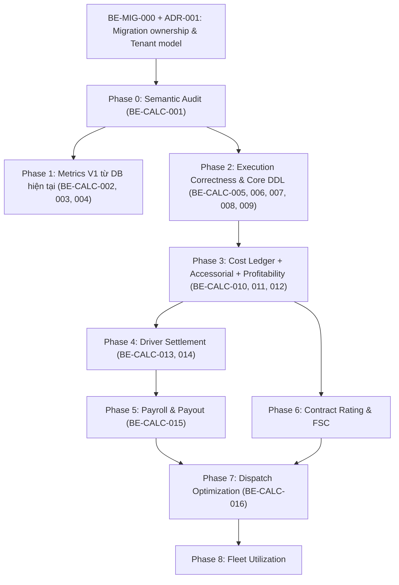

# LOGISTICSX TMS — KẾ HOẠCH CHUYỂN HÓA VÀ QUY CHUẨN CƠ SỞ DỮ LIỆU (PLAN-CONVENTION)
> **Phiên bản:** 3.0 (Implementation-Ready Enterprise Specification)  
> **Căn cứ tài liệu:** `LogisticsX_Core_Business_Data_Model_and_Calculation_Spec_v2_Schema_Aligned.md`  
> **Nền tảng công nghệ:** Spring Boot 3 / Spring Framework 6 / PostgreSQL 15+ / Hibernate JPA / Flyway Multi-Tenancy  
> **Mục tiêu:** Chuẩn hóa mô hình dữ liệu, khóa các quyết định kiến trúc còn mơ hồ, thiết lập conventions bắt buộc và biến từng Epic/Task thành specification đủ chi tiết để dev người hoặc AI triển khai mà không phải tự đoán business rule, transaction boundary, migration strategy, security hay acceptance criteria.

---

## MỤC LỤC

1. [TỔNG QUAN CHIẾN LƯỢC & NGUYÊN TẮC CHUYỂN HÓA](#1-tổng-quan-chiến-lược--nguyên-tắc-chuyển-hóa)
2. [BẢNG MA TRẬN ĐỐI SOÁT: KEEP / ALTER / NEW / DEPRECATE](#2-bảng-ma-trận-đối-soát-keep--alter--new--deprecate)
3. [HỆ THỐNG QUY CHUẨN KỸ THUẬT (ENGINEERING & DATA CONVENTIONS)](#3-hệ-thống-quy-chuẩn-kỹ-thuật-engineering--data-conventions)
   - [3.1 Quy chuẩn đặt tên (Naming Conventions)](#31-quy-chuẩn-đặt-tên-naming-conventions)
   - [3.2 Quy chuẩn kiểu dữ liệu (Data Type Conventions)](#32-quy-chuẩn-kiểu-dữ-liệu-data-type-conventions)
   - [3.3 Quy chuẩn Entity JPA & Tính bất biến (JPA & Immutability Conventions)](#33-quy-chuẩn-entity-jpa--tính-bất-biến-jpa--immutability-conventions)
   - [3.4 Quy chuẩn Toàn vẹn Tài chính & Khử sai số tiền tệ (Financial Integrity Guard)](#34-quy-chuẩn-toàn-vẹn-tài-chính--khử-sai-số-tiền-tệ-financial-integrity-guard)
   - [3.5 Quy chuẩn Quản lý Trạng thái & State Machine (Status Machine Conventions)](#35-quy-chuẩn-quản-lý-trạng-thái--state-machine-status-machine-conventions)
   - [3.6 Quy chuẩn Phản hồi Chỉ số (Metric Availability Conventions)](#36-quy-chuẩn-phản-hồi-chỉ-số-metric-availability-conventions)
   - [3.7 Quy chuẩn Quản lý Migration Flyway (Flyway Governance)](#37-quy-chuẩn-quản-lý-migration-flyway-flyway-governance)
4. [KẾ HOẠCH TRIỂN KHAI CHI TIẾT THEO TỪNG BUSINESS & TASK](#4-kế-hoạch-triển-khai-chi-tiết-theo-từng-business--task)
   - [Phase 0: Semantic Audit & Khảo sát nghiệp vụ kế thừa (BE-CALC-001)](#phase-0-semantic-audit--khảo-sát-nghiệp-vụ-kế-thừa-be-calc-001)
   - [Phase 1: Xây dựng Bộ chỉ số V1 từ CSDL hiện tại (BE-CALC-002 -> 004)](#phase-1-xây-dựng-bộ-chỉ-số-v1-từ-csdl-hiện-tại-be-calc-002---004)
   - [Phase 2: Chuẩn hóa Thực thi Vận hành & CSDL Cốt lõi (BE-CALC-005 -> 009)](#phase-2-chuẩn-hóa-thực-thi-vận-hành--csdl-cốt-lõi-be-calc-005---009)
   - [Phase 3: Sổ cái Chi phí Vận chuyển, Phụ phí & Lợi nhuận (BE-CALC-010 -> 012)](#phase-3-sổ-cái-chi-phí-vận-chuyển-phụ-phí--lợi-nhuận-be-calc-010---012)
   - [Phase 4: Quyết toán Thù lao Tài xế - Driver Settlement (BE-CALC-013 -> 014)](#phase-4-quyết-toán-thù-lao-tài-xế---driver-settlement-be-calc-013---014)
   - [Phase 5: Kỳ lương Chính thức, Phiếu lương & Chi trả (BE-CALC-015)](#phase-5-kỳ-lương-chính-thức-phiếu-lương--chi-trả-be-calc-015)
   - [Phase 6: Biểu giá Hợp đồng Khách hàng & Phụ phí Nhiên liệu (Rate Rules & FSC)](#phase-6-biểu-giá-hợp-đồng-khách-hàng--phụ-phí-nhiên-liệu-rate-rules--fsc)
   - [Phase 7: Tối ưu hóa Điều phối & Giải thuật Phân bổ Chuyến (BE-CALC-016)](#phase-7-tối-ưu-hóa-điều-phối--giải-thuật-phân-bổ-chuyến-be-calc-016)
   - [Phase 8: Giám sát Đội xe & Tỷ lệ Khai thác Lịch sử (Fleet Utilization)](#phase-8-giám-sát-đội-xe--tỷ-lệ-khai-thác-lịch-sử-fleet-utilization)
5. [LỘ TRÌNH FLYWAY MIGRATION DDL CHUẨN HÓA (V2 -> V14)](#5-lộ-trình-flyway-migration-ddl-chuẩn-hóa-v2---v14)
6. [CHIẾN LƯỢC MIGRATION AN TOÀN (EXPAND & CONTRACT PATTERN)](#6-chiến-lược-migration-an-toàn-expand--contract-pattern)
7. [MA TRẬN KIỂM THỬ (TEST MATRIX) & DEFINITION OF DONE (DoD)](#7-ma-trận-kiểm-thử-test-matrix--definition-of-done-dod)
8. [ARCHITECTURE DECISION GATES](#8-architecture-decision-gates--không-được-code-trước-khi-chốt)
9. [SECURITY & AUTHORIZATION MATRIX](#9-security--authorization-matrix)
10. [TRANSACTION, IDEMPOTENCY & OUTBOX CONVENTIONS](#10-transaction-idempotency--outbox-conventions)
11. [ERROR CONTRACT & HTTP SEMANTICS](#11-error-contract--http-semantics)
12. [OBSERVABILITY & AUDIT](#12-observability--audit)
13. [IMPLEMENTATION-READY TICKET TEMPLATE](#13-implementation-ready-ticket-template)
14. [CRITICAL INVARIANTS](#14-critical-invariants--devai-không-được-tự-suy-diễn)
15. [REVISED DEFINITION OF DONE](#15-revised-definition-of-done--production-ready)
16. [THỨ TỰ MERGE/RELEASE ĐỀ XUẤT](#16-thứ-tự-mergerelease-đề-xuất)

---

## CHANGELOG V3 — CÁC SỬA ĐỔI BẮT BUỘC SO VỚI V2

1. Thêm gate `BE-MIG-000` để xử lý ownership migration legacy -> Flyway trước V2.
2. Bắt buộc ADR tenant isolation trước khi tạo bảng mới.
3. Audit timezone legacy trước `TIMESTAMP -> TIMESTAMPTZ`.
4. Tách `shipment_costs.stage` thành `cost_basis` và `status`.
5. Sửa `ActualCost` để không double-count lifecycle.
6. Không hard-delete `trip_driver_assignments`.
7. `load_events` được định nghĩa là audit/event timeline, không gọi full Event Sourcing.
8. Snapshot chỉ bắt buộc cho persisted business decision, không phải mọi GET report.
9. Settlement hỗ trợ `ORIGINAL / ADJUSTMENT / REVERSAL`.
10. Settlement -> shipment cost project theo từng attributable line.
11. `LOCKED != PAID`; payment success mới tạo trạng thái PAID.
12. Bổ sung payment idempotency, provider unique reference và transactional outbox convention.
13. Không auto-deduplicate expense/maintenance trước khi có deterministic mapping.
14. Chuẩn hóa percentage ratio: `15.5% = 0.155000`.
15. Bỏ global `HALF_UP`; dùng `MoneyRoundingPolicy`.
16. Bỏ detention default 120/15 phút ở DB.
17. FSC được coi là policy theo hợp đồng, không phải universal formula.
18. Chuẩn hóa optimizer score direction/normalization.
19. Bổ sung Security/RBAC matrix và domain error contract.
20. Chuyển BE-CALC-014/015 thành Epic có sub-task implementation-ready.


---

## 1. TỔNG QUAN CHIẾN LƯỢC & NGUYÊN TẮC CHUYỂN HÓA

Hệ thống LogisticsX hiện tại đã sở hữu sẵn nền tảng CSDL nghiệp vụ phong phú (`V1__baseline_business_schema.sql` với hơn 50 bảng). Tuy nhiên, để đáp ứng tính toán chi phí thực tế (Costing), định giá (Rating), quyết toán thù lao tài xế (Settlement), khóa sổ lương (Payroll) và giải thuật điều phối tối ưu (Dispatch Optimization), hệ thống cần tiến hóa từ mô hình ghi đè trạng thái (state overwrite) sang mô hình **Event-driven, Snapshot-auditable và Financial Ledger**.

### 3 Nguyên tắc Chuyển hóa Cốt lõi:
1. **Reuse existing data first (Tái sử dụng tối đa CSDL hiện có)**: Không vứt bỏ hoặc tạo bảng trùng lặp nếu bảng hiện tại đang làm tốt vai trò gốc (Ví dụ: giữ nguyên `expenses`, không tạo thêm `expense_receipts`; giữ nguyên hệ thống `hos_logs`, `hos_violations`, `driver_hos_statuses`).
2. **Alter with care (Mở rộng có kiểm soát)**: Bổ sung các trường dữ liệu còn khuyết vào bảng hiện hữu để hoàn thiện ngữ nghĩa nghiệp vụ (Ví dụ: bổ sung phân loại dặm vào `trips`, bổ sung mốc thời gian bốc/dỡ vào `trip_stops`, gắn khóa ngoại định danh vào `expenses`).
3. **New only when necessary (Chỉ thêm bảng mới khi khái niệm nghiệp vụ chưa từng tồn tại)**: Tạo mới các bảng bắt buộc cho kiến trúc sổ cái và đối soát (`trip_driver_assignments`, `load_events`, `shipment_costs`, `calculation_snapshots`, `driver_pay_policies`, `settlements`, `payroll_runs`, `payslips`).
4. **Expand and Contract (Di trú dữ liệu có kiểm soát)**: Không xóa hoặc đổi tên trường đang chạy trên Production; chuyển đổi qua các bước: Thêm trường/bảng mới -> Dual-write khi thật sự cần -> Backfill có kiểm chứng -> Switch read -> Deprecated -> Contract ở phiên bản sau.
5. **Fail fast over silent drift**: Migration versioned phải thất bại khi schema thực tế khác với schema kỳ vọng. Không dùng `IF NOT EXISTS` đại trà để che schema drift.
6. **No hidden business defaults**: Tỷ lệ, detention free time, rounding rule, scoring weight, FSC base/MPG và các tolerance phải đến từ policy/config có version; không dùng magic number trong service hoặc DEFAULT ở DB nếu đó là business policy.
7. **Command changes state, event records history**: Client không được POST một event/status tùy ý để ép state. Application Service nhận business command, validate state transition, commit aggregate rồi append audit/event.
8. **LOCKED is not PAID**: `LOCKED` chỉ có nghĩa dữ liệu đã chốt bất biến. `PAID` chỉ được thiết lập sau khi giao dịch chi trả thành công hoặc được đối soát xác nhận.

---

## 2. BẢNG MA TRẬN ĐỐI SOÁT: KEEP / ALTER / NEW / DEPRECATE

| Phân nhóm nghiệp vụ | Bảng CSDL | Hành động | Lý do & Định hướng kỹ thuật |
|---|---|---|---|
| **Vận đơn & Chuyến xe** | `loads` | **KEEP** | Lưu trữ cốt lõi đơn hàng vận chuyển. Chưa đổi tên `delivery_cost_amount` khi chưa audit xong. |
| | `trips` | **ALTER** | Bổ sung `planned_distance_miles`, `actual_distance_miles`, `loaded_miles`, `empty_miles`. Giữ tạm `total_distance`. |
| | `trip_stops` | **ALTER** | Bổ sung `status`, `appointment_start`, `appointment_end`, `service_started_at`, `service_completed_at`, `departed_at` để tính Dwell/Detention. |
| | `trip_driver_assignments` | **NEW** | **Bắt buộc V1**. Lưu vết lịch sử gán tài xế vào chuyến xe theo thời gian thực. Chấm dứt việc dùng `trucks.main_driver_id` sai lệch lịch sử. |
| | `load_events` | **NEW** | **Bắt buộc V1**. Lưu vết timeline/audit vòng đời đơn hàng (tọa độ GPS, nguồn phát sinh). Đây là event history/audit log, **không tuyên bố full Event Sourcing** khi `loads` vẫn là aggregate/source of truth hiện hành. |
| **Đội xe & Nhân sự** | `trucks` | **KEEP** | Quản lý định danh, tình trạng và trang thiết bị đầu kéo. |
| | `employees` | **KEEP** | Quản lý hồ sơ nhân sự, tài xế và mức lương cơ bản (HR base salary / hourly). |
| | `driver_licenses` | **KEEP** | Quản lý giấy phép lái xe và thời hạn pháp lý. |
| | `hos_logs`, `hos_violations`, `driver_hos_statuses` | **KEEP** | Subsystem tuân thủ HOS/ELD cực kỳ tốt hiện có; tái sử dụng trực tiếp làm đầu vào cho Dispatch Optimizer. |
| | `eld_*_mappings`, `eld_provider_configurations` | **KEEP** | Cấu hình tích hợp thiết bị giám sát hành trình ELD. |
| | `driver_behavior_events` | **KEEP** | Dữ liệu sự kiện an toàn giao thông của tài xế. |
| | `time_entries` | **KEEP** | Nguồn chấm công theo giờ cho nhân sự/tài xế hưởng lương thời gian. |
| **Tài chính & Chi phí** | `expenses` | **ALTER** | Giữ nguyên làm nguồn tài chính chi phí vận hành. Bổ sung các FK: `load_id`, `trip_id`, `employee_id`, `maintenance_record_id`, `document_id`. |
| | `maintenance_records`, `maintenance_parts` | **KEEP** | Nguồn ghi nhận chi phí bảo dưỡng xe chính thống. Ngăn chặn tính trùng (double-count) với `expenses`. |
| | `maintenance_schedules` | **KEEP** | Kế hoạch bảo trì định kỳ của phương tiện. |
| | `invoices` | **KEEP + DEPRECATE** | Giữ vai trò Hóa đơn Phải thu Khách hàng (Customer AR). **DEPRECATE** các trường liên quan đến lương tài xế (`employee_id`, `period_*`, `total_hours_worked`, `total_distance_driven`). |
| | `invoice_line_items` | **KEEP** | Phân rã chi tiết doanh thu từng mục trên hóa đơn. |
| | `payments` | **KEEP** | Lưu vết thanh toán của khách hàng (AR). Không dùng bảng này để chi trả lương tài xế. |
| | `payment_links` | **KEEP** | Cổng thanh toán trực tuyến cho khách hàng. |
| **Sổ cái & Audit mới** | `shipment_costs` | **NEW** | **Bắt buộc V1/V2**. Sổ cái chi phí chuẩn hóa cấp Load/Trip. Nhập liệu từ `expenses`, `maintenance_records`, `settlements`. |
| | `calculation_snapshots` | **NEW** | **Bắt buộc V1/V2**. Bản chụp bất biến toàn bộ công thức, input, output, chính sách tính toán (Rating, Costing, Settlement, ETA). |
| | `accessorial_charges` | **NEW** | **Bắt buộc V2**. Quản lý phụ phí phát sinh (Detention, Layover, Lumper), tách bạch 3 cột: Phí thu khách, Chi phí công ty, Thù lao tài xế. |
| **Thù lao & Lương tài xế** | `driver_pay_policies` | **NEW** | Chính sách thù lao tài xế có phiên bản và ngày hiệu lực (Per-mile, Per-load, % Doanh thu, Hourly, Phụ cấp dừng đỗ). |
| | `pay_periods` | **NEW** | Chu kỳ chốt thù lao/lương (Tuần, Nửa tháng, Tháng). |
| | `settlements` | **NEW** | Bảng quyết toán thù lao chuyến/kỳ của tài xế kèm số liệu chốt và snapshot. |
| | `settlement_lines` | **NEW** | Chi tiết các dòng thù lao, thưởng, phụ cấp, khấu trừ, hoàn ứng. |
| | `payroll_runs` | **NEW** | Đợt chạy bảng lương chính thức cấp doanh nghiệp. |
| | `payroll_run_items` | **NEW** | Khoản lương chi tiết từng nhân sự trong đợt chạy lương. |
| | `payslips` | **NEW** | Phiếu lương chính thức của tài xế (Bất biến, có snapshot JSON và liên kết file PDF). |
| | `payroll_payments` | **NEW** | Sổ cái thanh toán chi trả lương (Tích hợp Stripe Payout/Bank Transfer). |
| **Định giá & Tối ưu** | `rate_rules` | **NEW** | Ma trận định giá hợp đồng vận chuyển, biểu giá sàn/trần và phụ phí nhiên liệu FSC. |
| | `optimization_runs` | **NEW** | Lưu vết các phiên chạy thuật toán điều phối tối ưu (Solver, Objectives, Inputs, Results). |
| | `optimization_assignments` | **NEW** | Chi tiết điểm số, lý do khả thi/từ chối và gợi ý ghép chuyến của thuật toán. |
| | `vehicle_status_events` | **NEW (Optional)** | Lưu vết biến động trạng thái xe theo thời gian để tính toán Tỷ lệ khai thác xe (Utilization %). |

---

## 3. HỆ THỐNG QUY CHUẨN KỸ THUẬT (ENGINEERING & DATA CONVENTIONS)

Mọi thay đổi CSDL và viết code backend trong dự án **bắt buộc tuân thủ 100%** các quy chuẩn dưới đây:

### 3.1 Quy chuẩn đặt tên (Naming Conventions)

#### CSDL (PostgreSQL):
- **Tên bảng**: Danh từ số nhiều, chữ thường, phân cách dấu gạch dưới (`snake_case`).  
  *Ví dụ:* `trip_driver_assignments`, `calculation_snapshots`, `driver_pay_policies`.
- **Tên cột**: Chữ thường, phân cách dấu gạch dưới (`snake_case`). Không dùng dấu cách, không viết hoa lạc đà, không dùng từ khóa SQL làm tên trần (nếu có phải đặt rõ nghĩa: dùng `assignment_order` thay vì `order`, dùng `trip_number` thay vì `number`).
- **Khóa chính**: Luôn đặt tên là `id`, kiểu `UUID`.
- **Khóa ngoại**: `<tên_bảng_số_ít>_id`.  
  *Ví dụ:* `load_id`, `trip_id`, `driver_id`, `pay_period_id`.
- **Chỉ mục (Index)**:
  - B-tree thông thường: `ix_<tên_bảng>_<tên_cột_1>[_<tên_cột_2>]`.
  - Khóa duy nhất (Unique): `uq_<tên_bảng>_<tên_cột_1>[_<tên_cột_2>]`.
  - Khóa ngoại: `fk_<tên_bảng_nguồn>_<tên_bảng_đích>`.
- **Cột thời gian**: Kết thúc bằng `_at` nếu là mốc thời gian có múi giờ (`occurred_at`, `departed_at`), kết thúc bằng `_date` nếu là ngày thuần túy (`start_date`, `effective_from`).

#### Lớp Ứng dụng (Java / Spring Boot):
- **Entity**: Viết hoa lạc đà (`PascalCase`), số ít (`TripDriverAssignment`, `CalculationSnapshot`, `ShipmentCost`).
- **Repository**: `<EntityName>Repository` (`TripDriverAssignmentRepository`).
- **Service Interface**: `<BusinessArea>Service` hoặc `<Concept>Engine` (`DriverPayEngine`, `ProfitabilityService`).
- **DTOs**: `<BusinessAction>[Request|Response|Dto]` (`CalculateSettlementRequest`, `LoadProfitabilityResponse`).
- **Enum**: Viết hoa cách nhau dấu gạch dưới (`UPPER_SNAKE_CASE`), gom cụm theo domain logic.

---

### 3.2 Quy chuẩn kiểu dữ liệu (Data Type Conventions)

| Nhóm nghiệp vụ | Kiểu dữ liệu PostgreSQL | Kiểu dữ liệu Java | Quy định đặc thù |
|---|---|---|---|
| **Số tiền (Money)** | `NUMERIC(19,4)` | `java.math.BigDecimal` | **TUYỆT ĐỐI CẤM** dùng `double` hoặc `float`. Mọi số tiền luôn đi kèm cột tiền tệ `currency VARCHAR(3)` (ISO-4217: USD, VND, EUR). |
| **Đơn giá / Tỷ lệ chi tiết** | `NUMERIC(19,6)` | `java.math.BigDecimal` | Dùng cho đơn giá dặm ($/mile), tỷ giá quy đổi, trọng số tối ưu. |
| **Tỷ lệ / Percentage ratio** | `NUMERIC(9,6)` | `java.math.BigDecimal` | **Quy ước duy nhất:** lưu ratio trong khoảng `[0,1]`. Ví dụ 15.5% phải lưu `0.155000`. API/UI tự chuyển thành `15.5%` khi hiển thị. DB/service không được trộn hai cách biểu diễn. |
| **Khoảng cách (Distance)** | `NUMERIC(12,3)` | `java.math.BigDecimal` | Đơn vị đo dặm (Miles) hoặc km. Lưu chính xác đến 3 chữ số thập phân (1/1000 dặm). |
| **Tọa độ GPS** | `DOUBLE PRECISION` | `java.lang.Double` | Vĩ độ (`latitude`) và Kinh độ (`longitude`) sử dụng tọa độ WGS-84. |
| **Mốc thời gian tuyệt đối** | `TIMESTAMPTZ` | `java.time.Instant` | Persist một instant tuyệt đối; DB/session chuẩn hóa UTC. Dùng `OffsetDateTime` ở API chỉ khi offset là dữ liệu nghiệp vụ cần giữ/hiển thị. **Không tự đổi TIMESTAMP legacy sang TIMESTAMPTZ trước khi audit timezone semantics.** |
| **Ngày (Date)** | `DATE` | `java.time.LocalDate` | Dùng cho kỳ lương, ngày hiệu lực chính sách. |
| **Dữ liệu tài liệu / Payload** | `JSONB` | `java.lang.String` hoặc Record/POJO với `@JdbcTypeCode(SqlTypes.JSON)` | Dùng cho `input_json`, `result_json`, `snapshot_json`. Cho phép đánh chỉ mục GIN khi cần query sâu. |
| **Khóa chính** | `UUID` | `java.util.UUID` | Khởi tạo qua v4 UUID (`@UuidGenerator` hoặc `gen_random_uuid()`). |

---

### 3.3 Quy chuẩn Entity JPA & Tính bất biến (JPA & Immutability Conventions)

1. **Audit theo loại aggregate**:
   - Aggregate mutable: kế thừa `BaseAuditableEntity` với `created_at`, `created_by`, `last_modified_at`, `last_modified_by`.
   - Ledger/snapshot immutable: chỉ cần `created_at`, `created_by` và metadata nghiệp vụ; không tạo `last_modified_*` chỉ để cho đủ form.
   - Mọi thay đổi trạng thái tài chính phải lưu `approved_at/by`, `locked_at/by`, `posted_at/by`, `paid_at/by` khi trạng thái tương ứng tồn tại.
2. **Khóa Lạc quan (Optimistic Locking)**:
   - Các bảng tài chính, quyết toán, bảng lương có thao tác xét duyệt đồng thời **phải có trường `@Version private Long version;`** (`settlements`, `payroll_runs`, `shipment_costs`, `accessorial_charges`, `driver_pay_policies`).
   - Ngăn chặn triệt để trường hợp 2 kế toán viên cùng duyệt/sửa đè dữ liệu tài chính của nhau.
3. **Quy tắc Bất biến (Financial Immutability Gate)**:
   - Khi một bản ghi tài chính chuyển sang trạng thái chốt (`LOCKED`, `POSTED`, `PAID`):
     - **CẤM UPDATE TRỰC TIẾP** vào các cột số tiền, dặm, đơn giá.
     - Mọi điều chỉnh sau khi khóa sổ phải được thực hiện thông qua bản ghi điều chỉnh (Adjustment / Reversal Record) ở kỳ tiếp theo.
     - Entity/Application Service phải ném **domain exception có mã lỗi ổn định** như `FinancialAggregateLockedException`; không dùng `IllegalStateException` làm API contract.
4. **Fetch Type**: Toàn bộ quan hệ `@ManyToOne` và `@OneToOne` mặc định dùng `fetch = FetchType.LAZY` để tránh N+1 Query.

---

### 3.4 Quy chuẩn Toàn vẹn Tài chính & Khử sai số tiền tệ (Financial Integrity Guard)

Mọi thao tác tài chính phải tuân thủ nghiêm ngặt các bất biến toán học sau:

#### Bất biến 1: Đối soát Hóa đơn Khách hàng (Customer Invoice Reconciliation)
$$\text{Invoice.subtotal} \equiv \sum_{i=1}^{n} \text{InvoiceLineItem}_i\text{.amount}$$
$$\text{Invoice.total} \equiv \text{Invoice.subtotal} + \text{Invoice.tax\_amount}$$
$$\text{CustomerOpenBalance} \equiv \text{Invoice.total} - \sum \text{EligibleCompletedPayments.amount}$$
> **Quy định:** Không dùng sai số $\epsilon$ (epsilon) tùy tiện cho tiền bạc. Sai lệch quá 0 đơn vị nhỏ nhất (minor unit) phải kích hoạt `InvoiceReconciliationException`.

#### Bất biến 2: Đối soát Quyết toán Lương Tài xế (Driver Settlement Reconciliation)
$$\text{GrossEarnings} \equiv \sum \text{SettlementLines (EARNING)}$$
$$\text{TotalDeductions} \equiv \sum \text{SettlementLines (DEDUCTION)}$$
$$\text{TotalReimbursements} \equiv \sum \text{SettlementLines (REIMBURSEMENT)}$$
$$\text{SettlementNet} \equiv \text{GrossEarnings} - \text{TotalDeductions} + \text{TotalReimbursements}$$
> **Quy định:** Phân lớp dòng chi phí bằng Enum tường minh `SettlementLineClass` (`EARNING`, `DEDUCTION`, `REIMBURSEMENT`), không dùng các cờ boolean chồng chéo.

#### Bất biến 3: Phòng chống Tính trùng Chi phí (Double-Count Prevention)
Một khoản chi phí sửa chữa/bảo dưỡng xe nếu đã ghi nhận trong `maintenance_records` thì bản ghi thanh toán tương ứng trong `expenses` phải được liên kết qua khóa ngoại `expenses.maintenance_record_id`.
> **Quy tắc tính toán:** Khi tổng hợp chi phí vận hành (Total Operating Cost), hệ thống chỉ được lấy giá trị từ một nguồn duy nhất (hoặc `maintenance_records` hoặc `expenses`), tuyệt đối không `SUM()` cả 2 bảng dẫn đến đội khống chi phí gấp đôi.

#### Bất biến 4: Hàng rào Tiền tệ (Currency Guard)
**TUYỆT ĐỐI CẤM** cộng các giá trị khác loại tiền tệ (ví dụ: $1,000\text{ USD} + 5,000,000\text{ VND}$).
Mọi phép tính tổng hợp nhiều dòng tiền tệ phải:
1. Lọc theo đồng tiền báo cáo (`WHERE currency = :reportCurrency`), hoặc
2. Nhóm theo đồng tiền (`GROUP BY currency`), hoặc
3. Đi qua một Động cơ Quy đổi Tỷ giá chính thức (`FxConversionService`) có lưu version và ngày áp dụng tỷ giá.

#### Bất biến 5: Rounding Policy
- Không hard-code `RoundingMode.HALF_UP` cho toàn hệ thống.
- Tạo `MoneyRoundingPolicy`/`CurrencyScaleProvider`.
- Rounding boundary phải được xác định theo loại phép tính: invoice line, tax, settlement, payroll, FX.
- Reconciliation so sánh **sau rounding tại business boundary đã định nghĩa**.
- Mọi calculator phải nhận hoặc resolve rounding policy, không tự gọi `setScale(2, ...)` rải rác.

#### Bất biến 6: Idempotency cho dữ liệu tài chính
Các command có thể bị retry phải có idempotency key hoặc business/provider unique key:
- generate invoice;
- ingest expense/provider event;
- calculate/persist settlement;
- create payroll payment;
- provider webhook/callback;
- project source transaction sang `shipment_costs`.

Duplicate request phải trả lại kết quả cũ hoặc no-op an toàn, không tạo dòng tiền thứ hai.

---

### 3.5 Quy chuẩn Quản lý Trạng thái & State Machine (Status Machine Conventions)

Mọi quá trình chuyển đổi trạng thái phải được định nghĩa bằng State Pattern hoặc Service kiểm soát chuyển dịch hợp lệ. Không cho phép Controller nhận trạng thái tùy ý từ Client và lưu thẳng vào CSDL.

```
Vòng đời Settlement:
DRAFT -> CALCULATED -> VALIDATION_REQUIRED -> IN_REVIEW -> APPROVED -> LOCKED -> PAYMENT_SCHEDULED -> PAID
              |                 |                 |
              +-> DRAFT         +-> REJECTED      +-> VOIDED/ADJUSTMENT theo policy

Quy tắc bắt buộc:
- `LOCKED != PAID`.
- Settlement chỉ `PAID` sau khi payroll/payment liên quan đã `SUCCEEDED` hoặc được đối soát xác nhận.
- Sau `LOCKED`, sửa sai bằng `ADJUSTMENT`/`REVERSAL`, không mở khóa để sửa amount.

Vòng đời Payroll Run:
DRAFT -> CALCULATING -> CALCULATED -> REVIEWED -> APPROVED -> LOCKED -> PROCESSING_PAYMENT -> PAID
                             |                     |                 |
                             +-> FAILED             +-> REJECTED      +-> PAYMENT_FAILED

Vòng đời Payroll Payment:
PENDING -> SCHEDULED -> PROCESSING -> SUCCEEDED
                         |
                         +-> FAILED -> RETRY_SCHEDULED

Vòng đời Trip Stop:
PENDING -> EN_ROUTE -> ARRIVED -> SERVICE_STARTED -> SERVICE_COMPLETED -> DEPARTED

Client không được gửi trực tiếp một `status` tùy ý; command endpoint quyết định transition hợp lệ.
```

---

### 3.6 Quy chuẩn Phản hồi Chỉ số (Metric Availability Conventions)

Khi CSDL hiện tại chưa có đủ dữ liệu thành phần (mẫu số hoặc nguồn đối soát):
- **CẤM TRẢ VỀ SỐ 0 GIẢ MẠO (Fake Zero)** cho các chỉ số quan trọng (như Profit, Margin, CPM, Loaded/Empty Ratio).
- Bắt buộc trả về DTO chuẩn hóa với trạng thái khả dụng rõ ràng:

```java
public enum MetricAvailability {
    AVAILABLE,      // Đầy đủ dữ liệu, công thức chạy 100% tin cậy
    PARTIAL,        // Chỉ tính được 1 phần (ví dụ Known Operating Cost chưa có Driver Pay)
    UNAVAILABLE,    // Thiếu dữ liệu cốt lõi (ví dụ chưa có quãng đường dặm)
    NOT_APPLICABLE  // Không áp dụng cho đối tượng này
}
```

*Ví dụ Payload JSON trả về cho API Báo cáo:*
```json
{
  "code": "LOAD_PROFITABILITY",
  "value": null,
  "availability": "PARTIAL",
  "basis": "RECORDED_REVENUE_WITHOUT_COMPLETE_ALLOCATED_COST",
  "reason": "DRIVER_SETTLEMENT_AND_MAINTENANCE_ALLOCATION_NOT_RECORDED"
}
```

---

### 3.7 Quy chuẩn Quản lý Migration Flyway (Flyway Governance)

#### 3.7.1 Ownership gate — bắt buộc hoàn thành trước V2
Database hiện hữu có lịch sử migration kế thừa. Trước khi Spring/Flyway trở thành owner schema, phải hoàn thành `BE-MIG-000`:

1. Xác định hệ migration cũ còn được phép mutate schema hay đã đóng băng.
2. Chọn duy nhất một schema owner cho production.
3. Baseline database hiện hữu vào Flyway tại version được phê duyệt.
4. Kiểm thử cả:
   - bootstrap database trắng;
   - upgrade database production-like đã có dữ liệu.
5. Không được để hai migration engine đồng thời sở hữu cùng một schema.

#### 3.7.2 Tenant isolation ADR
Trước migration mới phải có `ADR-001-tenant-isolation.md`, chọn **một** mô hình:

```text
DATABASE_PER_TENANT
SCHEMA_PER_TENANT
SHARED_SCHEMA_WITH_TENANT_ID
```

Nếu shared schema:
- mọi bảng business mới phải có `tenant_id`;
- unique/index phải bao gồm tenant khi cần;
- repository/query bắt buộc tenant scoping.

Nếu schema/database per tenant:
- migration runner phải chứng minh migrate được tất cả tenant;
- failure của một tenant phải có recovery/reporting rõ ràng.

#### 3.7.3 Vị trí và naming
Migration tenant:
`src/main/resources/db/migration/tenant/`

Tên:
`V{version}__{short_english_description}.sql`

Ví dụ:
`V2__create_trip_driver_assignments.sql`

#### 3.7.4 Versioned migration là immutable
- Đã merge/chạy ở bất kỳ environment nào => **không sửa file cũ**.
- Sửa lỗi bằng migration kế tiếp.

#### 3.7.5 Fail-fast mặc định
Versioned migration **không bắt buộc và không nên mặc định** dùng:

```sql
CREATE TABLE ...
ADD COLUMN ...
```

Lý do: câu lệnh idempotent có thể che schema drift hoặc thay đổi tay ngoài Flyway.

Quy tắc:
- migration bình thường: mô tả chính xác expected previous schema và fail nếu không đúng;
- `IF EXISTS/IF NOT EXISTS` chỉ dùng có chủ đích cho repair/compatibility migration, kèm comment giải thích;
- pipeline staging phải chạy `flyway validate`.

#### 3.7.6 Expand/Backfill/Switch/Contract
Mỗi thay đổi destructive hoặc đổi semantic phải tách tối thiểu:

```text
EXPAND
BACKFILL + VERIFY
SWITCH READ/WRITE
CONTRACT (release sau)
```

Backfill phải:
- resumable/idempotent;
- có row count / checksum / reconciliation;
- không giữ transaction/table lock quá lâu;
- có dry-run/report nếu dữ liệu lớn.

#### 3.7.7 Timezone migration gate
Legacy `TIMESTAMP` chỉ được đổi thành `TIMESTAMPTZ` sau khi Phase 0 xác minh giá trị lịch sử được ghi theo UTC hay local timezone. Không được dùng `ALTER ... TYPE TIMESTAMPTZ` mù quáng.


---

## 4. KẾ HOẠCH TRIỂN KHAI CHI TIẾT THEO TỪNG BUSINESS & TASK

Lộ trình được chia làm 9 Phase (từ Phase 0 đến Phase 8) bao phủ toàn bộ 16 backend tickets (`BE-CALC-001` đến `BE-CALC-016`), đảm bảo chuyển hóa từng bước mà không làm gián đoạn hệ thống hiện tại.



---

### Phase 0: Semantic Audit & Khảo sát nghiệp vụ kế thừa (BE-CALC-001)

#### 1. Mục tiêu kinh doanh:
Làm rõ bản chất ngữ nghĩa của các trường dữ liệu mơ hồ trong CSDL hiện hữu trước khi viết code logic tính toán. Tuyệt đối không giả định ngầm.

#### 2. Danh sách Task chi tiết:
- [x] **Task 0.1**: Rà soát cột `loads.distance` trong mã nguồn Java hiện tại:
  - Xác minh xem giá trị này là dặm định tuyến dự kiến (planned routing), dặm báo giá khách (quoted miles) hay dặm GPS thực tế (actual miles).
  - Tạm thời gán nhãn ngữ nghĩa là `recordedLoadDistance` trong DTO báo cáo.
- [x] **Task 0.2**: Rà soát cột `trips.total_distance`:
  - Tìm toàn bộ các hàm đang ghi dữ liệu vào trường này. Xác định nguồn phát sinh (tính từ Google Maps API, OSRM hay tài xế tự gõ).
- [x] **Task 0.3**: Rà soát cột `loads.delivery_cost_amount` & `loads.delivery_cost_currency`:
  - Kiểm tra xem đây là doanh thu báo khách (quoted revenue), chi phí ước tính (estimated cost) hay cước trả nhà xe phụ (carrier cost).
  - **Quy tắc an toàn**: CẤM đưa trường này vào công thức tính lợi nhuận (Profit) chừng nào chưa có tài liệu xác nhận nghiệp vụ.
- [x] **Task 0.4**: Kiểm kê toàn bộ giá trị Enum thực tế trong mã nguồn:
  - Enum `InvoiceStatus`, `InvoiceType`.
  - Enum `ExpenseCategory`, `ExpenseType`, `TruckExpenseCategory`.
  - Enum `EmployeeSalaryType` (Salary, Hourly, Mileage...).
  - Enum `TripStatus`, `LoadStatus`.
- [x] **Task 0.5**: Audit timezone semantics cho toàn bộ cột `TIMESTAMP` legacy:
  - Xác định timestamp đang được ghi dưới UTC hay timezone local.
  - Không đổi type sang `TIMESTAMPTZ` trước khi có kết luận.
- [x] **Task 0.6**: Audit multi-tenancy:
  - Xác nhận mô hình tenant theo `ADR-001`.
  - Xác định bảng nào tenant-local và bảng nào global.
- [x] **Task 0.7**: Audit migration ownership:
  - Xác định lịch sử migration legacy và điểm baseline Flyway.
  - Hoàn thành `BE-MIG-000` trước khi merge `V2`.
- [x] **Đầu ra (Deliverables)**:
  - `docs/current-domain-semantics.md`
  - `docs/adr/ADR-001-tenant-isolation.md`
  - `docs/adr/ADR-002-migration-ownership.md`
  - `docs/legacy-timezone-semantics.md`.

---

### Phase 1: Xây dựng Bộ chỉ số V1 từ CSDL hiện tại (BE-CALC-002 -> 004)

#### 1. Mục tiêu kinh doanh:
Cung cấp ngay lập tức các báo cáo tài chính, chi phí và vận hành khả dụng từ CSDL hiện có mà chưa cần can thiệp thay đổi cấu trúc bảng lớn.

#### 2. Danh sách Task chi tiết:
- [x] **Task 1.1 (BE-CALC-002 - Doanh thu & Công nợ Khách hàng)**:
  - Tạo service `RevenueCalculator`: Tính tổng doanh thu đơn hàng từ các hóa đơn hợp lệ (`invoices.subtotal_amount` where `load_id = :id`).
  - Tạo service `InvoiceReconciliationService`: Kiểm tra tính đúng đắn giữa `subtotal` và tổng `invoice_line_items`.
  - Tạo service `CustomerBalanceCalculator`: Tính số tiền khách đã thanh toán (`payments`) và dư nợ còn lại (`open_balance`).
  - Bổ sung `CurrencyGuard` ngăn chặn tính toán sai khác đồng tiền.
  - Endpoints:
    - `GET /api/reports/revenue`
    - `GET /api/customers/{customerId}/balance`
    - `GET /api/reports/financials/monthly`
- [x] **Task 1.2 (BE-CALC-003 - Hiệu suất Vận hành OTD & Độ trễ)**:
  - Tạo service `OnTimeCalculator`: Đánh giá giao hàng đúng hẹn dựa trên `loads.requested_delivery_date` và `loads.delivered_at`.
  - Tạo service `TransitTimeCalculator`: Tính thời gian vận chuyển (`delivered_at - picked_up_at`).
  - Tạo service `DelayCalculator`: Thống kê số phút trễ hẹn và tỷ lệ giao trễ.
  - Tạo service `ExceptionMetricsService`: Đo lường số lượng sự cố (`load_exceptions`) và thời gian xử lý sự cố (`resolved_at - occurred_at`).
  - Endpoints:
    - `GET /api/reports/operations/on-time-delivery`
    - `GET /api/reports/operations/delays`
    - `GET /api/reports/operations/exceptions-summary`
- [x] **Task 1.3 (BE-CALC-004 - Chi phí Vận hành Hiện hữu & Chống tính trùng)**:
  - Tạo service `ExpenseReportService`: Tổng hợp chi phí đã duyệt từ bảng `expenses` theo chủng loại (Nhiên liệu, Cầu đường, Bến bãi...).
  - Tạo service `MaintenanceReportService`: Tổng hợp chi phí sửa chữa từ `maintenance_records` (`labor_cost + parts_cost`).
  - **Không tự động suy đoán duplicate ở Phase 1** bằng amount/date/vendor.
  - Trả riêng `ExpenseOperatingCost` và `MaintenanceCost`.
  - Nếu bắt buộc có combined metric trước Phase 2, trả `availability = PARTIAL` và reason `DUPLICATE_SOURCE_NOT_FULLY_RECONCILED`.
  - Chỉ kích hoạt `DoubleCountPreventionPolicy` deterministic sau khi có `expenses.maintenance_record_id` hoặc reconciliation mapping được xác nhận.
  - Tính toán chỉ số Chi phí Vận hành Đã biết (`KnownOperatingCost` và `KnownOperatingCPM` đi kèm cờ `driverCostIncluded: false`).
  - Endpoints:
    - `GET /api/reports/expenses`
    - `GET /api/reports/fleet/fuel`
    - `GET /api/reports/fleet/maintenance`
    - `GET /api/reports/costs/known-operating-cpm`
  - **Tiến độ:** Hoàn thành theo trạng thái khả dụng an toàn của Phase 1: expense và maintenance được trả tách riêng; maintenance currency không có trong schema nên được gắn `PARTIAL` thay vì suy đoán; monthly combined amount không phát hành khi không thể đối chiếu currency; known CPM không dùng legacy distance và báo `PARTIAL` với phần maintenance bị loại trừ. Không có heuristic duplicate; V5 đã cung cấp khóa `expenses.maintenance_record_id` cho đối soát deterministic khi currency cho phép kết hợp nguồn.

---

### Phase 2: Chuẩn hóa Thực thi Vận hành & CSDL Cốt lõi (BE-CALC-005 -> 009)

#### 1. Mục tiêu kinh doanh:
Tạo dựng nền móng CSDL chuẩn hóa cho việc truy vết lịch sử điều phối, phân rã quãng đường, tính toán lưu bãi (detention) và kiểm toán snapshot.

#### 2. Danh sách Task chi tiết:
- [x] **Task 2.1 (BE-CALC-005 - Lịch sử Phân công Tài xế Chuyến xe)**:
  - Viết Flyway Migration `V2__create_trip_driver_assignments.sql`.
  - Tạo Entity `TripDriverAssignment`: Lưu quan hệ nhiều-nhiều giữa `Trip` và `Employee` (Driver) theo khoảng thời gian hiệu lực (`effective_from`, `effective_to`), vai trò (`PRIMARY`, `SECONDARY`, `TEAM`, `RELIEF`).
  - Cập nhật logic màn hình Dispatch: Khi điều phối gán tài xế vào chuyến, tạo bản ghi snapshot vào bảng này.
  - CẤM lấy `trucks.main_driver_id` để tính thù lao lịch sử.
  - Endpoints:
    - `GET /api/trips/{tripId}/drivers`
    - `POST /api/trips/{tripId}/drivers`
    - `POST /api/trips/{tripId}/drivers/{assignmentId}/unassign` -> đóng assignment bằng `effective_to`, **không hard-delete lịch sử**
- [x] **Task 2.2 (BE-CALC-006 - Phân rã Quãng đường Chuyến xe)**:
  - Viết Flyway Migration `V3__add_trip_mileage_breakdown.sql`: Thêm vào bảng `trips` các cột:
    - `planned_distance_miles NUMERIC(12,3)`
    - `actual_distance_miles NUMERIC(12,3)`
    - `loaded_miles NUMERIC(12,3)`
    - `empty_miles NUMERIC(12,3)`
  - Cập nhật Entity `Trip`.
  - Tạo service tính toán tỷ lệ dặm chạy có hàng vs dặm chạy rỗng:
    $$\text{LoadedMilePercent} = \frac{\text{loaded\_miles}}{\text{actual\_distance\_miles}} \times 100$$
    $$\text{EmptyMilePercent} = \frac{\text{empty\_miles}}{\text{actual\_distance\_miles}} \times 100$$
- [x] **Task 2.3 (BE-CALC-007 - Mốc thời gian Thực thi Điểm dừng)**:
  - Viết Flyway Migration `V4__extend_trip_stops_execution.sql`: Thêm vào bảng `trip_stops`:
    - `status VARCHAR(40)`
    - `appointment_start TIMESTAMPTZ`, `appointment_end TIMESTAMPTZ`
    - `service_started_at TIMESTAMPTZ`, `service_completed_at TIMESTAMPTZ`, `departed_at TIMESTAMPTZ`
  - Cập nhật Entity `TripStop`.
  - Viết API cập nhật tiến độ trạm cho tài xế/điều phối:
    - `POST /api/trip-stops/{id}/arrive` -> Cập nhật `arrived_at`, chuyển status = `ARRIVED`.
    - `POST /api/trip-stops/{id}/start-service` -> Cập nhật `service_started_at`, status = `SERVICE_STARTED`.
    - `POST /api/trip-stops/{id}/complete-service` -> Cập nhật `service_completed_at`, status = `SERVICE_COMPLETED`.
    - `POST /api/trip-stops/{id}/depart` -> Cập nhật `departed_at`, status = `DEPARTED`.
  - Tính thời gian chờ tại điểm (Dwell Time) = `departed_at - arrived_at`.
- [x] **Task 2.4 (BE-CALC-008 - Gắn định danh cho Chi phí Vận hành)**:
  - Viết Flyway Migration `V5__extend_expenses_attribution.sql`: Bổ sung các cột khóa ngoại vào `expenses`:
    - `load_id UUID REFERENCES loads(id)`
    - `trip_id UUID REFERENCES trips(id)`
    - `employee_id UUID REFERENCES employees(id)`
    - `maintenance_record_id UUID REFERENCES maintenance_records(id)`
    - `document_id UUID REFERENCES documents(id)`
  - Cập nhật Entity `Expense` và Repository. Cho phép gắn trực tiếp hóa đơn dầu/vé cầu đường vào đơn hàng hoặc chuyến xe cụ thể.
- [x] **Task 2.5 (Load Event Timeline & Audit Log)**:
  - Viết Flyway Migration `V6__create_load_events.sql`: Tạo bảng `load_events` ghi nhận toàn bộ dòng sự kiện:
    - `load_id`, `trip_id`, `trip_stop_id`, `event_type`, `previous_status`, `new_status`, `occurred_at`, `latitude`, `longitude`, `source`, `actor_id`, `note`.
  - Tạo Entity `LoadEvent` và `LoadTimelineService`.
  - Endpoints:
    - `GET /api/loads/{id}/timeline`
    - Event audit chủ yếu được sinh **nội bộ** sau business command. Chỉ cung cấp endpoint ingest riêng cho trusted integration nếu cần; không cho client tự set `new_status` tùy ý.
- [x] **Task 2.6 (BE-CALC-009 - Hạ tầng Snapshot Tính toán Bất biến)**:
  - Viết Flyway Migration `V7__create_calculation_snapshots.sql`: Tạo bảng `calculation_snapshots`.
  - Lưu trữ: `entity_type`, `entity_id`, `calculation_type`, `engine_name`, `engine_version`, `policy_id`, `policy_version`, `input_json`, `result_json`, `checksum`, `calculated_at`.
  - Xây dựng `CalculationSnapshotService`.
  - **Bắt buộc snapshot** khi kết quả trở thành business decision/persisted financial fact: accepted rating, persisted cost estimate/allocation, settlement, payroll, optimization run, ETA prediction cần đánh giá lịch sử.
  - **Không snapshot mặc định** cho GET dashboard/report thuần đọc hoặc preview tạm thời để tránh phình dữ liệu.

---

### Phase 3: Sổ cái Chi phí Vận chuyển, Phụ phí & Lợi nhuận (BE-CALC-010 -> 012)

#### 1. Mục tiêu kinh doanh:
Chuyển đổi toàn bộ chi phí rời rạc thành một sổ cái chi phí chuẩn hóa cấp đơn hàng (`shipment_costs`), bóc tách phụ phí khách hàng vs thù lao tài xế, và tự động hóa tính lãi lỗ thực tế từng đơn hàng (True Profitability & P&L).

#### 2. Danh sách Task chi tiết:
- [x] **Task 3.1 (BE-CALC-010 - Sổ cái Chi phí Vận chuyển Canonical)**:
  - Flyway tạo bảng `shipment_costs` (đã triển khai trong migration canonical `V9__create_shipment_costs_and_accessorial_charges.sql`; V8 được dùng cho forward-fix bảo toàn lịch sử assignment ở Task 2.1, không được tái sử dụng version).
  - Cột: `load_id`, `trip_id`, `truck_id`, `driver_id`, `category` (FUEL, DRIVER, TOLL, MAINTENANCE, ACCESSORIAL...), `cost_basis` (ESTIMATE, ACCRUAL, ACTUAL) và `status` (DRAFT, VERIFIED, APPROVED, POSTED, VOIDED), `source_type` (EXPENSE, MAINTENANCE_RECORD, DRIVER_SETTLEMENT, ALLOCATION), `source_id`, `amount`, `currency`.
  - Xây dựng `ShipmentCostEngine`: Tự động đồng bộ các bản ghi `expenses` (đã duyệt) có gắn `load_id` sang `shipment_costs` với `cost_basis = ACTUAL`, trạng thái workflow ban đầu theo policy (`DRAFT/VERIFIED`).
  - Xây dựng `CostAllocator`: Phân bổ chi phí bảo dưỡng xe theo tỷ lệ dặm đơn hàng:
    $$\text{AllocatedMaintenance} = \text{LoadEligibleMiles} \times \text{TruckMaintenanceCPM}$$
  - **Đã kiểm chứng 2026-10-03:** Approval command có RBAC, audit actor từ authentication và transaction/row lock; retry đồng thời chỉ sinh một ACTUAL/VERIFIED cost; xung đột ledger rollback approval. Allocation dùng explicit V3 actual miles/truck lịch sử, từ chối multi-load/multi-truck hoặc thiếu miles, CPM nhập tay là ESTIMATE; snapshot lưu đầy đủ input/rounding version và retry không tạo thêm snapshot. V12 forward-fix tên audit legacy để JPA runtime khớp schema, không sửa V1–V11. PostgreSQL clean V1–V12 và upgrade V11–V12/full startup PASS; Maven 65 tests, 0 failures/errors, 1 legacy test skipped (startup được integration test mới thay thế). Contract: `docs/cost-ledger-contracts.md`. Các lỗi Phase 1 phát hiện qua regression đã sửa trước khi đóng Task 3.1; xem `docs/reporting-contracts.md`.
- [x] **Task 3.2 (BE-CALC-012 - Quản lý Phụ phí & Tính toán Lưu bãi/Detention)**:
  - Bảng `accessorial_charges` đã nằm trong migration canonical `V9__create_shipment_costs_and_accessorial_charges.sql`; không tạo V9 thứ hai hoặc sửa migration đã áp dụng.
  - Tách bạch 3 cột số tiền:
    - `customer_amount NUMERIC(19,4)` (Phí thu khách hàng)
    - `company_cost_amount NUMERIC(19,4)` (Chi phí thực công ty chịu)
    - `driver_pay_amount NUMERIC(19,4)` (Thù lao bồi dưỡng cho tài xế)
  - Xây dựng `DetentionCalculator`:
    - Tính thời gian chờ thực tế = `DwellMinutes = departed_at - arrived_at`.
    - Tính phút vượt định mức = $\max(0, \text{DwellMinutes} - \text{FreeMinutes})$.
    - Tính tiền detention theo Block (ví dụ mỗi block 15 hoặc 30 phút) hoặc theo giờ liên tục.
  - Endpoints:
    - `POST /api/loads/{loadId}/accessorials`
    - `PUT /api/accessorial-charges/{id}/approve`
  - **Đã kiểm chứng 2026-10-03:** Detention block/hourly giữ fractional seconds, không tính từ display đã làm tròn, từ chối missing/reversed timestamp và rate âm; amount theo scale currency/rounding boundary. Accessorial tách ba amount, validate reference/attribution/type và RBAC; approval actor lấy từ authentication, khóa row, retry giữ audit và chỉ project company cost đúng một lần. Adapter legacy duplicate không active. Maven 74 tests, 0 failures/errors, 1 legacy skip; PostgreSQL 6 integration cases PASS, gồm concurrent accessorial approval và endpoint chống actor spoofing. Contract: `docs/accessorial-contracts.md`.
- [x] **Task 3.3 (BE-CALC-011 - Động cơ Tính Lợi nhuận Đơn hàng & Phân tích Sai lệch)**:
  - **Tiến độ 2026-10-03 — Phase 3 COMPLETE theo availability-aware contract:**
    - [x] Actual revenue chỉ lấy subtotal invoice eligible và reconcile line/currency; bỏ quoted-revenue fallback.
    - [x] Actual cost chỉ lấy ACTUAL APPROVED/POSTED, bao gồm signed credit hợp lệ; không cộng VERIFIED/VOIDED/ACCRUAL/ESTIMATE vào actual.
    - [x] Cost variance dùng estimate đã APPROVED/POSTED; thiếu authoritative estimate trả UNAVAILABLE, không giả định estimate = 0; rounding theo policy boundary.
    - [x] Unit economics chỉ dùng explicit V3 miles từ trip thuộc đúng một load; kiểm tra missing/shared/zero/mismatched loaded-empty mileage, không dùng legacy distance.
    - [x] Đủ bốn report routes; group lane/truck theo currency, truck từ trip association thay vì load assignment hiện tại, giữ UNALLOCATED bucket và không catch-and-skip record lỗi; RBAC và currency errors đã kiểm chứng.
    - [x] Maven 87 tests, 0 failures/errors, 1 legacy startup skip; 8 PostgreSQL integration cases PASS, gồm report routes/serialization/auth/currency mismatch/no GET cost-or-snapshot write. Clean V1–V12 PASS; không sửa migration. Contract: `docs/profitability-contracts.md`.
    - [x] User-authorized `LOGISTICSX_COST_CLASSIFICATION` V1: category/source/basis/allocation policy, maintenance DIRECT vs ALLOCATION/CPM_MILEAGE; OTHER/ambiguous maintenance giữ UNCLASSIFIED, không backfill. Calculator tính variable/fixed/excluded, ContributionMargin/AllocatedProfit và ratio; legacy MARGIN_PERCENT giữ unit PERCENT. Unknown rows suppress derived metrics; zero revenue suppress percentages. Response có cost IDs/input/classification/policy version; GET không persist snapshot. Clean regression 100 tests, 0 failures/errors, 1 legacy skip; 9 live PG cases PASS. Không sửa migration; contract/progress đã cập nhật.
  - Xây dựng `ProfitabilityService`:
    $$\text{ActualRevenue} = \sum \text{Eligible Invoice Subtotals}$$
    $$\text{ActualCost} = \sum \text{ShipmentCosts where cost\_basis = ACTUAL and status in [APPROVED, POSTED]}$$
    $$\text{ContributionMargin} = \text{ActualRevenue} - \text{ActualVariableCost}$$
    $$\text{AllocatedProfit} = \text{ContributionMargin} - \text{AllocatedFixedCost}$$
    $$\text{MarginPercent} = \frac{\text{AllocatedProfit}}{\text{ActualRevenue}} \times 100\%$$
  - Tính toán các chỉ số đơn vị:
    - Doanh thu trên mỗi dặm: $\text{RevenuePerTotalMile} = \text{Revenue} / \text{actual\_total\_miles}$
    - Chi phí trên mỗi dặm: $\text{CostPerTotalMile} = \text{ActualCost} / \text{actual\_total\_miles}$
    - Điểm hòa vốn cước có hàng: $\text{BreakEvenLoadedRate} = \text{ActualCost} / \text{loaded\_miles}$
  - Phân tích sai lệch chi phí (Cost Variance) = $\text{ActualCost} - \text{EstimatedCost}$.
- **Invariant chống double-count theo lifecycle**: `ACTUAL`, `APPROVED`, `POSTED` không được là ba bản sao amount của cùng logical cost. `cost_basis` mô tả bản chất số liệu; `status` mô tả workflow của cùng record/version.
  - Endpoints:
    - `GET /api/loads/{id}/financial-summary`
    - `GET /api/reports/profitability/by-load`
    - `GET /api/reports/profitability/by-lane`
    - `GET /api/reports/profitability/by-truck`

---

### Phase 4: Quyết toán Thù lao Tài xế - Driver Settlement (BE-CALC-013 -> 014)

#### 1. Mục tiêu kinh doanh:
Xây dựng cơ chế tính toán thu nhập tài xế theo chuyến đi/kỳ làm việc minh bạch, tách bạch hoàn toàn khỏi Hóa đơn khách hàng (`invoices`), hỗ trợ đầy đủ các hình thức trả lương ngành vận tải (theo dặm, theo cuốc, % cước, theo giờ, tiền chờ detention).

#### 2. Danh sách Task chi tiết:
- [ ] **Task 4.1 (BE-CALC-013 - Chính sách Thù lao Tài xế có Phiên bản)**:
  - Viết Flyway Migration `V10__create_driver_pay_and_settlement_tables.sql` (Phần 1: Bảng `driver_pay_policies` và `pay_periods`).
  - Hỗ trợ các phương thức: `PER_MILE`, `PER_LOAD`, `PERCENT_REVENUE`, `HOURLY`, `DAILY`, `FLAT_RATE`.
  - Thiết lập cơ chế hiệu lực theo ngày (`effective_from`, `effective_to`) và số phiên bản (`policy_version`).
  - Khi sửa chính sách: Tạo bản ghi phiên bản mới, không sửa đè phiên bản cũ đã chốt thù lao.
  - Endpoints:
    - `GET /api/driver-pay-policies`
    - `POST /api/driver-pay-policies`
    - `POST /api/driver-pay-policies/{id}/new-version`
- [ ] **Task 4.2 (BE-CALC-014 - Bảng Quyết toán Thù lao Chuyến - Driver Settlement)**:
  - Viết Flyway Migration `V10` (Phần 2: Bảng `settlements` và `settlement_lines`).
  - `settlements` phải hỗ trợ `settlement_type = ORIGINAL | ADJUSTMENT | REVERSAL`.
  - Thêm `parent_settlement_id` và `sequence_number` để sửa sai sau lock mà không mutate lịch sử.
  - Không dùng `UNIQUE(driver_id, pay_period_id)` cho mọi loại settlement; chỉ đảm bảo tối đa một `ORIGINAL` cho driver/kỳ bằng partial unique index hoặc invariant service.
  - Xây dựng `DriverPayEngine` & `SettlementCalculator`:
    - Quét công việc từ `trip_driver_assignments` và `time_entries` trong kỳ.
    - Áp đúng phiên bản `driver_pay_policies` tại ngày tài xế thực hiện công việc.
    - Phân bổ phụ cấp dừng đỗ, lưu bãi (`accessorial_charges.driver_pay_amount`).
    - Bù đắp hoàn ứng (`REIMBURSEMENT`) và trừ tạm ứng/phạt (`DEDUCTION`).
    - Sinh các dòng chi tiết `settlement_lines`.
    - Đối soát bất biến `SettlementNet == Gross - Deductions + Reimbursements`.
    - Lưu snapshot vào `calculation_snapshots`.
  - Triển khai quy trình xét duyệt: `DRAFT` -> `CALCULATED` -> `IN_REVIEW` -> `APPROVED` -> `LOCKED`.
  - Khi `LOCKED`: project **từng `settlement_line` có attribution đến Load/Trip** sang `shipment_costs` với `category = DRIVER`, `cost_basis = ACTUAL`.
  - Không project toàn bộ settlement thành một dòng cho một Load.
  - Bonus/chi phí không thuộc Load phải ở company/payroll cost hoặc đi qua allocation policy rõ ràng.
  - Projection phải idempotent theo `settlement_line_id`.
  - Endpoints:
    - `POST /api/driver-settlements/calculate`
    - `GET /api/driver-settlements/{id}`
    - `POST /api/driver-settlements/{id}/approve`
    - `POST /api/driver-settlements/{id}/lock`

---

### Phase 5: Kỳ lương Chính thức, Phiếu lương & Chi trả (BE-CALC-015)

#### 1. Mục tiêu kinh doanh:
Chấm dứt việc dùng `invoices` làm bảng lương. Thiết lập quy trình chốt lương định kỳ (Payroll Runs), xuất phiếu lương bất biến (Payslips) và quản lý giao dịch chi trả qua ngân hàng/Stripe.

#### 2. Danh sách Task chi tiết:
- [x] **Task 5.1 (CSDL Bảng lương Chính thức)**:
  - Viết Flyway Migration `V11__create_payroll_and_payslip_tables.sql`:
    - Tạo `payroll_runs`: Đợt chạy lương tổng thể cho công ty theo `pay_period_id`.
    - Tạo `payroll_run_items`: Dòng tổng hợp thù lao, thuế, bảo hiểm của từng tài xế.
    - Tạo `payslips`: Phiếu lương chính thức gửi tài xế (chứa `snapshot_json` và link tài liệu PDF).
    - Tạo `payroll_payments`: Sổ cái thanh toán tiền lương tài xế.
- [ ] **Task 5.2 (Quy trình Chạy lương & Khóa sổ Bất biến - Payroll Workflow)**:
  - Xây dựng `PayrollEngine`: Gom toàn bộ các `settlements` đã ở trạng thái `APPROVED` trong kỳ vào `payroll_runs`.
  - Tính thuế thu nhập và các khoản trích nộp theo quy định pháp lý.
  - Sau khi người có quyền nhấn `Approve & Lock`:
    - Đổi `payroll_runs` sang `LOCKED`.
    - Các settlement liên quan vẫn `LOCKED`/`PAYMENT_SCHEDULED`; **không được set `PAID` chỉ vì payroll đã khóa**.
    - Sinh `payslips` bất biến.
    - Tạo/schedule `payroll_payments`.
- Chỉ khi `payroll_payment.status = SUCCEEDED` (hoặc bank reconciliation xác nhận):
    - cập nhật payment `SUCCEEDED`;
    - cập nhật payroll item tương ứng `PAID`;
    - khi tất cả item thành công mới chuyển `payroll_runs = PAID`;
    - settlement tương ứng mới được chuyển `PAID`.
- Payment failure phải giữ nguyên lịch sử và cho phép retry idempotent.
- [ ] **Task 5.3 (Cổng Thanh toán Thù lao & Ứng dụng Di động cho Tài xế)**:
  - Tích hợp chi trả qua `payroll_payments` (kết nối `employees.stripe_connected_account_id` hoặc chuyển khoản ngân hàng).
  - Cung cấp API chuyên biệt cho tài xế xem phiếu lương trên ứng dụng di động:
    - `GET /api/driver/me/payslips`
    - `GET /api/payslips/{id}`
    - `GET /api/payslips/{id}/pdf`
- [ ] **Task 5.4 (Kế hoạch Khai tử cột lương trên Invoices - Deprecation Plan)**:
  - Đánh dấu `@Deprecated` trên các trường của Entity `Invoice`: `employee`, `periodStart`, `periodEnd`, `totalDistanceDriven`, `totalHoursWorked`.
  - Ngắt toàn bộ code nghiệp vụ mới không đọc/ghi vào các trường này.

---

### Phase 6: Biểu giá Hợp đồng Khách hàng & Phụ phí Nhiên liệu (Rate Rules & FSC)

#### 1. Mục tiêu kinh doanh:
Xây dựng động cơ định giá tự động cho khách hàng theo hợp đồng, tự động tính phụ phí nhiên liệu biến động theo thị trường (DOE Fuel Price Index).

#### 2. Danh sách Task chi tiết:
- [ ] **Task 6.1 (Bảng Biểu giá Hợp đồng)**:
  - Viết Flyway Migration `V12__create_rate_rules.sql`: Tạo bảng `rate_rules`.
  - Hỗ trợ các phương thức: `FLAT`, `PER_MILE`, `PER_WEIGHT`, `TIERED`, `INDEX_BASED`.
  - Thiết lập giá sàn tối thiểu (Minimum Charge) và giá trần tối đa (Maximum Charge).
- [ ] **Task 6.2 (Động cơ Phụ phí Nhiên liệu - FSC Engine)**:
  - Triển khai **một policy FSC được hỗ trợ** (`INDEX_BASED_MPG`), không coi đây là công thức bắt buộc cho mọi hợp đồng:
    $$\text{FSCPerMile} = \frac{\max(0, \text{CurrentFuelPrice} - \text{BaseFuelPrice})}{\text{ContractMPG}}$$
    $$\text{TotalFSC} = \text{FSCPerMile} \times \text{EligibleMiles}$$
  - Rate engine phải hỗ trợ policy type như `FLAT`, `PER_MILE`, `PERCENTAGE`, `INDEX_BASED_MPG`, `CUSTOM`.
  - Hợp đồng/rate rule là source of truth; không áp mặc định `INDEX_BASED_MPG` cho mọi customer.
  - Tự động sinh dòng cước phụ thu vào báo giá và hóa đơn khách hàng khi policy áp dụng.
  - Lưu snapshot cấu hình tính FSC tại thời điểm báo giá.

---

### Phase 7: Tối ưu hóa Điều phối & Giải thuật Phân bổ Chuyến (BE-CALC-016)

#### 1. Mục tiêu kinh doanh:
Nâng cấp thuật toán gợi ý ghép chuyến (Smart Dispatch Matcher), tích hợp đồng thời ràng buộc an toàn HOS/ELD, tính khả thi của phương tiện, chi phí chạy rỗng (Deadhead Cost) và biên lợi nhuận kỳ vọng.

#### 2. Danh sách Task chi tiết:
- [ ] **Task 7.1 (Bảng Kiểm toán Tối ưu hóa Điều phối)**:
  - Viết Flyway Migration `V13__create_optimization_audit_tables.sql`:
    - Tạo `optimization_runs`: Lưu trữ phiên chạy giải thuật, thuật toán sử dụng, tập ràng buộc và trọng số mục tiêu.
    - Tạo `optimization_assignments`: Lưu trữ danh sách ứng viên (Tài xế + Xe), xếp hạng điểm số (Rank), tính khả thi (`feasible = true/false`), lý do loại bỏ và điểm chi tiết.
- [ ] **Task 7.2 (Bộ lọc Ràng buộc Khả thi Tuyệt đối - Hard Feasibility Gate)**:
  - CẤM chấm điểm ứng viên nếu vi phạm các điều kiện an toàn:
    ```java
    boolean isFeasible = truckCapacityCompatible     // Tải trọng xe >= Khối lượng hàng
                      && equipmentTypeCompatible     // Loại thùng xe (Reefer, Dryvan...)
                      && hazmatCompatible           // Xe/Tài xế có chứng chỉ hàng nguy hiểm ADR
                      && truckAvailable              // Xe không nằm xưởng bảo dưỡng
                      && driverHosFeasible           // Giờ lái xe HOS còn lại > Thời gian chạy tới đích
                      && pickupReachableOnTime;      // Kịp giờ hẹn lấy hàng
    ```
  - Nếu `isFeasible == false`: Lưu lý do cụ thể vào `rejection_reason` (ví dụ: `HOS_CYCLE_LIMIT_EXCEEDED`).
- `driverHosFeasible` phải được lấy qua `HosFeasibilityService`, không chỉ so `requiredDriveMinutes <= drivingMinutesRemaining`; service phải xét duty window, break, cycle, service time và `nextAvailableAt` theo rule set hiện hành.
- [ ] **Task 7.3 (Động cơ Chấm điểm Trọng số Đa mục tiêu - Multi-Objective Scoring)**:
  - Chuẩn hóa tất cả component về `[0,1]` và định nghĩa rõ **higher score = better**.
- Khuyến nghị dùng utility thay vì raw value:
    $$\text{Score} =
      w_d \cdot \text{DeadheadUtility}
      + w_m \cdot \text{MarginUtility}
      + w_t \cdot \text{OnTimeUtility}
      + w_h \cdot \text{HOSUtility}$$
- Quy định:
  - mọi weight `>= 0`;
  - $\sum w_i = 1$ (trong tolerance decimal đã định nghĩa);
  - raw inputs và normalized component đều phải được lưu;
  - normalization/version của scoring policy phải được snapshot.
- Nếu chọn objective dạng **minimize cost**, không dùng công thức utility ở trên; objective direction phải được ghi rõ.
- Dispatcher phải xem được vì sao A được xếp trên B.

---

### Phase 8: Giám sát Đội xe & Tỷ lệ Khai thác Lịch sử (Fleet Utilization)

#### 1. Mục tiêu kinh doanh:
Đo lường chính xác tỷ lệ khai thác đội xe theo thời gian lịch sử thực tế thay vì chỉ chụp ảnh trạng thái tức thời (`trucks.status`).

#### 2. Danh sách Task chi tiết:
- [ ] **Task 8.1 (CSDL Sự kiện Trạng thái Xe)**:
  - Viết Flyway Migration `V14__create_vehicle_status_events.sql` (Tùy chọn khi triển khai tính năng telemetry mở rộng):
    - Tạo bảng `vehicle_status_events`: Ghi nhận các khoảng thời gian xe ở trạng thái: `DRIVING`, `IDLE`, `LOADING`, `MAINTENANCE`, `OFFLINE`.
- [ ] **Task 8.2 (Công thức Khai thác Đội xe - Fleet Utilization Engine)**:
  $$\text{FleetUtilization\%} = \frac{\text{Productive Eligible Hours}}{\text{Available Capacity Hours}} \times 100\%$$
- `Productive Eligible Hours` và `Available Capacity Hours` phải có data dictionary rõ ràng; không mặc định mọi `DRIVING` đều là productive và không mặc định `MAINTENANCE/OFFLINE` đều thuộc denominator.
  - Endpoints:
    - `GET /api/reports/fleet/utilization-history`

---

## 5. LỘ TRÌNH FLYWAY MIGRATION DDL CHUẨN HÓA (V2 -> V14)

Dưới đây là chi tiết các kịch bản DDL chuẩn hóa theo đúng tiêu chuẩn PostgreSQL, bảo đảm tương thích với baseline `V1__baseline_business_schema.sql` hiện tại.

### Migration V2: Bảng Lịch sử Phân công Tài xế
**File:** `src/main/resources/db/migration/tenant/V2__create_trip_driver_assignments.sql`
```sql
-- V2__create_trip_driver_assignments.sql
CREATE TABLE trip_driver_assignments (
    id UUID PRIMARY KEY,
    trip_id UUID NOT NULL,
    driver_id UUID NOT NULL,
    assignment_type VARCHAR(30) NOT NULL DEFAULT 'PRIMARY',
    assigned_at TIMESTAMPTZ NOT NULL DEFAULT CURRENT_TIMESTAMP,
    effective_from TIMESTAMPTZ NOT NULL,
    effective_to TIMESTAMPTZ,
    planned_miles NUMERIC(12,3),
    actual_miles NUMERIC(12,3),
    created_at TIMESTAMPTZ NOT NULL DEFAULT CURRENT_TIMESTAMP,
    created_by VARCHAR(50),
    last_modified_at TIMESTAMPTZ,
    last_modified_by VARCHAR(50),

    CONSTRAINT fk_trip_driver_assignments_trip 
        FOREIGN KEY (trip_id) REFERENCES trips(id) ON DELETE CASCADE,
    CONSTRAINT fk_trip_driver_assignments_driver 
        FOREIGN KEY (driver_id) REFERENCES employees(id) ON DELETE RESTRICT
);

CREATE INDEX ix_trip_driver_assignments_trip ON trip_driver_assignments(trip_id);
CREATE INDEX ix_trip_driver_assignments_driver_period ON trip_driver_assignments(driver_id, effective_from, effective_to);
```

---

### Migration V3: Bổ sung Phân rã Quãng đường cho Chuyến xe
**File:** `src/main/resources/db/migration/tenant/V3__add_trip_mileage_breakdown.sql`
```sql
-- V3__add_trip_mileage_breakdown.sql
ALTER TABLE trips
    ADD COLUMN planned_distance_miles NUMERIC(12,3),
    ADD COLUMN actual_distance_miles NUMERIC(12,3),
    ADD COLUMN loaded_miles NUMERIC(12,3),
    ADD COLUMN empty_miles NUMERIC(12,3);

COMMENT ON COLUMN trips.total_distance IS 'DEPRECATED: Legacy distance value. Use actual_distance_miles or loaded_miles instead.';
```

---

### Migration V4: Bổ sung Mốc thời gian Thực thi Điểm dừng
**File:** `src/main/resources/db/migration/tenant/V4__extend_trip_stops_execution.sql`
```sql
-- V4__extend_trip_stops_execution.sql
ALTER TABLE trip_stops
    ADD COLUMN status VARCHAR(40) DEFAULT 'PENDING',
    ADD COLUMN appointment_start TIMESTAMPTZ,
    ADD COLUMN appointment_end TIMESTAMPTZ,
    ADD COLUMN service_started_at TIMESTAMPTZ,
    ADD COLUMN service_completed_at TIMESTAMPTZ,
    ADD COLUMN departed_at TIMESTAMPTZ;

CREATE INDEX ix_trip_stops_trip_status ON trip_stops(trip_id, status);
```

---

### Migration V5: Bổ sung Liên kết Nghiệp vụ cho Chi phí
**File:** `src/main/resources/db/migration/tenant/V5__extend_expenses_attribution.sql`
```sql
-- V5__extend_expenses_attribution.sql
ALTER TABLE expenses
    ADD COLUMN load_id UUID,
    ADD COLUMN trip_id UUID,
    ADD COLUMN employee_id UUID,
    ADD COLUMN maintenance_record_id UUID,
    ADD COLUMN document_id UUID;

ALTER TABLE expenses
    ADD CONSTRAINT fk_expenses_load
        FOREIGN KEY (load_id) REFERENCES loads(id) ON DELETE SET NULL,
    ADD CONSTRAINT fk_expenses_trip
        FOREIGN KEY (trip_id) REFERENCES trips(id) ON DELETE SET NULL,
    ADD CONSTRAINT fk_expenses_employee
        FOREIGN KEY (employee_id) REFERENCES employees(id) ON DELETE SET NULL,
    ADD CONSTRAINT fk_expenses_maintenance_record
        FOREIGN KEY (maintenance_record_id) REFERENCES maintenance_records(id) ON DELETE SET NULL,
    ADD CONSTRAINT fk_expenses_document
        FOREIGN KEY (document_id) REFERENCES documents(id) ON DELETE SET NULL;

CREATE INDEX ix_expenses_load_id ON expenses(load_id);
CREATE INDEX ix_expenses_trip_id ON expenses(trip_id);
CREATE INDEX ix_expenses_maintenance_record_id ON expenses(maintenance_record_id);
```

---

### Migration V6: Tạo Bảng Dòng sự kiện Vận đơn (Load Events)
**File:** `src/main/resources/db/migration/tenant/V6__create_load_events.sql`
```sql
-- V6__create_load_events.sql
CREATE TABLE load_events (
    id UUID PRIMARY KEY,
    load_id UUID NOT NULL,
    trip_id UUID,
    trip_stop_id UUID,
    event_type VARCHAR(60) NOT NULL,
    previous_status VARCHAR(40),
    new_status VARCHAR(40),
    occurred_at TIMESTAMPTZ NOT NULL,
    latitude DOUBLE PRECISION,
    longitude DOUBLE PRECISION,
    source VARCHAR(30) NOT NULL DEFAULT 'SYSTEM',
    actor_id UUID,
    document_id UUID,
    note VARCHAR(2000),
    created_at TIMESTAMPTZ NOT NULL DEFAULT CURRENT_TIMESTAMP,

    CONSTRAINT fk_load_events_load FOREIGN KEY (load_id) REFERENCES loads(id) ON DELETE CASCADE
);

CREATE INDEX ix_load_events_load_occurred ON load_events(load_id, occurred_at);
```

---

### Migration V7: Tạo Bảng Bản chụp Tính toán Bất biến (Calculation Snapshots)
**File:** `src/main/resources/db/migration/tenant/V7__create_calculation_snapshots.sql`
```sql
-- V7__create_calculation_snapshots.sql
CREATE TABLE calculation_snapshots (
    id UUID PRIMARY KEY,
    entity_type VARCHAR(60) NOT NULL,
    entity_id UUID NOT NULL,
    calculation_type VARCHAR(60) NOT NULL,
    engine_name VARCHAR(100) NOT NULL,
    engine_version VARCHAR(50) NOT NULL,
    policy_type VARCHAR(80),
    policy_id UUID,
    policy_version VARCHAR(50),
    input_json JSONB NOT NULL,
    result_json JSONB NOT NULL,
    currency VARCHAR(3),
    checksum VARCHAR(128),
    calculated_at TIMESTAMPTZ NOT NULL DEFAULT CURRENT_TIMESTAMP,
    calculated_by UUID,
    correlation_id VARCHAR(100),
    created_at TIMESTAMPTZ NOT NULL DEFAULT CURRENT_TIMESTAMP
);

CREATE INDEX ix_calculation_snapshots_entity ON calculation_snapshots(entity_type, entity_id);
CREATE INDEX ix_calculation_snapshots_correlation ON calculation_snapshots(correlation_id);
```

---

### Migration V8: Tạo Sổ cái Chi phí Vận chuyển (Shipment Costs)
**File:** `src/main/resources/db/migration/tenant/V8__create_shipment_costs.sql`
```sql
-- V8__create_shipment_costs.sql
CREATE TABLE shipment_costs (
    id UUID PRIMARY KEY,
    load_id UUID NOT NULL,
    trip_id UUID,
    truck_id UUID,
    driver_id UUID,
    category VARCHAR(40) NOT NULL,
    cost_basis VARCHAR(20) NOT NULL, -- ESTIMATE, ACCRUAL, ACTUAL
    status VARCHAR(20) NOT NULL DEFAULT 'DRAFT', -- DRAFT, VERIFIED, APPROVED, POSTED, VOIDED
    source_type VARCHAR(40) NOT NULL,
    source_id UUID,
    allocation_method VARCHAR(40),
    quantity NUMERIC(19,6),
    unit VARCHAR(30),
    unit_rate NUMERIC(19,6),
    amount NUMERIC(19,4) NOT NULL,
    currency VARCHAR(3) NOT NULL,
    incurred_at TIMESTAMPTZ,
    verified_at TIMESTAMPTZ,
    verified_by UUID,
    approved_at TIMESTAMPTZ,
    approved_by UUID,
    posted_at TIMESTAMPTZ,
    calculation_snapshot_id UUID,
    note VARCHAR(2000),
    version INT8 NOT NULL DEFAULT 0,
    created_at TIMESTAMPTZ NOT NULL DEFAULT CURRENT_TIMESTAMP,
    created_by VARCHAR(50),
    last_modified_at TIMESTAMPTZ,
    last_modified_by VARCHAR(50),

    CONSTRAINT fk_shipment_costs_load FOREIGN KEY (load_id) REFERENCES loads(id) ON DELETE CASCADE,
    CONSTRAINT fk_shipment_costs_trip FOREIGN KEY (trip_id) REFERENCES trips(id) ON DELETE SET NULL,
    CONSTRAINT fk_shipment_costs_truck FOREIGN KEY (truck_id) REFERENCES trucks(id) ON DELETE SET NULL,
    CONSTRAINT fk_shipment_costs_driver FOREIGN KEY (driver_id) REFERENCES employees(id) ON DELETE SET NULL,
    CONSTRAINT fk_shipment_costs_snapshot FOREIGN KEY (calculation_snapshot_id) REFERENCES calculation_snapshots(id) ON DELETE SET NULL
);

CREATE INDEX ix_shipment_costs_load_basis_status ON shipment_costs(load_id, cost_basis, status);
CREATE INDEX ix_shipment_costs_source ON shipment_costs(source_type, source_id);
```

---

### Migration V9: Tạo Bảng Phụ phí Lưu bãi & Phát sinh (Accessorial Charges)
**File:** `src/main/resources/db/migration/tenant/V9__create_accessorial_charges.sql`
```sql
-- V9__create_accessorial_charges.sql
CREATE TABLE accessorial_charges (
    id UUID PRIMARY KEY,
    load_id UUID NOT NULL,
    trip_id UUID,
    trip_stop_id UUID,
    type VARCHAR(40) NOT NULL,
    status VARCHAR(30) NOT NULL DEFAULT 'PENDING_APPROVAL',
    quantity NUMERIC(19,6),
    unit VARCHAR(30),
    rate NUMERIC(19,6),
    free_quantity NUMERIC(19,6) DEFAULT 0,
    customer_amount NUMERIC(19,4) NOT NULL DEFAULT 0,
    company_cost_amount NUMERIC(19,4) NOT NULL DEFAULT 0,
    driver_pay_amount NUMERIC(19,4) NOT NULL DEFAULT 0,
    currency VARCHAR(3) NOT NULL,
    occurred_at TIMESTAMPTZ,
    approved_at TIMESTAMPTZ,
    approved_by UUID,
    document_id UUID,
    calculation_snapshot_id UUID,
    note VARCHAR(2000),
    version INT8 NOT NULL DEFAULT 0,
    created_at TIMESTAMPTZ NOT NULL DEFAULT CURRENT_TIMESTAMP,

    CONSTRAINT fk_accessorial_charges_load FOREIGN KEY (load_id) REFERENCES loads(id) ON DELETE CASCADE,
    CONSTRAINT fk_accessorial_charges_trip FOREIGN KEY (trip_id) REFERENCES trips(id) ON DELETE SET NULL,
    CONSTRAINT fk_accessorial_charges_stop FOREIGN KEY (trip_stop_id) REFERENCES trip_stops(id) ON DELETE SET NULL,
    CONSTRAINT fk_accessorial_charges_document FOREIGN KEY (document_id) REFERENCES documents(id) ON DELETE SET NULL,
    CONSTRAINT fk_accessorial_charges_snapshot FOREIGN KEY (calculation_snapshot_id) REFERENCES calculation_snapshots(id) ON DELETE SET NULL
);

CREATE INDEX ix_accessorial_charges_load ON accessorial_charges(load_id);
```

---

### Migration V10: Tạo CSDL Chính sách Thù lao & Quyết toán Lương Tài xế
**File:** `src/main/resources/db/migration/tenant/V10__create_driver_pay_and_settlement_tables.sql`
```sql
-- V10__create_driver_pay_and_settlement_tables.sql

-- 1. Bảng kỳ tính thù lao/lương
CREATE TABLE pay_periods (
    id UUID PRIMARY KEY,
    period_code VARCHAR(50) NOT NULL UNIQUE,
    start_date DATE NOT NULL,
    end_date DATE NOT NULL,
    payment_date DATE,
    status VARCHAR(30) NOT NULL DEFAULT 'OPEN',
    created_at TIMESTAMPTZ NOT NULL DEFAULT CURRENT_TIMESTAMP,
    CONSTRAINT chk_pay_periods_dates CHECK (start_date <= end_date)
);

-- 2. Bảng chính sách thù lao tài xế
CREATE TABLE driver_pay_policies (
    id UUID PRIMARY KEY,
    policy_code VARCHAR(80) NOT NULL,
    name VARCHAR(200) NOT NULL,
    driver_id UUID,
    pay_method VARCHAR(40) NOT NULL,
    per_mile_rate NUMERIC(19,6),
    per_load_rate NUMERIC(19,4),
    hourly_rate NUMERIC(19,6),
    daily_rate NUMERIC(19,4),
    flat_rate NUMERIC(19,4),
    revenue_percentage NUMERIC(9,6),
    mileage_basis VARCHAR(40),
    revenue_basis VARCHAR(50),
    detention_rate NUMERIC(19,6),
    detention_free_minutes INTEGER,
    detention_block_minutes INTEGER,
    layover_rate NUMERIC(19,4),
    stop_pay_rate NUMERIC(19,4),
    currency VARCHAR(3) NOT NULL,
    effective_from DATE NOT NULL,
    effective_to DATE,
    policy_version INTEGER NOT NULL DEFAULT 1,
    active BOOLEAN NOT NULL DEFAULT TRUE,
    created_at TIMESTAMPTZ NOT NULL DEFAULT CURRENT_TIMESTAMP,
    CONSTRAINT uq_driver_pay_policies_version UNIQUE (policy_code, policy_version),
    CONSTRAINT fk_driver_pay_policies_driver FOREIGN KEY (driver_id) REFERENCES employees(id) ON DELETE SET NULL,
    CONSTRAINT chk_driver_pay_policies_percentage CHECK (
        revenue_percentage IS NULL OR (revenue_percentage >= 0 AND revenue_percentage <= 1)
    ),
    CONSTRAINT chk_driver_pay_policies_dates CHECK (
        effective_to IS NULL OR effective_to >= effective_from
    )
);

-- 3. Bảng quyết toán thù lao chuyến/kỳ
CREATE TABLE settlements (
    id UUID PRIMARY KEY,
    settlement_number VARCHAR(60) NOT NULL UNIQUE,
    driver_id UUID NOT NULL,
    pay_period_id UUID NOT NULL,
    settlement_type VARCHAR(20) NOT NULL DEFAULT 'ORIGINAL',
    parent_settlement_id UUID,
    sequence_number INTEGER NOT NULL DEFAULT 0,
    pay_policy_id UUID NOT NULL,
    pay_policy_version INTEGER NOT NULL,
    status VARCHAR(40) NOT NULL DEFAULT 'DRAFT',
    currency VARCHAR(3) NOT NULL,
    mileage_pay NUMERIC(19,4) NOT NULL DEFAULT 0,
    load_pay NUMERIC(19,4) NOT NULL DEFAULT 0,
    percentage_pay NUMERIC(19,4) NOT NULL DEFAULT 0,
    hourly_pay NUMERIC(19,4) NOT NULL DEFAULT 0,
    accessorial_pay NUMERIC(19,4) NOT NULL DEFAULT 0,
    bonus_amount NUMERIC(19,4) NOT NULL DEFAULT 0,
    reimbursement_amount NUMERIC(19,4) NOT NULL DEFAULT 0,
    deduction_amount NUMERIC(19,4) NOT NULL DEFAULT 0,
    gross_earnings NUMERIC(19,4) NOT NULL DEFAULT 0,
    settlement_net NUMERIC(19,4) NOT NULL DEFAULT 0,
    eligible_miles NUMERIC(19,3),
    loaded_miles NUMERIC(19,3),
    empty_miles NUMERIC(19,3),
    eligible_hours NUMERIC(19,3),
    calculation_snapshot_id UUID NOT NULL,
    calculated_at TIMESTAMPTZ,
    reviewed_at TIMESTAMPTZ,
    reviewed_by UUID,
    approved_at TIMESTAMPTZ,
    approved_by UUID,
    locked_at TIMESTAMPTZ,
    locked_by UUID,
    paid_at TIMESTAMPTZ,
    version INT8 NOT NULL DEFAULT 0,
    created_at TIMESTAMPTZ NOT NULL DEFAULT CURRENT_TIMESTAMP,
    CONSTRAINT fk_settlements_driver FOREIGN KEY (driver_id) REFERENCES employees(id),
    CONSTRAINT fk_settlements_period FOREIGN KEY (pay_period_id) REFERENCES pay_periods(id),
    CONSTRAINT fk_settlements_policy FOREIGN KEY (pay_policy_id) REFERENCES driver_pay_policies(id),
    CONSTRAINT fk_settlements_parent FOREIGN KEY (parent_settlement_id) REFERENCES settlements(id),
    CONSTRAINT fk_settlements_snapshot FOREIGN KEY (calculation_snapshot_id) REFERENCES calculation_snapshots(id),
    CONSTRAINT chk_settlements_type CHECK (settlement_type IN ('ORIGINAL','ADJUSTMENT','REVERSAL'))
);

CREATE UNIQUE INDEX uq_settlements_original_driver_period
ON settlements(driver_id, pay_period_id)
WHERE settlement_type = 'ORIGINAL';

CREATE UNIQUE INDEX uq_settlements_parent_sequence
ON settlements(parent_settlement_id, sequence_number)
WHERE parent_settlement_id IS NOT NULL;

-- 4. Bảng chi tiết các dòng thù lao
CREATE TABLE settlement_lines (
    id UUID PRIMARY KEY,
    settlement_id UUID NOT NULL,
    line_type VARCHAR(50) NOT NULL,
    load_id UUID,
    trip_id UUID,
    accessorial_charge_id UUID,
    expense_id UUID,
    description VARCHAR(300) NOT NULL,
    quantity NUMERIC(19,6),
    unit VARCHAR(30),
    rate NUMERIC(19,6),
    amount NUMERIC(19,4) NOT NULL,
    currency VARCHAR(3) NOT NULL,
    taxable BOOLEAN DEFAULT TRUE,
    line_class VARCHAR(30) NOT NULL, -- EARNING, DEDUCTION, REIMBURSEMENT
    source_type VARCHAR(40),
    source_id UUID,
    calculation_snapshot_id UUID,
    created_at TIMESTAMPTZ NOT NULL DEFAULT CURRENT_TIMESTAMP,
    CONSTRAINT fk_settlement_lines_settlement FOREIGN KEY (settlement_id) REFERENCES settlements(id) ON DELETE CASCADE,
    CONSTRAINT fk_settlement_lines_load FOREIGN KEY (load_id) REFERENCES loads(id) ON DELETE SET NULL,
    CONSTRAINT fk_settlement_lines_trip FOREIGN KEY (trip_id) REFERENCES trips(id) ON DELETE SET NULL,
    CONSTRAINT fk_settlement_lines_accessorial FOREIGN KEY (accessorial_charge_id) REFERENCES accessorial_charges(id) ON DELETE SET NULL,
    CONSTRAINT fk_settlement_lines_expense FOREIGN KEY (expense_id) REFERENCES expenses(id) ON DELETE SET NULL,
    CONSTRAINT fk_settlement_lines_snapshot FOREIGN KEY (calculation_snapshot_id) REFERENCES calculation_snapshots(id) ON DELETE SET NULL,
    CONSTRAINT chk_settlement_line_class CHECK (line_class IN ('EARNING','DEDUCTION','REIMBURSEMENT'))
);

CREATE INDEX ix_settlement_lines_settlement ON settlement_lines(settlement_id);
```

---

### Migration V11: Tạo CSDL Đợt chạy Lương, Phiếu lương Bất biến & Chi trả
**File:** `src/main/resources/db/migration/tenant/V11__create_payroll_and_payslip_tables.sql`
```sql
-- V11__create_payroll_and_payslip_tables.sql

-- 1. Bảng đợt chạy bảng lương
CREATE TABLE payroll_runs (
    id UUID PRIMARY KEY,
    payroll_number VARCHAR(60) NOT NULL UNIQUE,
    pay_period_id UUID NOT NULL,
    status VARCHAR(40) NOT NULL DEFAULT 'DRAFT',
    currency VARCHAR(3) NOT NULL,
    driver_count INTEGER NOT NULL DEFAULT 0,
    gross_pay_total NUMERIC(19,4) NOT NULL DEFAULT 0,
    tax_total NUMERIC(19,4) NOT NULL DEFAULT 0,
    deduction_total NUMERIC(19,4) NOT NULL DEFAULT 0,
    reimbursement_total NUMERIC(19,4) NOT NULL DEFAULT 0,
    net_pay_total NUMERIC(19,4) NOT NULL DEFAULT 0,
    calculation_snapshot_id UUID,
    calculated_at TIMESTAMPTZ,
    reviewed_at TIMESTAMPTZ,
    reviewed_by UUID,
    approved_at TIMESTAMPTZ,
    approved_by UUID,
    locked_at TIMESTAMPTZ,
    locked_by UUID,
    paid_at TIMESTAMPTZ,
    version INT8 NOT NULL DEFAULT 0,
    created_at TIMESTAMPTZ NOT NULL DEFAULT CURRENT_TIMESTAMP,
    CONSTRAINT fk_payroll_runs_period FOREIGN KEY (pay_period_id) REFERENCES pay_periods(id)
);

-- 2. Dòng thù lao từng nhân sự trong đợt chạy lương
CREATE TABLE payroll_run_items (
    id UUID PRIMARY KEY,
    payroll_run_id UUID NOT NULL,
    driver_id UUID NOT NULL,
    settlement_id UUID NOT NULL,
    gross_pay NUMERIC(19,4) NOT NULL,
    tax_amount NUMERIC(19,4) NOT NULL DEFAULT 0,
    deduction_amount NUMERIC(19,4) NOT NULL DEFAULT 0,
    reimbursement_amount NUMERIC(19,4) NOT NULL DEFAULT 0,
    net_pay NUMERIC(19,4) NOT NULL,
    currency VARCHAR(3) NOT NULL,
    status VARCHAR(30) NOT NULL DEFAULT 'CALCULATED',
    created_at TIMESTAMPTZ NOT NULL DEFAULT CURRENT_TIMESTAMP,
    CONSTRAINT uq_payroll_run_items_driver UNIQUE (payroll_run_id, driver_id),
    CONSTRAINT fk_payroll_run_items_run FOREIGN KEY (payroll_run_id) REFERENCES payroll_runs(id) ON DELETE CASCADE,
    CONSTRAINT fk_payroll_run_items_driver FOREIGN KEY (driver_id) REFERENCES employees(id),
    CONSTRAINT fk_payroll_run_items_settlement FOREIGN KEY (settlement_id) REFERENCES settlements(id)
);

-- 3. Bảng phiếu lương chính thức bất biến
CREATE TABLE payslips (
    id UUID PRIMARY KEY,
    payslip_number VARCHAR(60) NOT NULL UNIQUE,
    payroll_run_id UUID NOT NULL,
    payroll_run_item_id UUID NOT NULL,
    driver_id UUID NOT NULL,
    pay_period_id UUID NOT NULL,
    currency VARCHAR(3) NOT NULL,
    gross_pay NUMERIC(19,4) NOT NULL,
    tax_amount NUMERIC(19,4) NOT NULL DEFAULT 0,
    deduction_amount NUMERIC(19,4) NOT NULL DEFAULT 0,
    reimbursement_amount NUMERIC(19,4) NOT NULL DEFAULT 0,
    net_pay NUMERIC(19,4) NOT NULL,
    document_id UUID,
    snapshot_json JSONB NOT NULL,
    issued_at TIMESTAMPTZ NOT NULL,
    created_at TIMESTAMPTZ NOT NULL DEFAULT CURRENT_TIMESTAMP,
    CONSTRAINT fk_payslips_driver FOREIGN KEY (driver_id) REFERENCES employees(id),
    CONSTRAINT fk_payslips_run FOREIGN KEY (payroll_run_id) REFERENCES payroll_runs(id),
    CONSTRAINT fk_payslips_item FOREIGN KEY (payroll_run_item_id) REFERENCES payroll_run_items(id),
    CONSTRAINT fk_payslips_period FOREIGN KEY (pay_period_id) REFERENCES pay_periods(id),
    CONSTRAINT fk_payslips_document FOREIGN KEY (document_id) REFERENCES documents(id) ON DELETE SET NULL
);

-- 4. Bảng sổ cái thanh toán chi trả lương
CREATE TABLE payroll_payments (
    id UUID PRIMARY KEY,
    payroll_run_item_id UUID NOT NULL,
    driver_id UUID NOT NULL,
    status VARCHAR(30) NOT NULL DEFAULT 'PENDING',
    amount NUMERIC(19,4) NOT NULL,
    currency VARCHAR(3) NOT NULL,
    payment_method VARCHAR(40),
    provider VARCHAR(50),
    provider_reference VARCHAR(200),
    scheduled_at TIMESTAMPTZ,
    paid_at TIMESTAMPTZ,
    failure_code VARCHAR(80),
    failure_message VARCHAR(1000),
    created_at TIMESTAMPTZ NOT NULL DEFAULT CURRENT_TIMESTAMP,
    CONSTRAINT fk_payroll_payments_item FOREIGN KEY (payroll_run_item_id) REFERENCES payroll_run_items(id),
    CONSTRAINT fk_payroll_payments_driver FOREIGN KEY (driver_id) REFERENCES employees(id)
);

CREATE UNIQUE INDEX uq_payroll_payments_provider_reference
ON payroll_payments(provider, provider_reference)
WHERE provider IS NOT NULL AND provider_reference IS NOT NULL;

CREATE INDEX ix_payroll_payments_driver ON payroll_payments(driver_id);
```

---

### Migration V12: Tạo Bảng Định giá Hợp đồng (Rate Rules)
**File:** `src/main/resources/db/migration/tenant/V12__create_rate_rules.sql`
```sql
-- V12__create_rate_rules.sql
CREATE TABLE rate_rules (
    id UUID PRIMARY KEY,
    rule_code VARCHAR(80) NOT NULL,
    customer_id UUID,
    method VARCHAR(40) NOT NULL,
    base_rate NUMERIC(19,6) NOT NULL,
    minimum_charge NUMERIC(19,4),
    maximum_charge NUMERIC(19,4),
    currency VARCHAR(3) NOT NULL,
    effective_from DATE NOT NULL,
    effective_to DATE,
    version INTEGER NOT NULL DEFAULT 1,
    active BOOLEAN NOT NULL DEFAULT TRUE,
    created_at TIMESTAMPTZ NOT NULL DEFAULT CURRENT_TIMESTAMP,
    CONSTRAINT fk_rate_rules_customer FOREIGN KEY (customer_id) REFERENCES customers(id) ON DELETE CASCADE
);

CREATE INDEX ix_rate_rules_customer ON rate_rules(customer_id, active);
```

---

### Migration V13: Tạo Bảng Kiểm toán Điều phối Tối ưu (Optimization Audit)
**File:** `src/main/resources/db/migration/tenant/V13__create_optimization_audit_tables.sql`
```sql
-- V13__create_optimization_audit_tables.sql
CREATE TABLE optimization_runs (
    id UUID PRIMARY KEY,
    run_type VARCHAR(50) NOT NULL,
    status VARCHAR(40) NOT NULL,
    solver_name VARCHAR(100) NOT NULL,
    solver_version VARCHAR(50),
    objective_type VARCHAR(50) NOT NULL,
    objective_value NUMERIC(19,6),
    load_count INTEGER NOT NULL DEFAULT 0,
    driver_count INTEGER NOT NULL DEFAULT 0,
    truck_count INTEGER NOT NULL DEFAULT 0,
    assigned_count INTEGER NOT NULL DEFAULT 0,
    unassigned_count INTEGER NOT NULL DEFAULT 0,
    input_json JSONB NOT NULL,
    constraint_json JSONB NOT NULL,
    weight_json JSONB,
    result_json JSONB,
    started_at TIMESTAMPTZ,
    completed_at TIMESTAMPTZ,
    duration_ms BIGINT,
    triggered_by UUID,
    failure_code VARCHAR(80),
    failure_message TEXT,
    created_at TIMESTAMPTZ NOT NULL DEFAULT CURRENT_TIMESTAMP
);

CREATE TABLE optimization_assignments (
    id UUID PRIMARY KEY,
    optimization_run_id UUID NOT NULL,
    load_id UUID NOT NULL,
    trip_id UUID,
    driver_id UUID,
    truck_id UUID,
    rank INTEGER,
    deadhead_miles NUMERIC(12,3),
    estimated_total_miles NUMERIC(12,3),
    estimated_cost NUMERIC(19,4),
    estimated_revenue NUMERIC(19,4),
    estimated_profit NUMERIC(19,4),
    estimated_margin_percent NUMERIC(9,4),
    eta_pickup TIMESTAMPTZ,
    eta_delivery TIMESTAMPTZ,
    hos_remaining_minutes INTEGER,
    late_risk_score NUMERIC(10,6),
    cost_score NUMERIC(10,6),
    margin_score NUMERIC(10,6),
    hos_risk_score NUMERIC(10,6),
    final_score NUMERIC(10,6),
    feasible BOOLEAN NOT NULL,
    rejection_reason VARCHAR(500),
    selected BOOLEAN NOT NULL DEFAULT FALSE,
    selected_by UUID,
    selected_at TIMESTAMPTZ,
    created_at TIMESTAMPTZ NOT NULL DEFAULT CURRENT_TIMESTAMP,
    CONSTRAINT fk_optimization_assignments_run FOREIGN KEY (optimization_run_id) REFERENCES optimization_runs(id) ON DELETE CASCADE,
    CONSTRAINT fk_optimization_assignments_load FOREIGN KEY (load_id) REFERENCES loads(id) ON DELETE CASCADE,
    CONSTRAINT fk_optimization_assignments_trip FOREIGN KEY (trip_id) REFERENCES trips(id) ON DELETE SET NULL,
    CONSTRAINT fk_optimization_assignments_driver FOREIGN KEY (driver_id) REFERENCES employees(id) ON DELETE SET NULL,
    CONSTRAINT fk_optimization_assignments_truck FOREIGN KEY (truck_id) REFERENCES trucks(id) ON DELETE SET NULL
);

CREATE INDEX ix_optimization_assignments_run ON optimization_assignments(optimization_run_id);
```

---

## 6. CHIẾN LƯỢC MIGRATION AN TOÀN (EXPAND & CONTRACT PATTERN)

Để bảo đảm quá trình nâng cấp CSDL không gây downtime và không làm gãy các tính năng đang vận hành của ứng dụng, toàn bộ đội ngũ bắt buộc tuân theo mô hình 4 bước:

```
[ Bước 1: Expand ]      Thêm bảng mới, thêm cột mới (Nullable). Giữ nguyên toàn bộ cấu trúc cũ.
                               ↓
[ Bước 2: Dual-Write ]   Backend mới ghi đồng thời vào cả cột cũ và cột mới. Chạy script backfill.
                               ↓
[ Bước 3: Switch Read ]  Chuyển toàn bộ các truy vấn đọc sang cột mới/bảng mới. Deprecate cột cũ.
                               ↓
[ Bước 4: Contract ]     (Sau 1-2 quý) Xóa bỏ vĩnh viễn các cột/bảng cũ đã bị deprecate.
```

### Các trường hợp cụ thể trong dự án:
1. **Trường `trips.total_distance`**:
   - *Expand*: Thêm `actual_distance_miles`, `loaded_miles`, `empty_miles`.
   - *Dual-Write*: Khi kết thúc chuyến, ghi cả `actual_distance_miles` và `total_distance`.
   - *Backfill*: Chỉ cập nhật `actual_distance_miles = total_distance` cho record đã được Phase 0 chứng minh `total_distance` có semantic actual mileage; record không chắc chắn phải để NULL và báo cáo `UNAVAILABLE/PARTIAL`.
   - *Switch Read*: Toàn bộ API tính CPM, Doanh thu/Dặm chuyển sang đọc `actual_distance_miles`.
   - *Contract*: Giữ lại `total_distance` ít nhất 6 tháng trước khi xem xét DROP COLUMN.
2. **Khai tử các cột lương trên bảng `invoices`**:
   - *Tình trạng hiện tại*: `invoices` có các cột `employee_id`, `period_start`, `period_end`, `total_distance_driven`, `total_hours_worked`.
   - *Thực thi*:
     - **Không xóa ngay** các cột này để tránh làm crash các view/code cũ.
     - Tạo hệ thống mới: `settlements`, `payroll_runs`, `payslips`.
     - Ngừng phát sinh bản ghi lương mới trong `invoices`. Bảng `invoices` từ nay 100% chỉ phục vụ Khách hàng (Customer AR).

---

## 7. MA TRẬN KIỂM THỬ (TEST MATRIX) & DEFINITION OF DONE (DoD)

### 7.1 Ma trận Kiểm thử Đơn vị & Tích hợp (Test Suite Matrix)

| Phân hệ | Kịch bản kiểm thử (Test Case) | Tiêu chí kỳ vọng (Acceptance Criteria) |
|---|---|---|
| **Doanh thu (Revenue)** | Đơn hàng có 1 hóa đơn, nhiều hóa đơn | Tính tổng doanh thu chính xác theo `subtotal`. |
| | Hóa đơn khác đồng tiền (USD vs VND) | Hệ thống chặn tính tổng, ném `CurrencyMismatchException`. |
| | Hóa đơn bị lệch dòng chi tiết (`subtotal != sum(lines)`) | Ném `InvoiceReconciliationException`, không lưu. |
| | Khách thanh toán thừa (Overpayment) | Báo cáo thể hiện đúng số dư nợ âm hoặc cảnh báo. |
| **Chi phí (Expense & Maintenance)** | Chi phí đã duyệt vs Chi phí chờ duyệt | Báo cáo chi phí hoạt động chỉ gom trạng thái `APPROVED`. |
| | Chi phí sửa chữa xe có hóa đơn và phiếu bảo dưỡng | `DoubleCountPreventionPolicy` phát hiện và chỉ cộng 1 lần. |
| | Phân bổ bảo dưỡng theo dặm (`CostAllocator`) | Phân bổ chính xác theo tỷ lệ dặm chạy của đơn hàng. |
| **Thực thi (Trip & Stops)** | Lưu bãi (Detention) dưới thời gian miễn phí (< Free minutes) | Tiền detention bằng 0. |
| | Lưu bãi vượt 45 phút, định mức block 15 phút | Tính tròn 3 blocks detention và nhân đơn giá chính xác. |
| | Phân công tài xế qua các chặng thời gian | Lịch sử phân công được bảo toàn, không bị ghi đè tài xế mới. |
| **Quyết toán (Settlement)** | Công thức tính lương theo dặm, cuốc, % doanh thu | Tính đúng từng dòng `settlement_lines`. |
| | Đối soát thù lao (`Net == Gross - Deductions + Reimb.`) | Chênh lệch 0 minor units. Bất kỳ sai số nào đều chặn lưu. |
| | Sửa đổi settlement đã ở trạng thái `LOCKED` | Ném lỗi `400 Bad Request / IllegalStateException`. |
| **Bảng lương (Payroll)** | Gom nhiều settlement vào đợt chạy lương | Tổng `gross_pay_total` khớp 100% tổng các item con. |
| | Xuất phiếu lương `payslip` | Bản chụp `snapshot_json` độc lập, không bị biến động khi sửa policy sau này. |
| **Tối ưu hóa (Optimization)** | Ứng dụng vi phạm luật giờ lái xe HOS | Bị loại ngay lập tức tại Hard Feasibility Gate, lý do rõ ràng. |
| | Trọng số giải thuật | Sinh điểm số chi tiết `final_score` kèm giải trình các điểm thành phần. |

---

### 7.2 Tiêu chuẩn Hoàn thành (Definition of Done - DoD)

Một task hoặc một giai đoạn migration chỉ được nghiệm thu khi đạt đầy đủ các tiêu chuẩn sau:

- [ ] Script Flyway DDL chạy thành công trên môi trường kiểm thử (Local/Staging) từ bản trắng (clean database) và từ bản baseline nâng cấp.
- [ ] Các Entity JPA được ánh xạ đầy đủ, thiết lập khóa ngoại, ràng buộc duy nhất và FetchType.LAZY chính xác.
- [ ] Tất cả money/rate dùng `BigDecimal`; có `CurrencyGuard` và `MoneyRoundingPolicy`. Không hard-code một rounding mode toàn hệ thống.
- [ ] Mọi aggregate tài chính đều có `@Version` kiểm soát khóa lạc quan.
- [ ] Mọi **persisted business decision** trọng yếu (accepted Rating, Costing persist, Settlement, Payroll, Optimization, ETA prediction cần audit) có snapshot; GET report/dashboard thuần đọc không tạo snapshot vô hạn.
- [ ] Calculator/Engine trọng yếu có branch/invariant tests đầy đủ; coverage được dùng như tín hiệu phụ, không thay thế kiểm thử business rule. Mục tiêu 85% chỉ áp dụng khi có ý nghĩa, không chạy theo số coverage.
- [ ] Viết Integration Test kiểm tra toàn bộ luồng từ Controller -> Service -> CSDL với Testcontainers PostgreSQL.
- [ ] Không sinh ra bất kỳ lỗi hồi quy (regression) nào trên các API hiện hữu đang phục vụ khách hàng và tài xế.
- [ ] Tài liệu Swagger/OpenAPI được cập nhật đầy đủ các endpoint mới.

---
---

## 8. ARCHITECTURE DECISION GATES — KHÔNG ĐƯỢC CODE TRƯỚC KHI CHỐT

### Gate A — Migration ownership
**Deliverable:** `ADR-002-migration-ownership.md`

Phải trả lời:
- Migration engine nào là owner từ release này?
- Existing DB được baseline ở version nào?
- Legacy migration engine có bị disable không?
- Bootstrap DB trắng dùng baseline + Flyway hay một schema dump?
- Roll-forward recovery khi một tenant migration fail?

**Exit criteria:** Không còn hai migration engine có quyền mutate cùng schema.

### Gate B — Tenant isolation
**Deliverable:** `ADR-001-tenant-isolation.md`

Phải chọn chính xác một:
`DATABASE_PER_TENANT`, `SCHEMA_PER_TENANT`, `SHARED_SCHEMA_WITH_TENANT_ID`.

**Exit criteria:** Mọi DDL mới chứng minh cách isolate tenant.

### Gate C — Legacy timezone
**Deliverable:** `legacy-timezone-semantics.md`

Phải xác định:
- JVM timezone hiện tại;
- DB/session timezone;
- timestamp do provider gửi;
- timestamp người dùng nhập;
- lịch sử đang là UTC hay local.

**Exit criteria:** Có migration/backfill strategy không làm lệch thời gian lịch sử.

### Gate D — Financial semantic
Phải chốt:
- `loads.delivery_cost_amount`;
- `loads.distance`;
- `trips.total_distance`;
- invoice statuses nào counts-as-revenue;
- payment statuses nào counts-as-paid;
- expense statuses nào counts-as-cost.

Không chốt => calculator tương ứng chỉ được trả `UNAVAILABLE/PARTIAL`.

---

## 9. SECURITY & AUTHORIZATION MATRIX

Authorization là yêu cầu nghiệp vụ, không phải phần bổ sung sau cùng.

| Capability | Driver | Dispatcher | Accounting | Payroll Manager | Owner/Admin | System Integration |
|---|---:|---:|---:|---:|---:|---:|
| View own payslip | Yes | No | By permission | Yes | Yes | No |
| View all payroll | No | No | Read permission | Yes | Yes | No |
| Calculate settlement | No | No | Yes | Yes | Yes | No |
| Approve settlement | No | No | Configurable | Yes | Yes | No |
| Lock payroll | No | No | No/default | Yes | Yes | No |
| Mark manual payment reconciled | No | No | Configurable | Yes | Yes | No |
| Assign trip driver | No | Yes | No | No | Yes | Trusted service |
| Run optimizer | No | Yes | No | No | Yes | Trusted scheduler |
| Change rate policy | No | No | Configurable | No | Yes | No |

Rules:
- `GET /api/payslips/{id}` phải kiểm tra ownership hoặc capability.
- Resource ID không bao giờ thay thế authorization.
- Controller chỉ map request; authorization business-sensitive có thể cần cả method security và domain ownership check.
- Audit `actor_id` cho approve/lock/manual reconciliation.
- Không log full payroll/tax/bank payload.

Recommended authorities:

```text
RATE_VIEW
RATE_EDIT
COST_VIEW
COST_APPROVE
SETTLEMENT_VIEW
SETTLEMENT_CALCULATE
SETTLEMENT_APPROVE
SETTLEMENT_LOCK
PAYROLL_VIEW
PAYROLL_CALCULATE
PAYROLL_APPROVE
PAYROLL_LOCK
PAYROLL_RECONCILE
OPTIMIZATION_RUN
OPTIMIZATION_ACCEPT
```

---

## 10. TRANSACTION, IDEMPOTENCY & OUTBOX CONVENTIONS

### 10.1 Transaction boundary
Một transaction chỉ bao gồm thay đổi cần atomic trong cùng DB.

Ví dụ calculate settlement:

```text
resolve policy
load work
build settlement lines
reconcile
persist snapshot
persist settlement + lines
COMMIT
```

Không gọi payment provider trong transaction DB dài.

### 10.2 Provider calls
Flow:

```text
DB: create payroll_payment PENDING
COMMIT

call provider

provider result/webhook
    ↓
idempotent handler
    ↓
update payroll_payment
```

### 10.3 Transactional Outbox
Cross-domain side effect tài chính nên dùng outbox:

```text
Settlement LOCKED
    + OutboxEvent DRIVER_SETTLEMENT_LOCKED
COMMIT

Outbox Processor
    -> project shipment cost
    -> notify payroll/read model
```

Yêu cầu:
- outbox event có unique event id;
- consumer idempotent;
- retry/backoff;
- dead-letter/failed state observable.

### 10.4 Idempotency keys
Các endpoint/handler sau bắt buộc:
- settlement calculation command nếu persist;
- payroll payment creation;
- payment/provider webhook;
- expense/provider import;
- invoice generation;
- shipment cost projection.

---

## 11. ERROR CONTRACT & HTTP SEMANTICS

Không expose `IllegalStateException` trực tiếp.

DTO chuẩn:

```java
public record ApiError(
    String code,
    String message,
    String field,
    Map<String, Object> details,
    String correlationId,
    Instant timestamp
) {}
```

Ví dụ domain codes:

```text
CURRENCY_MISMATCH
INVOICE_RECONCILIATION_FAILED
MIGRATION_SEMANTIC_UNRESOLVED

INVALID_TRIP_DRIVER_ASSIGNMENT
TRIP_DRIVER_ASSIGNMENT_OVERLAP

SHIPMENT_COST_ALREADY_POSTED
SHIPMENT_COST_RECONCILIATION_FAILED

SETTLEMENT_ALREADY_LOCKED
INVALID_SETTLEMENT_TRANSITION
SETTLEMENT_RECONCILIATION_FAILED

PAYROLL_ALREADY_LOCKED
INVALID_PAYROLL_TRANSITION
PAYMENT_ALREADY_SUCCEEDED

RATE_RULE_NOT_EFFECTIVE
RATE_RULE_AMBIGUOUS

OPTIMIZATION_INFEASIBLE
HOS_INFEASIBLE
```

HTTP guideline:
- `400`: malformed/field validation.
- `401/403`: authentication/authorization.
- `404`: resource not found within authorized tenant.
- `409`: state/concurrency/idempotency conflict.
- `422`: well-formed request nhưng business rule không thể thực hiện, nếu project dùng semantic này thống nhất.
- `500`: unexpected defect only.

---

## 12. OBSERVABILITY & AUDIT

Mỗi financial/optimization workflow cần:
- `correlationId`;
- structured log;
- domain error code;
- duration metric;
- count success/failure;
- actor;
- engine/policy version khi calculation persist.

Không log:
- full bank account;
- tax identifier;
- access token;
- full provider secret;
- sensitive payroll snapshot.

Metrics đề xuất:

```text
settlement_calculation_duration
settlement_reconciliation_failure_total

payroll_payment_success_total
payroll_payment_failure_total

shipment_cost_projection_duplicate_total

optimization_run_duration
optimization_infeasible_total

calculation_snapshot_write_total
outbox_pending_total
outbox_failed_total
```

---

## 13. IMPLEMENTATION-READY TICKET TEMPLATE

Mọi BE-CALC ticket từ bản này phải được tách đến mức một dev có thể implement/review/test mà không tự quyết business rule.

```text
Ticket ID / Title

1. Business Goal
2. Current State
3. Preconditions / ADR dependencies
4. Scope
5. Out of Scope
6. DB Changes
   - migration
   - columns
   - FK
   - indexes
   - check/unique constraints
7. Domain Model
   - entity
   - enum
   - state transitions
8. Formula / Business Rules
   - exact inputs
   - source of truth
   - output
   - rounding
   - currency
   - missing-data behavior
9. API
   - method/path
   - request
   - response
   - error codes
   - authorization
10. Transaction Boundary
11. Idempotency
12. Events / Outbox
13. Backfill / Migration Verification
14. Backward Compatibility
15. Unit Tests
16. Integration Tests
17. Concurrency Tests
18. Observability
19. Acceptance Criteria
20. Rollback / Recovery
```

### Ticket sizing rule
Một ticket không nên đồng thời tạo schema + nhiều calculator + workflow + payment integration.

`BE-CALC-014` phải được quản lý như Epic:

```text
BE-CALC-014A Settlement schema & repository
BE-CALC-014B Mileage/Load/Hourly pay calculators
BE-CALC-014C Percentage revenue calculator
BE-CALC-014D Accessorial pay calculator
BE-CALC-014E Settlement aggregation & reconciliation
BE-CALC-014F Settlement state machine
BE-CALC-014G Settlement-line -> shipment-cost projection
BE-CALC-014H Settlement API + authorization
BE-CALC-014I Adjustment / reversal flow
```

Tương tự `BE-CALC-015 Payroll` tối thiểu tách:

```text
015A schema
015B payroll calculation/reconciliation
015C approval/lock
015D payslip
015E payment orchestration
015F provider callback/idempotency
015G manual bank reconciliation
```

---

## 14. CRITICAL INVARIANTS — DEV/AI KHÔNG ĐƯỢC TỰ SUY DIỄN

### Cost ledger
```text
cost_basis = ESTIMATE | ACCRUAL | ACTUAL
status = DRAFT | VERIFIED | APPROVED | POSTED | VOIDED
```

Không gộp hai dimension.

`ActualCost`:

```text
SUM(amount)
WHERE cost_basis = ACTUAL
  AND status IN (APPROVED, POSTED)
```

với rule chống duplicate logical source.

### Settlement
- Một driver/kỳ có tối đa một `ORIGINAL`.
- Có thể có nhiều `ADJUSTMENT/REVERSAL`.
- Locked record immutable.
- Adjustment giữ link đến parent/original.
- Net reconcile chính xác sau business rounding.

### Payroll
- Payroll `LOCKED` chưa phải `PAID`.
- Payment `SUCCEEDED` mới tạo sự thật “đã trả”.
- Partial payment failure => payroll không được đánh dấu toàn bộ `PAID`.
- Provider callback phải idempotent.

### Trip assignment
- Không hard-delete lịch sử assignment.
- Không tính historical pay từ `trucks.main_driver_id`.
- Assignment overlap phải được validate theo role/policy.

### Metrics
- Thiếu denominator/source => `UNAVAILABLE/PARTIAL`.
- Không fake zero.
- Response phải có basis/reason cho metric chưa đầy đủ.

---

## 15. REVISED DEFINITION OF DONE — PRODUCTION READY

Một Epic/Task chỉ hoàn thành khi các điều kiện **áp dụng cho task đó** đều đạt:

### Architecture
- [ ] ADR/precondition liên quan đã được chốt.
- [ ] Không còn semantic field chưa xác định trong formula.
- [ ] Source of truth được ghi rõ.

### Database
- [ ] Versioned Flyway migration fail-fast và `flyway validate` pass.
- [ ] Test upgrade từ production-like baseline.
- [ ] Backfill có verification.
- [ ] FK/index/check/unique constraint đầy đủ.
- [ ] Tenant isolation đúng ADR.
- [ ] Không destructive change cùng release với expand nếu chưa switch hoàn toàn.

### Calculation
- [ ] Money/rate dùng `BigDecimal`.
- [ ] Ratio convention `[0,1]`.
- [ ] Currency guard.
- [ ] Rounding policy explicit.
- [ ] Zero/missing denominator được xử lý.
- [ ] Reconciliation invariant pass.

### Workflow
- [ ] State machine có allowed transitions.
- [ ] Invalid transition trả domain error.
- [ ] `@Version`/concurrency test cho aggregate mutable quan trọng.
- [ ] Locked/posted/paid immutability được test.

### Integration safety
- [ ] Idempotency test.
- [ ] Provider retry/webhook duplicate test nếu có external payment/import.
- [ ] Outbox/side effect retry test nếu workflow phát event cross-domain.

### Security
- [ ] Capability/ownership test.
- [ ] Cross-tenant access test.
- [ ] Sensitive payload không xuất hiện trong log.

### Tests
- [ ] Unit tests phủ toàn bộ business-rule branches quan trọng.
- [ ] Invariant/property tests cho reconciliation.
- [ ] Integration tests với PostgreSQL/Testcontainers.
- [ ] Migration test clean/bootstrap + upgrade.
- [ ] Regression suite hiện hữu pass.

### API & Documentation
- [ ] OpenAPI cập nhật.
- [ ] Error codes documented.
- [ ] Example request/response.
- [ ] Metric basis/availability documented.

### Observability
- [ ] Structured logs + correlation id.
- [ ] Success/failure metrics cho workflow quan trọng.
- [ ] Alert/recovery path cho payment/outbox/migration failure.

---

## 16. THỨ TỰ MERGE/RELEASE ĐỀ XUẤT

```text
Release Gate 0
  BE-MIG-000
  ADR-001 tenant
  ADR-002 migration ownership
  timezone/semantic audit

Release 1
  Revenue / AR metrics
  Operations KPI V1
  Expense & maintenance reports (không đoán duplicate)

Release 2
  trip_driver_assignments
  mileage breakdown
  trip stop execution
  expense attribution
  load event audit
  calculation snapshots

Release 3
  shipment cost ledger
  accessorial
  profitability

Release 4
  driver pay policies
  settlement + adjustment
  shipment cost projection

Release 5
  payroll calculation
  payslip
  payment orchestration
  provider reconciliation

Release 6
  contract rating/FSC

Release 7
  dispatch optimization

Release 8
  historical vehicle utilization
```

Không triển khai Payroll/Optimization lên production trước khi source data của Phase 2/3 đã đủ tin cậy.

---

**HẾT BẢN SPECIFICATION IMPLEMENTATION-READY — PLAN-CONVENTION V3**
