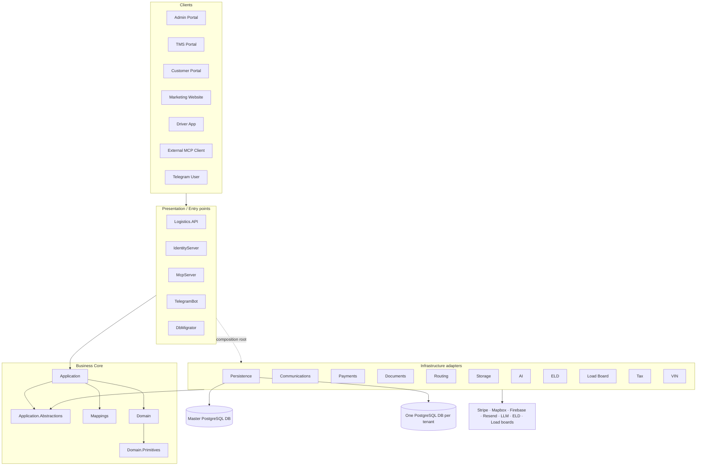
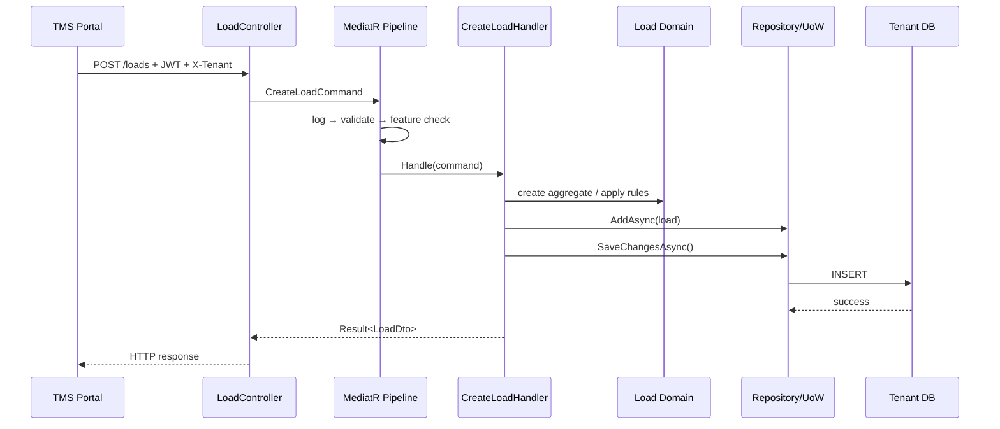

# LogisticsX — Báo cáo tổng quan kiến trúc và cấu trúc dự án

**Mục tiêu tài liệu:** giúp thành viên mới hiểu toàn bộ repository, biết trách nhiệm của từng thư mục/project, cách một request đi qua hệ thống, dữ liệu nằm ở đâu và nên bắt đầu đọc code từ đâu.  
**Phạm vi:** trạng thái repository tại ngày 2026-07-16.  
**Nguồn kiểm chứng:** `CLAUDE.md`, `.claude/feature-map.md`, `docs/architecture/*`, các file project, composition root và mã nguồn hiện tại.

---

## 1. Tóm tắt dự án

LogisticsX là nền tảng quản lý vận tải và đội xe đa tenant dành cho doanh nghiệp trucking. Hệ thống hỗ trợ ba nhóm hoạt động chính:

- Vận chuyển hàng hóa thông thường (freight).
- Vận tải container intermodal.
- Vận chuyển xe và các loại phương tiện chuyên dụng.

Sản phẩm không chỉ là một REST API. Đây là một hệ sinh thái gồm:

- TMS Portal cho Owner, Manager và Dispatcher.
- Customer Portal cho khách hàng theo dõi shipment, chứng từ và hóa đơn.
- Admin Portal cho SuperAdmin vận hành nền tảng SaaS.
- Website marketing.
- Driver App cho tài xế.
- Identity Server để đăng nhập và cấp token.
- API xử lý nghiệp vụ.
- MCP Server cho AI client bên ngoài.
- Telegram Bot.
- Database Migrator để migrate và seed database.

Kiến trúc tổng thể là **modular monolith** theo hướng **DDD + CQRS + Clean Architecture**. Ứng dụng được chia theo layer và bounded context, nhưng vẫn deploy backend chính dưới dạng một API thay vì nhiều microservice độc lập.

---

## 2. Bức tranh toàn hệ thống



Ý tưởng quan trọng nhất là business core không cần biết Stripe, Mapbox, Firebase hay PostgreSQL được cài đặt như thế nào. Core gọi các interface trong `Application.Abstractions`; Infrastructure cung cấp implementation; Presentation nối chúng lại qua dependency injection.

---

## 3. Cấu trúc repository cấp cao

```text
logistics-app/
├── Logistics.slnx                 # Solution .NET
├── src/                           # Toàn bộ mã nguồn sản phẩm
│   ├── Client/                    # Angular, mobile, demo video
│   ├── Core/                      # Business core
│   ├── Shared/                    # Contract/thành phần dùng chung
│   ├── Infrastructure/            # Adapter DB và dịch vụ ngoài
│   └── Presentation/              # Các executable/entry point
├── test/                          # Unit, integration, architecture tests
├── docs/                          # Tài liệu nghiệp vụ, kiến trúc, API, deploy
├── deploy/                        # Docker Compose và cấu hình triển khai
├── scripts/                       # Script migration, seed và chạy local
├── .github/workflows/             # CI/CD GitHub Actions
├── .claude/                       # Feature map, rules, plans và skills nội bộ
├── CLAUDE.md                      # Quy tắc và thông tin nhanh của repository
├── README.md                      # Giới thiệu sản phẩm và quick start
└── package.json                   # Command cấp workspace
```

### 3.1 Các file gốc quan trọng

| File/thư mục | Vai trò | Khi nào cần đọc |
|---|---|---|
| `Logistics.slnx` | Danh sách project .NET trong solution | Khi build, thêm project hoặc hiểu dependency tổng thể |
| `CLAUDE.md` | Kiến trúc, command, port và các quy tắc load-bearing | Đọc đầu tiên trước khi sửa code |
| `.claude/feature-map.md` | Map feature → Domain → Application → Infrastructure → API/UI | Đọc trước khi tìm code theo feature |
| `README.md` | Góc nhìn sản phẩm, tính năng, demo, quick start | Onboarding tổng quan |
| `docs/` | Tài liệu chuyên sâu | Tra cứu theo vấn đề, không cần đọc tuần tự |
| `deploy/` | Môi trường container | Khi chạy local hoặc deploy |
| `scripts/` | Tiện ích migration/seed/run | Khi thao tác database hoặc chạy riêng service |

---

## 4. Kiến trúc layer và quy tắc phụ thuộc

### 4.1 Thứ tự layer

```text
Presentation
    ↓
Application ─────────→ Application.Abstractions
    ↓                          ↑
Domain                   Infrastructure implements
    ↓
Domain.Primitives
```

Quy tắc mong muốn:

- `Domain.Primitives` nằm thấp nhất, không phụ thuộc tầng nghiệp vụ cao hơn.
- `Domain` chứa nghiệp vụ thuần và phụ thuộc `Domain.Primitives`.
- `Application.Abstractions` định nghĩa các port mà Application cần từ thế giới ngoài.
- `Application` điều phối use case và phụ thuộc Domain/Abstractions.
- `Infrastructure` triển khai các port.
- `Presentation` là composition root, có quyền biết Application và Infrastructure để đăng ký DI.

Các quy tắc boundary được kiểm tra bởi `test/Logistics.Architecture.Tests`.

### 4.2 Điểm cần lưu ý trong code hiện tại

Phần lớn Infrastructure chỉ tham chiếu `Application.Abstractions`, đúng với kiến trúc đặt ra. Tuy nhiên `Logistics.Infrastructure.AI.csproj` hiện tham chiếu trực tiếp `Logistics.Application`. Đây là dependency thực tế cần biết khi đọc hoặc refactor; không nên mặc định mọi infrastructure project đều hoàn toàn tách khỏi Application.

---

## 5. `src/Core` — trung tâm nghiệp vụ

`src/Core` gồm 5 project. Đây là phần cần hiểu trước khi sửa business logic.

### 5.1 `Logistics.Domain.Primitives`

**Trách nhiệm:** chứa các khái niệm nhỏ, ổn định và được nhiều tầng dùng chung.

Nội dung chính:

- Enum: trạng thái Load, Trip, Invoice, Payment, Container, Truck, Subscription...
- Value Object: `Money`, `Address`, `GeoPoint`, các giới hạn HOS và giá trị có semantics nghiệp vụ.

Đặt một kiểu ở đây khi nó:

- Không phụ thuộc Entity Framework, HTTP hoặc provider ngoài.
- Có ý nghĩa nghiệp vụ rõ ràng.
- Được Domain và DTO cùng sử dụng.

Không nên đặt handler, repository, controller hoặc provider client trong project này.

### 5.2 `Logistics.Domain`

**Trách nhiệm:** mô hình hóa nghiệp vụ và bảo vệ invariant.

```text
Logistics.Domain/
├── Core/              # Entity, aggregate, domain-event abstractions
├── Entities/          # Tenant, Load, Trip, Truck, Invoice...
├── Events/            # Domain events
├── Exceptions/        # Domain exceptions
├── Persistence/       # Marker/interface nền tảng liên quan persistence
├── Specifications/    # Specification dùng chéo feature
└── Options/           # Một số option/value cấu hình domain
```

Các entity quan trọng:

- `Load`: shipment từ origin đến destination.
- `Trip`: tập hợp các stop của một hoặc nhiều load.
- `Truck`: phương tiện và tài xế được gán.
- `Employee`: nhân viên/driver, salary và role.
- `Customer`: khách hàng đặt shipment.
- `Container` và `Terminal`: nghiệp vụ intermodal.
- `Invoice`, `Payment`, `PaymentLink`: tài chính.
- `AiDispatchSession`, `AiDispatchDecision`: phiên và quyết định AI.
- `DvirReport`, `AccidentReport`, `HosLog`: compliance/safety.

Business rule quan trọng nên nằm trong entity hoặc domain service, ví dụ:

- Load chỉ đi theo state machine hợp lệ.
- Pickup phải xảy ra trước delivery.
- Container chỉ chuyển sang state được phép.
- Invoice tính total và trạng thái thanh toán nhất quán.

Domain entity được đánh dấu theo nơi lưu dữ liệu:

- `IMasterEntity`: thuộc master database.
- `ITenantEntity`: thuộc tenant database.
- Một số entity có thể xuất hiện ở cả hai context vì phục vụ nhiều boundary.

### 5.3 `Logistics.Application.Abstractions`

**Trách nhiệm:** khai báo port/interface cho các khả năng nằm ngoài business core.

Ví dụ thư mục:

- `Payments/`: payment gateway và Stripe-related contracts.
- `Storage/`: blob storage.
- `Routing/`, `Geocoding/`: route/geocode.
- `Eld/`, `LoadBoard/`: integration contracts.
- `Email/`, `Notifications/`, `Realtime/`: communication.
- `Ai/`, `AiDispatch/`: LLM và agent contracts.
- `Tenancy/`: tenant context/service.
- `Common/`: `ICommand<T>`, `IQuery<T>`, result abstractions.

Application chỉ biết `IBlobStorageService`, không biết file đang nằm ở Azure, R2 hay local. Điều này giúp đổi provider mà không sửa use case.

### 5.4 `Logistics.Application`

**Trách nhiệm:** triển khai use case của hệ thống bằng CQRS.

Application được chia thành 6 bounded context:

| Module | Trách nhiệm | Feature tiêu biểu |
|---|---|---|
| `Operations` | Công việc TMS hằng ngày | Loads, Trips, Trucks, Containers, Terminals, Tracking, Maintenance, TimeEntries |
| `Compliance` | Quy định và an toàn | ELD/HOS, DVIR, Inspections, Accidents, Safety, Privacy |
| `Financial` | Tiền vào/ra | Invoice, Tax, Payment, PaymentLink, Payroll, Expense, Stripe Connect |
| `IdentityAccess` | Ai được làm gì trong tổ chức nào | User, Role, Tenant, Employee, Customer, Invitation, Subscription, Feature, API key |
| `Integrations` | Luồng kết nối và webhook | AI Dispatch, Load Board, Documents, Messaging, Webhooks |
| `Platform` | Chức năng toàn nền tảng | Stats, Reports, Notifications, Blog, Contact, Demo Request, AI Settings |

Cấu trúc chuẩn của một feature:

```text
Modules/Operations/Loads/
├── Commands/
│   ├── CreateLoad/
│   │   ├── CreateLoadCommand.cs
│   │   ├── CreateLoadHandler.cs
│   │   └── CreateLoadValidator.cs
│   └── DispatchLoad/
├── Queries/
│   ├── GetLoadById/
│   └── GetLoads/
├── Events/
├── Services/
├── Specifications/
└── Constants/
```

Ý nghĩa:

- **Command:** yêu cầu thay đổi state.
- **Query:** yêu cầu đọc dữ liệu, không nên tạo side effect.
- **Handler:** điều phối domain/repository/provider để xử lý request.
- **Validator:** kiểm tra input trước handler.
- **Event handler:** phản ứng với domain event sau thay đổi nghiệp vụ.
- **Specification:** đóng gói điều kiện query có thể tái sử dụng.
- **Workflow service:** điều phối nhiều aggregate/use case; vẫn thuộc Application.

MediatR pipeline áp dụng theo thứ tự khái quát:

```text
Request
  → LoggingBehaviour
  → UnhandledExceptionBehaviour
  → ValidationBehaviour
  → FeatureCheckBehaviour
  → Handler
  → Result
```

Lưu ý quan trọng: handler tự gọi `SaveChangesAsync`. Không có transaction behavior tự động commit cho mọi command. Quên gọi save có thể khiến command trả success nhưng dữ liệu không được lưu.

### 5.5 `Logistics.Mappings`

**Trách nhiệm:** chuyển đổi giữa Domain Entity và DTO.

Project dùng Mapperly/generator pattern để tránh viết mapping thủ công lặp lại. Mapping không nên chứa business rule; nhiệm vụ của nó là chuyển representation.

Ví dụ:

```text
Load entity ↔ LoadDto
Employee entity ↔ EmployeeDto
Invoice entity ↔ InvoiceDto
```

---

## 6. `src/Shared` — contract dùng chung

### 6.1 `Logistics.Shared.Models`

Chứa DTO được chia sẻ giữa API, Application, mapping và client generation.

Các folder theo feature như `Load`, `Trip`, `Employee`, `Invoice`, `Reports`, `Tenant`. Đây là representation đi qua boundary, không phải aggregate chứa business behavior.

Phân biệt:

- Entity dùng bên trong domain và persistence.
- DTO dùng để truyền dữ liệu giữa các tầng hoặc ra API.

### 6.2 `Logistics.Shared.Identity`

Chứa contract identity dùng chung:

- Tên role: SuperAdmin, Admin, Owner, Manager, Dispatcher, Driver, Customer.
- Permission policies.
- Claim names và helper liên quan authorization.

Controller thường dùng policy từ project này thay vì hard-code string.

### 6.3 `Logistics.Shared.Geo`

Chứa utility địa lý dùng lại giữa các project, tránh để calculation thuần bị buộc vào Mapbox hoặc một provider cụ thể.

---

## 7. `src/Infrastructure` — adapter kỹ thuật

Repository hiện có **11 infrastructure projects**. Một số tài liệu cũ vẫn ghi 9 vì chưa tính `Tax` và `Vin` được tách riêng.

### 7.1 `Logistics.Infrastructure.Persistence`

Đây là infrastructure project lớn nhất, chịu trách nhiệm:

- EF Core và PostgreSQL.
- `MasterDbContext` và `TenantDbContext`.
- Repository và Unit of Work.
- Entity configuration.
- Master/Tenant migrations.
- Tenant resolution và tenant database provisioning.
- SaveChanges interceptor cho audit và domain event.
- Converter, convention và read query.

Cấu trúc đáng chú ý:

```text
Persistence/
├── Data/             # DbContext
├── Configurations/   # IEntityTypeConfiguration cho từng entity
├── Migrations/
│   ├── Master/
│   └── Tenant/
├── Repositories/     # Repository implementation
├── Services/         # TenantService, TenantDatabaseService...
├── Interceptors/     # Audit và domain event
├── Conventions/      # snake_case enum/naming conventions
├── Converters/       # Value conversion
├── Reads/            # Read-side/query optimization
└── Options/          # Connection/tenant options
```

#### Entity configuration dùng để làm gì?

Các file bạn đang mở như:

- `EmployeeEntityConfiguration.cs`
- `DriverLicenseEntityConfiguration.cs`
- `ImpersonationAuditLogEntityConfiguration.cs`

không chứa workflow nghiệp vụ. Chúng mô tả entity được lưu vào PostgreSQL như thế nào:

- Tên bảng/cột.
- Độ dài, precision, required/optional.
- Index và unique constraint.
- Foreign key và delete behavior.
- Complex property/value object mapping.

Ví dụ `EmployeeEntityConfiguration`:

- Map `Employee` vào bảng `employees`.
- Map `Salary` như complex property với amount precision `(18,2)` và currency tối đa 3 ký tự.
- Map quan hệ Employee → Role.
- Khi Role bị xóa, `RoleId` của Employee được set null thay vì xóa Employee.

Domain nói “Employee là gì và làm được gì”; configuration nói “Employee được lưu như thế nào”.

### 7.2 `Logistics.Infrastructure.Communications`

Phụ trách giao tiếp real-time và outbound:

- SignalR `TrackingHub`: vị trí tài xế.
- `ChatHub`: nhắn tin.
- `NotificationHub`: thông báo trong app.
- Firebase Cloud Messaging: push notification.
- Resend + Fluid template: email.
- Google reCAPTCHA: xác minh form public.

### 7.3 `Logistics.Infrastructure.AI`

Chứa AI dispatch agent:

- Adapter cho Anthropic, OpenAI-compatible và DeepSeek.
- Agent loop và prompt.
- Tool registry.
- Tool thực thi tìm load, tìm truck, kiểm tra HOS, tính distance, tạo/dispatch trip.
- Quota và pricing theo model.

`AiDispatchToolRegistry` là nguồn định nghĩa tool dùng chung cho AI agent và MCP Server. Nếu thêm tool nhưng không đăng ký đúng registry, external MCP client hoặc agent có thể không nhìn thấy tool.

### 7.4 `Logistics.Infrastructure.Integrations.Eld`

Adapter cho Electronic Logging Device và Hours of Service:

- Samsara.
- Motive.
- Geotab.
- TT ELD.
- Demo provider.

Nó chuyển dữ liệu provider-specific về model chung để Application không phụ thuộc format của từng hãng.

### 7.5 `Logistics.Infrastructure.Integrations.LoadBoard`

Adapter cho thị trường load:

- DAT.
- Truckstop.
- 123Loadboard.
- Demo provider.

Chức năng: tìm listing, book load, post truck và đồng bộ dữ liệu provider.

### 7.6 `Logistics.Infrastructure.Payments`

Phụ trách Stripe và Stripe Connect:

- Subscription billing của platform.
- Customer payment.
- Connected account cho tenant.
- Payment intent/checkout.
- Webhook processing support.

### 7.7 `Logistics.Infrastructure.Tax`

Tách riêng calculation thuế:

- Manual tax calculation.
- Stripe Tax.
- Dữ liệu jurisdiction/rate hỗ trợ fallback.

Financial Application gọi tax abstraction; project này quyết định provider và thuật toán kỹ thuật.

### 7.8 `Logistics.Infrastructure.Documents`

Phụ trách nội dung tài liệu:

- Tạo PDF invoice, payroll, BOL, POD bằng QuestPDF.
- Đọc/import PDF.
- Extract dữ liệu load bằng text parser và LLM fallback.
- Chuẩn bị privacy export.

### 7.9 `Logistics.Infrastructure.Storage`

Lưu binary object qua `IBlobStorageService`:

- Azure Blob Storage.
- Cloudflare R2.
- Local file system cho development/on-prem.

`Documents` quyết định nội dung file; `Storage` quyết định file được lưu ở đâu.

### 7.10 `Logistics.Infrastructure.Routing`

Phụ trách địa lý và route:

- Mapbox geocoding.
- Mapbox Matrix optimizer.
- Heuristic nearest-neighbor optimizer.
- Composite optimizer: ưu tiên Mapbox, fallback heuristic.
- Trip tracking service.

### 7.11 `Logistics.Infrastructure.Vin`

Tách riêng việc decode VIN qua NHTSA và các strategy/fallback liên quan. Truck form gọi API VIN, Application gọi abstraction, project này giao tiếp với nguồn ngoài.

---

## 8. `src/Presentation` — executable và entry point

### 8.1 `Logistics.API`

Backend HTTP chính, chạy ở port 7000.

Nó chịu trách nhiệm:

- REST controllers.
- Authentication/authorization middleware.
- Swagger trong development.
- Global rate limit 100 request/phút theo identity/host.
- Exception handling và Serilog request logging.
- SignalR hubs.
- Hangfire server/dashboard và recurring jobs.
- Stripe/ELD webhook endpoints.
- Mount MCP endpoint và Telegram webhook.
- Health check `/health`.

`Program.cs` là entry point nhỏ. `Setup.cs` làm composition root:

1. Đăng ký Application.
2. Đăng ký toàn bộ Infrastructure.
3. Cấu hình persistence cho master/tenant/identity.
4. Cấu hình JWT, permission, controllers, JSON, CORS, rate limit.
5. Xây pipeline middleware.
6. Map controller, SignalR, MCP, Telegram.
7. Schedule recurring jobs.

Controller nên mỏng: nhận HTTP input, gửi command/query qua MediatR, chuyển `Result` thành HTTP response. Business logic không nên viết trực tiếp trong controller.

### 8.2 `Logistics.IdentityServer`

Chạy ở port 7001, dùng Duende IdentityServer và ASP.NET Identity.

Vai trò:

- Login/logout/register/reset password.
- OAuth2/OIDC.
- Authorization code, refresh token và các flow đã cấu hình.
- Cấp JWT có role, permission và tenant claim.
- 2FA/recovery code.
- Accept invitation.
- External login và impersonation UI.

API chỉ validate JWT; IdentityServer chịu trách nhiệm xác thực và phát token.

### 8.3 `Logistics.McpServer`

Cung cấp MCP Streamable HTTP tại `/mcp` cho Claude Desktop, Cursor và AI client khác.

- Xác thực bằng API key tenant-scoped.
- API key có format `logsx_{tenantId}_{random}` và được lưu dạng hash.
- Sau khi xác thực, handler gắn `McpTenantId` vào `HttpContext.Items`.
- Dùng chung tool registry với AI Dispatch.
- Rate limit 100 request/phút/key theo thiết kế MCP.

### 8.4 `Logistics.TelegramBot`

Cho phép người dùng tương tác qua Telegram:

- Command xem loads, trips, trucks và HOS.
- Notification.
- Authentication/link Telegram chat với tài khoản LogisticsX.
- Hỗ trợ webhook hoặc polling tùy môi trường.

### 8.5 `Logistics.DbMigrator`

Console/worker chuyên xử lý database:

1. Apply master migrations.
2. Lấy danh sách tenant từ master DB.
3. Apply tenant migrations cho từng tenant DB.
4. Tạo PostgreSQL functions nếu cần.
5. Chạy seeder theo thứ tự.

Seeder gồm hai nhóm:

- Infrastructure seed: role, plan, super admin, tax rate, Stripe metadata.
- Fake/demo data: tenant, user, employee, truck, load, trip, invoice, safety...

Migrator chạy riêng giúp deploy kiểm soát schema trước khi API nhận traffic.

---

## 9. `src/Client` — giao diện và ứng dụng người dùng

### 9.1 Angular workspace

`src/Client/Logistics.Angular` là một Angular workspace dùng Angular 21, PrimeNG và Tailwind.

| Project | Port | Đối tượng | Nội dung |
|---|---:|---|---|
| `admin-portal` | 7002 | SuperAdmin/Admin | Tenant, plan, feature, user, AI settings, marketing và privacy admin |
| `tms-portal` | 7003 | Owner/Manager/Dispatcher | Load, trip, fleet, employee, finance, ELD, AI, reports, settings |
| `customer-portal` | 7004 | Customer | Shipment, tracking, document, invoice/payment |
| `website` | 7005 | Public visitor | Marketing, blog, contact, demo request; hỗ trợ SSR |
| `shared` | — | Tất cả portal | API client, auth, component, form, layout, utility dùng chung |

Một page Angular thường có:

```text
pages/{feature}/
├── {feature}-list/
├── {feature}-detail/
├── {feature}-form/
├── {feature}.routes.ts
└── services/state phụ trợ
```

API client được generate từ Swagger, vì vậy khi backend contract đổi cần regenerate thay vì sửa file generated thủ công.

Shared UI có các form component chuẩn như address, currency, unit, phone và field wrapper. Việc dùng component chung đảm bảo validation/region/accessibility nhất quán giữa portal.

### 9.2 Driver App

`Logistics.DriverApp` dùng Kotlin Multiplatform và Compose Multiplatform:

- `composeApp/commonMain`: business/UI dùng chung Android và iOS.
- `androidApp`: Android entry/config.
- `iosApp`: iOS host.
- `service/`: auth, location, SignalR, network, preferences.
- `viewmodel/`: state và action của screen.
- `ui/screens/`: Login, Trips, Trip Detail, Load Detail, POD, DVIR, Messages, Stats, Licenses, Privacy...

App phục vụ tài xế nên tập trung vào:

- Trip/load được gán.
- Navigation và location tracking.
- Proximity để bật pickup/delivery confirmation.
- POD/signature/photo.
- DVIR/condition report.
- Messaging và notification.

### 9.3 Demo Video

`Logistics.DemoVideo` dùng Remotion để tạo video marketing bằng React/code. Nó không nằm trong runtime nghiệp vụ của TMS.

---

## 10. Database và multi-tenancy

### 10.1 Hai loại database

LogisticsX sử dụng **database-per-tenant**:

```text
Master DB
├── Tenants
├── Subscriptions / Plans
├── Platform users / admins
├── Feature defaults
├── API keys
├── System settings
└── Marketing / platform data

Tenant A DB                      Tenant B DB
├── Loads                        ├── Loads
├── Trips                        ├── Trips
├── Trucks                       ├── Trucks
├── Employees                    ├── Employees
├── Customers                    ├── Customers
├── Invoices / Payments          ├── Invoices / Payments
├── Documents / Messages         ├── Documents / Messages
└── Compliance / AI              └── Compliance / AI
```

Không phải một database chung rồi thêm `TenantId` vào mọi bảng. Mỗi công ty có database vận hành riêng, giúp cô lập dữ liệu mạnh hơn nhưng làm migration, pooling và backup phức tạp hơn.

### 10.2 `MasterDbContext`

- Kế thừa IdentityDbContext.
- Quản lý user/role của nền tảng và các `IMasterEntity`.
- Dùng audit/domain-event interceptors.
- Apply master configurations rồi loại các type chỉ dành cho tenant.

### 10.3 `TenantDbContext`

- Quản lý các `ITenantEntity`.
- Có connection mặc định cho local/test.
- `SwitchToTenant` đổi connection string trước query/save đầu tiên.
- Apply tenant configurations và loại master-only types.
- Có một số keyless read DTO cho PostgreSQL function/report.

### 10.4 Cách xác định tenant cho request

Thứ tự ưu tiên:

1. MCP API key đã xác thực và gắn `McpTenantId`.
2. Header `X-Tenant`.
3. JWT `tenant` claim.

Sau khi tìm tenant trong master DB, hệ thống kiểm tra subscription rồi mở `TenantDbContext` bằng connection string của công ty đó.

### 10.5 Provision tenant

Luồng khái quát:

```text
Create tenant record in Master DB
→ generate tenant connection string
→ create PostgreSQL database
→ apply tenant migrations
→ seed tenant roles/settings/owner
→ save connection string/status
```

### 10.6 Audit và domain event khi SaveChanges

EF Core interceptor thực hiện hai nhiệm vụ quan trọng:

- Gán `CreatedAt`, `CreatedBy`, `UpdatedAt`, `UpdatedBy` cho auditable entity.
- Dispatch domain event phát sinh trong aggregate.

Vì vậy không nên bypass DbContext/Unit of Work tùy tiện nếu muốn giữ audit và event behavior nhất quán.

---

## 11. Một HTTP request đi qua hệ thống như thế nào?

Ví dụ: Dispatcher tạo Load.



Chi tiết theo tầng:

1. Angular gửi request có access token và tenant context.
2. ASP.NET middleware validate JWT, CORS và rate limit.
3. Tenant service xác định đúng database.
4. Controller bind DTO và gửi command.
5. Pipeline log, bắt lỗi, validate và kiểm tra feature flag.
6. Handler lấy repository/service cần thiết.
7. Domain entity bảo vệ business rule.
8. Handler gọi Unit of Work save.
9. Interceptor gắn audit và dispatch domain event.
10. Mapping chuyển entity thành DTO.
11. Controller trả response cho client.

---

## 12. Authentication, authorization và feature gating

### 12.1 Authentication

- IdentityServer xác thực user và cấp JWT.
- API dùng JwtBearer để validate issuer, audience và chữ ký.
- MCP dùng API key riêng.
- Public tracking/payment/webhook dùng cơ chế scoped token/signature tương ứng.

### 12.2 Authorization

Có hai cấp:

- Role mô tả nhóm người dùng.
- Permission policy mô tả hành động cụ thể như View/Manage/Approve.

`PermissionPolicyProvider` và `PermissionHandler` xử lý policy động. API áp dụng global authenticated filter; endpoint public phải khai báo `AllowAnonymous` rõ ràng.

### 12.3 Feature flag và subscription

`FeatureCheckBehaviour` đọc `[RequiresFeature]` trên command/query. Nếu plan hoặc tenant configuration không cho dùng feature, pipeline dừng trước handler.

Tenant resolution cũng kiểm tra subscription. Billing endpoints được bypass có chủ đích để tenant hết hạn vẫn có thể gia hạn/thanh toán.

---

## 13. Real-time, job và webhook

### 13.1 SignalR

API map bốn hub:

- `/hubs/tracking`
- `/hubs/ai-dispatch`
- `/hubs/notification`
- `/hubs/chat`

SignalR dùng cho dữ liệu cần cập nhật ngay mà polling REST không phù hợp.

### 13.2 Hangfire jobs

Các recurring job chính:

- Payroll generation.
- ELD sync.
- Load board sync.
- Maintenance reminder.
- Driver license expiry reminder.
- Invitation expiry.
- Privacy export/deletion/retention/expiry.
- AI dispatch session chạy on-demand qua background runner.

Hangfire dùng master PostgreSQL làm storage. Job chạy ngoài HTTP context nên phải xử lý tenant context/connection rõ ràng.

### 13.3 Webhook

Webhook chính:

- Stripe: payment, checkout, subscription và connected account events.
- ELD: Samsara, Motive, Geotab, TT ELD.

Luồng an toàn cần giữ:

```text
Raw request
→ verify signature
→ idempotency check
→ map provider payload
→ send application command
→ save business result
→ audit/log response
```

---

## 14. Các nhóm nghiệp vụ chính và nơi tìm code

| Nhóm | Domain | Application | Infrastructure | API/UI |
|---|---|---|---|---|
| Load | `Domain/Entities/Load` | `Operations/Loads` | Persistence/Documents | `LoadController`, TMS loads pages |
| Trip | `Domain/Entities/Trip` | `Operations/Trips` | Routing | `TripController`, TMS trips pages |
| Fleet/Driver | Truck/Employee/License | Operations + IdentityAccess | Persistence/Vin | Truck/Employee/Driver controllers |
| Container | Container/Terminal | Operations | Persistence | Container/Terminal controllers |
| Invoice/Payment | Invoice/Payment | Financial | Payments/Tax/Documents | Invoice/Payment/PublicPayment controllers |
| Payroll/Expense | Invoice/Expense/TimeEntry | Financial | Persistence/Documents | Payroll/Expense/TimeEntry UI/API |
| ELD/Safety | Eld/Safety/Inspection entities | Compliance | ELD | Eld/Dvir/Accident/Inspection controllers |
| Messaging | Conversation/Message | Integrations | Communications | MessageController/ChatHub |
| Documents | Document hierarchy | Integrations | Documents/Storage | DocumentController |
| AI Dispatch | Session/Decision | Integrations/AiDispatch | AI | AiDispatchController/MCP |
| Subscription/Feature | Tenant/Subscription/Feature | IdentityAccess | Payments/Persistence | Subscription/Feature controllers |
| Reports | DTO/read data | Platform/Stats/Reports | Persistence reads | Stat/Report controllers |

Nguồn định tuyến đầy đủ nhất là `.claude/feature-map.md`.

---

## 15. Testing

Repository hiện có các test project:

| Project | Mục tiêu |
|---|---|
| `Logistics.Application.Tests` | Handler, service, validator và nghiệp vụ Application |
| `Logistics.Architecture.Tests` | Chặn dependency sai layer |
| `Logistics.Infrastructure.AI.Tests` | Agent, prompt, quota và tool |
| `Logistics.Infrastructure.Documents.Tests` | PDF import/extraction |
| `Logistics.Infrastructure.Payments.Tests` | Stripe/payment behavior |
| `Logistics.Infrastructure.Persistence.Tests` | Converter/persistence behavior |
| `Logistics.Infrastructure.Routing.Tests` | Geocode/route optimizer |
| `Logistics.Infrastructure.Tax.Tests` | Manual/Stripe tax |
| `Logistics.Infrastructure.Vin.Tests` | VIN decoder |

Chiến lược đọc test:

- Muốn hiểu rule: đọc domain/application test trước implementation chi tiết.
- Muốn đổi provider: đọc infrastructure test.
- Muốn đổi dependency/project boundary: chạy architecture tests.
- Muốn đổi API contract: ngoài unit test cần Swagger/client generation và e2e portal.

---

## 16. Build, chạy local và triển khai

### 16.1 Chạy local cơ bản

```bash
docker compose -f deploy/docker-compose.dev.yml up -d
dotnet run --project src/Presentation/Logistics.IdentityServer
dotnet run --project src/Presentation/Logistics.API
bun run start:tms
```

Port mặc định:

| Service | Port |
|---|---:|
| API | 7000 |
| Identity Server | 7001 |
| Admin Portal | 7002 |
| TMS Portal | 7003 |
| Customer Portal | 7004 |
| Website | 7005 |

### 16.2 Docker

- `deploy/docker-compose.dev.yml`: PostgreSQL và migrator cho local.
- `deploy/docker-compose.yml`: stack triển khai chính.
- `deploy/docker-compose.portainer.yml`: biến thể dùng Portainer.
- Mỗi Presentation/Angular app có Dockerfile riêng khi cần build image.

### 16.3 CI/CD

`.github/workflows` gồm:

- `build.yml`: build/test pipeline.
- `deploy.yml`: triển khai.
- `cleanup-container-images.yml`: dọn image cũ.

Nginx đứng trước các service trong môi trường deploy để reverse proxy/TLS/routing domain.

---

## 17. Cách tìm và đọc một feature mà không bị lan man

Ví dụ cần hiểu Employee:

1. Mở `.claude/feature-map.md`, tìm “Employees / Drivers”.
2. Đọc `Domain/Entities/Employee.cs` để hiểu dữ liệu và behavior.
3. Đọc enum/value object liên quan trong `Domain.Primitives`.
4. Đọc `Application/Modules/IdentityAccess/Employees` để thấy command/query.
5. Đọc `EmployeeController.cs` để biết API exposure.
6. Đọc `EmployeeEntityConfiguration.cs` để biết schema/relationship.
7. Đọc DTO trong `Shared.Models/Employee` và mapping.
8. Đọc Angular page/service tương ứng.
9. Đọc tests trước khi sửa.

Công thức chung:

```text
Feature map
→ Domain entity/rules
→ Application command/query/handler
→ Infrastructure adapter/configuration
→ Controller/API contract
→ Frontend/mobile consumer
→ Tests
```

Không nên bắt đầu từ EF configuration nếu câu hỏi là “nghiệp vụ hoạt động thế nào”; configuration chỉ trả lời “dữ liệu được lưu thế nào”.

---

## 18. Các quy tắc quan trọng dễ gây lỗi

1. **Đọc feature map trước khi grep rộng.** Một feature thường trải qua nhiều project.
2. **Handler phải tự `SaveChangesAsync`.** Không có auto-commit chung.
3. **EF lazy loading đang bật.** Repository convention yêu cầu tránh `.Include()`; đồng thời phải theo dõi nguy cơ N+1.
4. **Không đưa business logic vào controller/UI/provider.** Logic thuộc Domain hoặc Application.
5. **Infrastructure port đặt trong `Application.Abstractions`; workflow service đặt trong `Application`.**
6. **Mọi address form dùng shared address component và server `AddressValidator`.**
7. **Không để query/cache thiếu tenant scope.** Database tách tenant nhưng master/cross-context vẫn cần kiểm soát.
8. **Webhook phải verify signature và idempotency trước mutation.**
9. **API key/token/Stripe secret không được log.**
10. **Thêm top-level feature phải cập nhật `.claude/feature-map.md`.**
11. **Thêm Infrastructure assembly phải bổ sung vào architecture tests.**
12. **Generated API client không sửa thủ công.** Regenerate từ Swagger.

---

## 19. Những điểm tài liệu và code cần hiểu đúng

- `docs/architecture/overview.md` nói Infrastructure có 9 project; code hiện tại có 11 vì `Tax` và `Vin` đã được tách riêng.
- Tài liệu mô tả Infrastructure không tham chiếu Application; hầu hết đúng, nhưng AI project hiện có direct project reference đến Application.
- `MasterDbContext` và `TenantDbContext` tự scan configuration theo marker entity; thêm configuration sai marker có thể làm migration xuất hiện ở database không đúng.
- `TenantDbContext.SwitchToTenant` phải chạy trước query/SaveChanges đầu tiên vì nó retarget connection của DbContext.
- Global authorization filter yêu cầu authentication mặc định; endpoint public phải khai báo `AllowAnonymous` rõ ràng.

Các điểm trên nên được xem là “implementation facts” tại thời điểm report, không phải lý tưởng kiến trúc bất biến.

---

## 20. Lộ trình onboarding đề xuất

### Ngày 1 — hiểu sản phẩm và kiến trúc

- Đọc `README.md`.
- Đọc report này.
- Xem `.claude/feature-map.md`.
- Chạy hệ thống và đăng nhập TMS Portal.

### Ngày 2 — hiểu core flow

- Theo dõi Load từ controller đến handler/domain/configuration/UI.
- Theo dõi Trip và state transition.
- Đọc multi-tenancy resolution.

### Ngày 3 — hiểu cross-cutting

- Authentication/permission.
- Feature flag/subscription.
- Audit/domain event.
- SignalR/Hangfire/webhook.

### Ngày 4 — chọn chuyên môn

- Backend: Application + Domain + Persistence.
- Frontend: Angular shared + một portal.
- Mobile: KMP service/viewmodel/screen.
- Integration: một Infrastructure provider và tests.

### Ngày 5 — sửa một thay đổi nhỏ end-to-end

- Chọn feature nhỏ.
- Viết/điều chỉnh test.
- Sửa đúng layer.
- Chạy build/test liên quan.
- Kiểm tra API/UI và feature map.

---

## 21. Tài liệu nên đọc tiếp theo

| Muốn hiểu | Tài liệu |
|---|---|
| Nghiệp vụ toàn hệ thống | `docs/business-spec.md` |
| Danh sách feature | `docs/features.md` |
| Layer và dependency | `docs/architecture/layering.md` |
| Application module | `docs/architecture/module-layout.md` |
| Domain/state machine | `docs/architecture/domain-model.md` |
| Multi-tenancy | `docs/architecture/multi-tenancy.md` |
| Database tables | `docs/architecture/database-schema.md` |
| API/auth | `docs/api/overview.md`, `docs/api/authentication.md` |
| AI Dispatch | `docs/ai-dispatch.md` |
| MCP | `docs/mcp-server.md` |
| Payment | `docs/invoices.md`, `docs/customer-payments.md`, `docs/stripe-connect.md` |
| Deploy | `docs/deployment/overview.md` |
| Project specification đầy đủ | `docs/project-specification.vi.md` |

---

## 22. Kết luận

LogisticsX là modular monolith có phạm vi rộng nhưng cấu trúc nhất quán:

- `Domain` giữ rule.
- `Application` giữ use case.
- `Application.Abstractions` giữ port.
- `Infrastructure` giao tiếp database/provider.
- `Presentation` cung cấp entry point và nối dependency.
- `Shared` giữ contract dùng chung.
- `Client` cung cấp trải nghiệm cho từng nhóm người dùng.
- `test` bảo vệ behavior và boundary.

Cách đọc hiệu quả nhất không phải đi lần lượt qua từng folder. Hãy chọn một feature, đi theo chuỗi **feature map → domain → application → infrastructure → presentation → client → test**. Với cấu trúc này, mỗi thay đổi có thể được đặt đúng layer và đánh giá tác động rõ ràng hơn.

